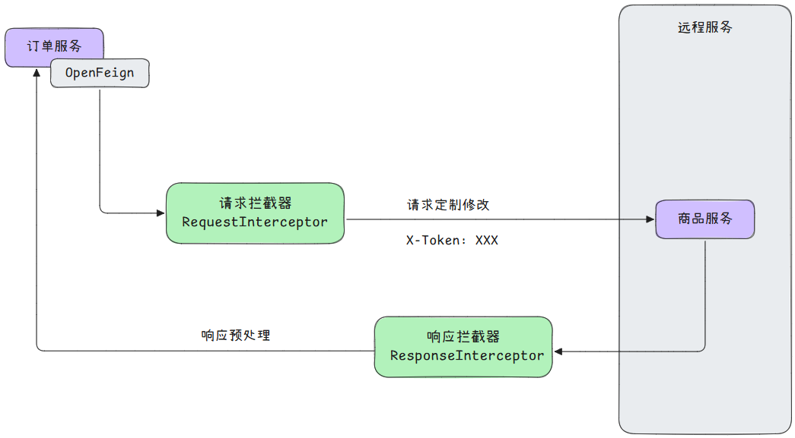

## 声明式远程调用
OpenFeign，是一种 Declarative REST Client，即声明式 Rest 客户端，与之对应的是编程式 Rest 客户端，比如 RestTemplate。

OpenFeign 由注解驱动：

+ 指定远程地址：`@FeignClien`
+ 指定请求方式：`@GetMapping`、`@PostMapping`、`@DeleteMapping`...
+ 指定携带数据：`@RequestHeader`、`@RequestParam`、`@RequestBody`...
+ 指定返回结果：响应模式

其中的 `@GetMapping` 等注解可以沿用 Spring MVC：

+ 当它们标记在 Controller 上时，用于接收请求
+ 当他们标记在 FeignClien 上时，用于发送请求


**使用时引入以下依赖：**

```plain
<dependency>
    <groupId>org.springframework.cloud</groupId>
    <artifactId>spring-cloud-starter-openfeign</artifactId>
</dependency>
```

**在主启动类上使用以下注解：**

```java
@EnableFeignClients
```


**编写FeignClient接口**

远程调用方法直接将调用地方的controller方法粘贴过来即可

```java
@FeignClient(value = "service-product")
public interface ProductFeignClient {
    @GetMapping(value = "/productId/{id}")
    public Product getProductById(@PathVariable("id") Long productId);
}
```

## 远程调用第三方API
**使用示例：**

```java
@FeignClient(value = "weather-client", url = "http://aliv18.data.moji.com")
public interface WeatherFeignClient {
    @PostMapping("/whapi/json/alicityweather/condition")
    String getWeather(@RequestHeader("Authorization") String auth,
                      @RequestParam("token") String token,
                      @RequestParam("cityId") String cityId);
}
```

## 日志
在配置文件中指定 feign 接口所在包的日志级别：

```yaml
logging:
  level:
    # 指定 feign 接口所在的包的日志级别为 debug 级别
    indi.mofan.order.feign（包路径）: debug
```

向 Spring 容器中注册 `feign.Logger.Level` 对象：

```java
@Bean
public Logger.Level feignlogLevel() {
    // 指定 OpenFeign 发请求时，日志级别为 FULL
    return Logger.Level.FULL;
}
```

## 超时控制
连接超时（connectTimeout），默认 10 秒。

读取超时（readTimeout），默认 60 秒。

如果需要修改默认超时时间，在配置文件中进行如下配置：

```yaml
spring:
  cloud:
    openfeign:
      client:
        config:
          # 默认配置
          default:
            logger-level: full
            connect-timeout: 1000
            read-timeout: 2000
          # 具体 feign 客户端的超时配置
          service-product:
            logger-level: full
            # 连接超时，3000 毫秒
            connect-timeout: 3000
            # 读取超时，5000 毫秒
            read-timeout: 5000
```

## 重试机制
远程调用超时失败后，还可以进行多次尝试，如果某次成功则返回 ok，如果多次尝试后依然失败则结束调用，返回错误。

OpenFeign 底层默认使用 `NEVER_RETRY`，即从不重试策略。

向 Spring 容器中添加 `Retryer` 类型的 Bean：

```java
@Bean
public Retryer retryer() {
    return new Retryer.Default();
}
```

这里使用 OpenFeign 的默认实现 `Retryer.Default`，在这种默认实现下：

```java
public Default() {
    this(100L, TimeUnit.SECONDS.toMillis(1L), 5);
}
```

OpenFeign 的重试规则是：

+ 重试间隔 100ms
+ 最大重试间隔 1s。新一次重试间隔是上一次重试间隔的 1.5 倍，但不能超过最大重试间隔。
+ 最多重试 5 次

## 拦截器
<!-- 这是一张图片，ocr 内容为： -->
  
 以请求拦截器为例，自定义的请求拦截器需要实现 `RequestInterceptor` 接口，并重写 `apply()` 方法：

```java
package indi.mofan.order.interceptor;

public class XTokenRequestInterceptor implements RequestInterceptor {
    /**
     * 请求拦截器
     *
     * @param template 封装本次请求的详细信息
     */
    @Override
    public void apply(RequestTemplate template) {
        System.out.println("XTokenRequestInterceptor ...");
        template.header("X-Token", UUID.randomUUID().toString());
    }
}
```

要想要该拦截器生效有两种方法：

1. 在配置文件中配置对应 Feign 客户端的请求拦截器，此时该拦截器只对指定的 Feign 客户端生效

```yaml
spring:
  cloud:
    openfeign:
      client:
        config:
          # 具体 feign 客户端
          service-product:
            # 该请求拦截器仅对当前客户端有效
            request-interceptors:
              - indi.mofan.order.interceptor.XTokenRequestInterceptor
```

2. 还可以直接将自定义的请求拦截器添加到 Spring 容器中，此时该拦截器对服务内的所有 Feign 客户端生效

```java
@Component
public class XTokenRequestInterceptor implements RequestInterceptor {
    // --snip--
}
```

## <font style="color:rgb(79, 79, 79);">fallback - 兜底返回</font>
注意，此功能需要整合 Sentinel 才能实现。

因此需要先导入 Sentinel 依赖：

```xml
<dependency>
  <groupId>com.alibaba.cloud</groupId>
  <artifactId>spring-cloud-starter-alibaba-sentinel</artifactId>
</dependency>
```

并在需要进行 Fallback 的服务的配置文件中开启配置：

```yaml
feign:
  sentinel:
    enabled: true
```

现在需要对 Feign 客户端 `ProductFeignClient` 配置 Fallback，那么需要先实现 `ProductFeignClient` 编写兜底返回逻辑，并将其交由 Spring 管理：

```java
@Component
public class ProductFeignClientFallback implements ProductFeignClient {
    @Override
    public Product getProductById(Long id) {
        System.out.println("Fallback...");
        Product product = new Product();
        product.setId(id);
        product.setPrice(new BigDecimal("0"));
        product.setProductName("未知商品");
        product.setNum(0);
        return product;
    }
}
```

之后回到对应的 Feign 客户端，配置 Fallback：

```java
@FeignClient(value = "service-product", fallback = ProductFeignClientFallback.class)
public interface ProductFeignClient {

    @GetMapping("/product/{id}")
    Product getProductById(@PathVariable("id") Long id);
}
```
