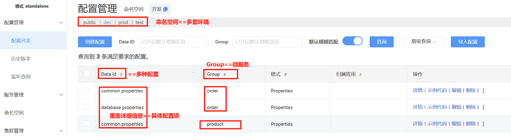
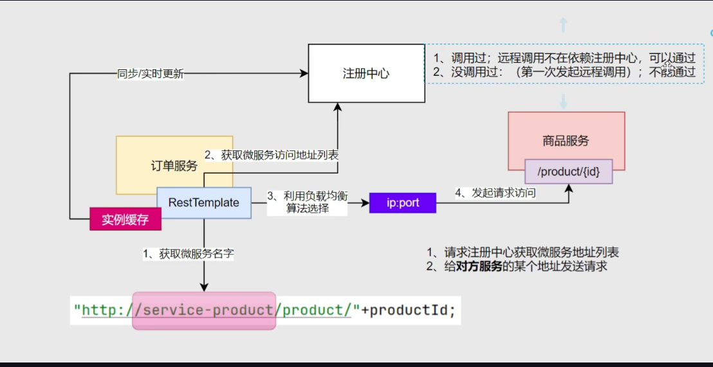

## Nacos安装
官网 ：[<font style="color:rgb(68, 147, 248);">Nacos官网</font>](https://nacos.io/)

启动命令：`startup.cmd -m standalone`

nacos是注册中心，服务启动时，会向nacos注册，nacos会记录服务的地址，服务下线时，会从nacos中删除服务地址。

## Nacos服务注册
+ 引入 spring-boot-starter-web、spring-cloud-starter-alibaba-nacos-discovery 依赖
+ 编写主启动类，编写配置文件
+ 配置 Naocs 地址

```yaml
spring:
  cloud:
    nacos:
      # 配置 Nacos 地址
      server-addr: 127.0.0.1:8848
```

+ 启动微服务，查看注册中心效果，访问 [http://localhost:8848/nacos/](http://localhost:8848/nacos/)

## Nacos服务发现
开启服务发现，在主启动类上添加 `@EnableDiscoveryClient` 注解

注： 

+ Spring Cloud 2020.0.0  版本之后，可以不加这个注解，但加了更兼容，更稳妥。
+ 为什么可以不加（原理一句话）

只要满足两点：

        1. 引入了 `spring-cloud-starter-alibaba-nacos-discovery`
        2. 配置了 `spring.cloud.nacos.discovery.server-addr`

Spring Boot 自动配置会自动开启服务注册与发现，不需要任何注解。

作用： 让当前服务注册到 Nacos 注册中心，同时让当前服务能发现注册中心里的其他所有服务，实现服务间自动发现、自动调用。  


## 配置中心
导入依赖：

```xml
<dependency>
  <groupId>com.alibaba.cloud</groupId>
  <artifactId>spring-cloud-starter-alibaba-nacos-config</artifactId>
</dependency>     
```

引入依赖但未使用配置中心需要关闭配置检查：

```yaml
spring:
    cloud:
      nacos:
        config:
          import-check:
            enabled: false
```

配置中心的动态刷新步骤：

+ `@Value("${xx}")` 获取配置 + `@RefreshScope(加在类上面)` 实现动态刷新
+ `@ConfigurationProperties(加在配置属性的类上面)` 无感自动刷新
+ `NacosConfigManager(添加ApplicationRunner的Bean)` 监听配置变化

## 数据中心配置隔离
<!-- 这是一张图片，ocr 内容为： -->


```yaml
server:
  port: 8000
spring:
  profiles:
    active: prod #指定命名空间
  application:
    name: service-order
  cloud:
    nacos:
      server-addr: 127.0.0.1:8848
      config:
        import-check:
          enabled: false
        namespace: ${spring.profiles.active:public} #默认是public

---
spring:
  config:
    import:
      - nacos:common.properties?group=order
      - nacos:database.properties?group=order
    activate:
      on-profile: dev #命名空间配置

---
spring:
  config:
    import:
      - nacos:common.properties?group=order
      - nacos:database.properties?group=order
      - nacos:haha.properties?group=order
    activate:
      on-profile: test

---
spring:
  config:
    import:
      - nacos:common.properties?group=order
      - nacos:database.properties?group=order
      - nacos:hehe.properties?group=order
    activate:
      on-profile: prod
```

## 经典面试题
1.注册中心宕机，远程调用还能成功吗？

+ Nacos存在实例缓存，不必每次都去请求Nacos服务发现。  
在实例更新/新增时，更新缓存。同时避免Nacos挂掉后，整个远程服务不可用。 
+ 如果一次远程调用都没有发起，则远程调用失败

<!-- 这是一张图片，ocr 内容为： -->



2.思考：配置文件和Nacos中的配置重复了，哪个生效？  
从设计的角度，以配置中心为准，不然就达不到配置管理、不重启服务生效的功能

配置文件存在优先级：先导入优先，外部优先
