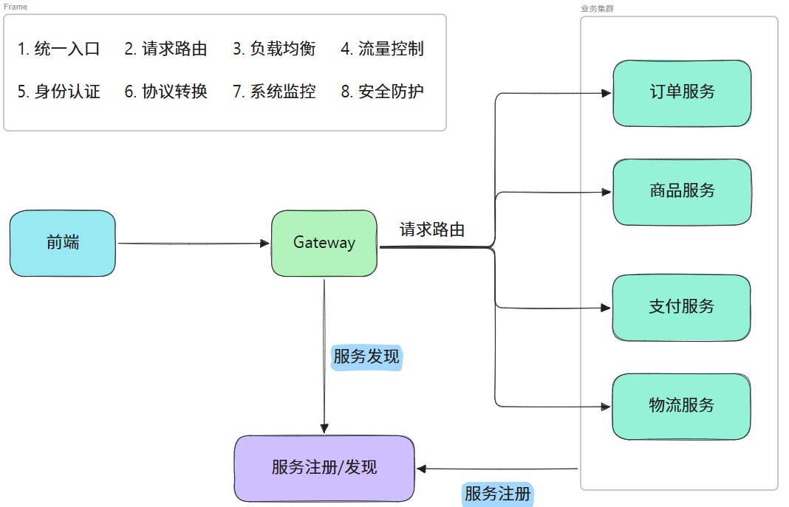
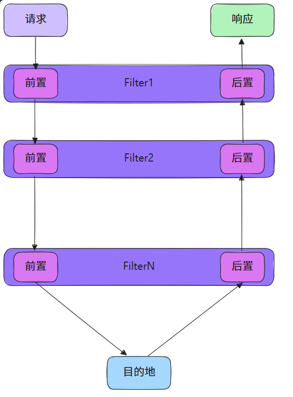
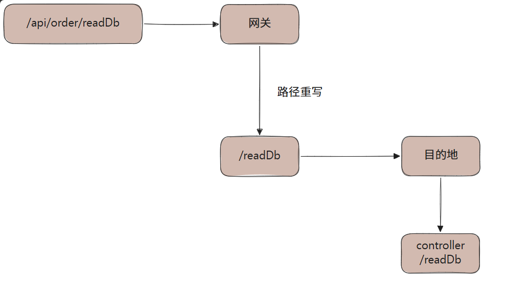

:::v-pre
<!-- 这是一张图片，ocr 内容为： -->


1. 外部客户端流量（前端/小程序/H5）

客户端 → 网关Gateway → 网关根据路由规则转发 → 目标业务微服务

2. 微服务内部互相远程调用（订单调用户、库存调支付）

服务A → 注册中心(Nacos)拉取服务B实例列表 → 直连服务B，全程不经过网关

## 路由
**建立gateway微服务**

**改pom**

```xml
<dependencies>
  <dependency>
    <groupId>org.springframework.cloud</groupId>
    <artifactId>spring-cloud-starter-gateway</artifactId>
  </dependency>
  <dependency>
    <groupId>com.alibaba.cloud</groupId>
    <artifactId>spring-cloud-starter-alibaba-nacos-discovery</artifactId>
  </dependency>
  <dependency>
    <groupId>org.springframework.cloud</groupId>
    <artifactId>spring-cloud-starter-loadbalancer</artifactId>
  </dependency>
  <dependency>
    <groupId>org.projectlombok</groupId>
    <artifactId>lombok</artifactId>
    <scope>annotationProcessor</scope>
  </dependency>
</dependencies>
```

**写路由规则**

```yaml
# 主yaml
spring:
  application:
    name: gateway
  cloud:
    nacos:
      discovery:
        server-addr: 127.0.0.1:8848
  profiles:
    include: route #使用路由规则yaml
server:
  port: 80
```
```yaml
# 路由规则yaml
spring:
  cloud:
    gateway:
      routes:
        - id: bing-route
          uri: https://cn.bing.com
          predicates:
            - Path=/**
          order: 10
          # id 全局唯一
        - id: order-route
          # 指定服务名称
          uri: lb://service-order
          # 指定断言规则，即路由匹配规则
          predicates:
            - Path=/api/order/**
          order: 1
        - id: product-route
          uri: lb://service-product
          predicates:
            - Path=/api/product/**
          order: 2
```

## 断言
官方文档：[Route Predicate Factories](https://docs.spring.io/spring-cloud-gateway/reference/spring-cloud-gateway/request-predicates-factories.html)

断言的两种书写方式：

```yaml
spring:
  cloud:
    gateway:
      routes:
          # id 全局唯一
        - id: order-route
          # 指定服务名称
          uri: lb://service-order
          # 指定断言规则，即路由匹配规则
          # Fully Expanded Arguments
          predicates:
            - name: Path
              args:
                patterns: /api/order/**
                matchTrailingSlash: true
        - id: product-route
          uri: lb://service-product
          # Shortcut Configuration
          predicates:
            - Path=/api/product/**
```

在 Spring Cloud Gateway 的实现中，断言的实现都是 `RoutePredicateFactory` 接口的实现。

因此除了直接查看官方文档外确定有哪些断言形式外，还可以通过查看 `RoutePredicateFactory` 的实现：

+ `HeaderRoutePredicateFactory`
+ `PathRoutePredicateFactory`
+ `ReadBodyRoutePredicateFactory`
+ `BeforeRoutePredicateFactory`
+ ...

断言的名称可以通过去掉实现类名后的 `RoutePredicateFactory` 来确定，比如 `HeaderRoutePredicateFactory` 对应名为 `Header` 的断言。


| **<font style="color:rgb(240, 246, 252);">名称</font>** | **<font style="color:rgb(240, 246, 252);">参数（个数/类型）</font>** | **<font style="color:rgb(240, 246, 252);">作用</font>** |
| --- | --- | --- |
| <font style="color:rgb(240, 246, 252);">After</font> | <font style="color:rgb(240, 246, 252);">1/datetime</font> | <font style="color:rgb(240, 246, 252);">在指定时间之后</font> |
| <font style="color:rgb(240, 246, 252);">Before</font> | <font style="color:rgb(240, 246, 252);">1/datetime</font> | <font style="color:rgb(240, 246, 252);">在指定时间之前</font> |
| <font style="color:rgb(240, 246, 252);">Between</font> | <font style="color:rgb(240, 246, 252);">2/datetime</font> | <font style="color:rgb(240, 246, 252);">在指定时间区间内</font> |
| <font style="color:rgb(240, 246, 252);">Cookie</font> | <font style="color:rgb(240, 246, 252);">2/string,regexp</font> | <font style="color:rgb(240, 246, 252);">包含 cookie 名且必须匹配指定值</font> |
| <font style="color:rgb(240, 246, 252);">Header</font> | <font style="color:rgb(240, 246, 252);">2/string,regexp</font> | <font style="color:rgb(240, 246, 252);">包含请求头且必须匹配指定值</font> |
| <font style="color:rgb(240, 246, 252);">Host</font> | <font style="color:rgb(240, 246, 252);">N/string</font> | <font style="color:rgb(240, 246, 252);">请求 host 必须是指定枚举值</font> |
| <font style="color:rgb(240, 246, 252);">Method</font> | <font style="color:rgb(240, 246, 252);">N/string</font> | <font style="color:rgb(240, 246, 252);">请求方式必须是指定枚举值</font> |
| <font style="color:rgb(240, 246, 252);">Path</font> | <font style="color:rgb(240, 246, 252);">2/List<String>,bool</font> | <font style="color:rgb(240, 246, 252);">请求路径满足规则，是否匹配最后的</font><font style="color:rgb(240, 246, 252);"> </font>`<font style="color:rgb(240, 246, 252);background-color:rgba(101, 108, 118, 0.2);">/</font>` |
| <font style="color:rgb(240, 246, 252);">Query</font> | <font style="color:rgb(240, 246, 252);">2/string,regexp</font> | <font style="color:rgb(240, 246, 252);">包含指定请求参数</font> |
| <font style="color:rgb(240, 246, 252);">RemoteAddr</font> | <font style="color:rgb(240, 246, 252);">1/List<String></font> | <font style="color:rgb(240, 246, 252);">请求来源于指定网络域（CIDR写法）</font> |
| <font style="color:rgb(240, 246, 252);">Weight</font> | <font style="color:rgb(240, 246, 252);">2/string,int</font> | <font style="color:rgb(240, 246, 252);">按指定权重负载均衡</font> |
| <font style="color:rgb(240, 246, 252);">XForwardedRemoteAddr</font> | <font style="color:rgb(240, 246, 252);">1/List<String></font> | <font style="color:rgb(240, 246, 252);">从</font><font style="color:rgb(240, 246, 252);"> </font>`<font style="color:rgb(240, 246, 252);background-color:rgba(101, 108, 118, 0.2);">X-Forwarded-For</font>`<br/><font style="color:rgb(240, 246, 252);"> </font><font style="color:rgb(240, 246, 252);">请求头中解析请求来源，并判断是否来源于指定网络域</font> |


以 `Query` 为例：

```yaml
spring:
  cloud:
    gateway:
      routes:
        - id: bing-route
          uri: https://cn.bing.com
          predicates:
            - name: Path
              args:
                patterns: /search
            - name: Query
              args:
                param: q
                regexp: haha
```

这表示：访问网关的 `/search` 地址，并且使用了名为 `q` 的请求参数，且值为 `haha`，才会将请求转到 `https://cn.bing.com`。

尽管 Gateway 内置了许多断言规则，但依旧难以满足千变万化的需求。

在上述规则的基础上，再指定一个名为 `Vip` 的断言规则，要求存在名为 `user` 的请求参数，并且值为 `mofan` 时才将请求跳转到 `https://cn.bing.com`：

```yaml
spring:
  cloud:
    gateway:
      routes:
        - id: bing-route
          uri: https://cn.bing.com
          predicates:
            - name: Path
              args:
                patterns: /search
            - name: Query
              args:
                param: q
                regexp: haha
            - Vip=user,mofan
```

自定义 `AbstractRoutePredicateFactory` 实现类 `VipRoutePredicateFactory`：

```java
/**
 * @author mofan
 * @date 2025/4/29 22:49
 */
@Component
public class VipRoutePredicateFactory extends AbstractRoutePredicateFactory<VipRoutePredicateFactory.Config> {


    public VipRoutePredicateFactory() {
        super(Config.class);
    }

    @Override
    public List<String> shortcutFieldOrder() {
        return List.of("param", "value");
    }

    @Override
    public Predicate<ServerWebExchange> apply(Config config) {
        return (GatewayPredicate) serverWebExchange -> {
            // localhost/search?q=haha&user=mofan
            ServerHttpRequest request = serverWebExchange.getRequest();
            String first = request.getQueryParams().getFirst(config.param);
            return StringUtils.hasText(first) && first.equals(config.value);
        };
    }

    @Validated
    @Getter
    @Setter
    public static class Config {
        @NotEmpty
        private String param;
        @NotEmpty
        private String value;
    }
}
```

然后访问 `http://localhost/search?q=haha&user=mofan` 时，会跳转到 Bing 搜索 `haha`。


## 过滤器
官方文档：[GatewayFilter Factories](https://docs.spring.io/spring-cloud-gateway/reference/spring-cloud-gateway/gatewayfilter-factories.html)

<!-- 这是一张图片，ocr 内容为： -->


先前在网关中配置了将 `/api/order/` 开头的请求转到 `service-order` 服务，并要求在 `service-order` 服务中也存在 `/api/order/` 开头的请求路径，比如 `/api/order/readDb`。如果该服务中原先并不存在 `/api/order/` 开头的请求，比如只有 `/readDb`，那么在以 `/api/order/readDb` 进行访问就会出现 404 错误。

为了解决这个问题，可以在 `service-order` 服务对应的 Controller 上添加 `@RequestMapping("/api/order")` 注解，但这并不是最佳方案，如果能直接在网关层面解决这个问题就好了，就像把 `/api/order/readDb` 重写为 `/readDb`。

Gateway 中内置了许多过滤器，其中有一个常用的过滤器名为：`RewritePath`，即路径重写。

<!-- 这是一张图片，ocr 内容为： -->


```yaml
spring:
  cloud:
    gateway:
      routes:
          # id 全局唯一
        - id: order-route
          # 指定服务名称
          uri: lb://service-order
          # 指定断言规则，即路由匹配规则
          # Fully Expanded Arguments
          predicates:
            - name: Path
              args:
                patterns: /api/order/**
                matchTrailingSlash: true
          filters:
            # 类似把 /api/order/a/bc 重写为 /a/bc，移除路径前的 /api/order/
            - RewritePath=/api/order/?(?<segment>.*), /$\{segment}
          order: 1
        - id: product-route
          uri: lb://service-product
          # Shortcut Configuration
          predicates:
            - Path=/api/product/**
          filters:
            - RewritePath=/api/product/?(?<segment>.*), /$\{segment}
          order: 2
```

默认过滤器

如果需要为所有路由都添加同一个过滤器，则可以使用 默认过滤器，比如：

```yaml
spring:
  cloud:
    gateway:
      default-filters:
        # 为所有路由添加响应头过滤器
        - AddResponseHeader=X-Response-Abc, 123
```

---

**全局过滤器**

除了默认过滤器，全局过滤器也能为所有匹配的路由添加一个过滤器，全局过滤器的配置无需修改配置文件。

实现 `GlobalFilter` 接口，并将实现类交由 Spring 管理，即可实现全局过滤器。

还可以实现 `Ordered` 接口，调整多个全局过滤器的执行顺序。

```java
/**
 * @author mofan
 * @date 2025/5/1 13:49
 */
@Slf4j
@Component
public class RtGlobalFilter implements GlobalFilter, Ordered {
    @Override
    public Mono<Void> filter(ServerWebExchange exchange, GatewayFilterChain chain) {
        ServerHttpRequest request = exchange.getRequest();
        String uri = request.getURI().toString();
        long start = System.currentTimeMillis();
        log.info("请求 [{}] 开始，时间：{}", uri, start);
        return chain.filter(exchange)
        .doFinally(res -> {
            long end = System.currentTimeMillis();
            log.info("请求 [{}] 结束，时间：{}，耗时：{}ms", uri, start, end - start);
        });
    }

    @Override
    public int getOrder() {
        return 0;
    }
}
```

---

**自定义过滤器工厂**

尽管 Gateway 内置了许多过滤器，但仍有无法满足需求的情况，此时就需要自定义过滤器工厂。

与自定义断言类似，自定义过滤器工厂的类名也有限制，要求以 `GatewayFilterFactory` 结尾，而配置文件中配置的名称就是类名开头。

比如需要在配置文件中定义名为 `OnceToken` 的过滤器，那么需要新增 `OnceTokenGatewayFilterFactory`：

```java
/**
 * @author mofan
 * @date 2025/5/1 14:24
 */
@Component
public class OnceTokenGatewayFilterFactory extends AbstractNameValueGatewayFilterFactory {
    @Override
    public GatewayFilter apply(NameValueConfig config) {
        return (exchange, chain) -> chain.filter(exchange).then(Mono.fromRunnable(() -> {
            ServerHttpResponse response = exchange.getResponse();

            String value = switch (config.getValue().toLowerCase()) {
                case "uuid" -> UUID.randomUUID().toString();
                case "jwt" -> "Test Token";
                default -> "";
            };

            HttpHeaders headers = response.getHeaders();
            headers.add(config.getName(), value);
        }));
    }
}
```

```yaml
spring:
  cloud:
    gateway:
      routes:
        - id: order-route
          uri: lb://service-order
          filters:
            # 自定义过滤器
            - OnceToken=X-Response-Token, uuid
```

  

 

## 全局跨域
如果需要配置跨域，可以在 Controller 的类上添加 `@CrossOrigin` 注解。

如果有许多 Controller，逐一添加注解太麻烦，可以在项目的配置类中添加 `CorsFilter` 类型的 Bean。

上述方法只适用于单体服务，那如果在微服务中呢？

借由 Gateway 的功能，可以在配置文件中轻松完成微服务的跨域配置：

```yaml
spring:
  cloud:
    gateway:
      globalcors:
        cors-configurations:
          '[/**]':
            allowed-origin-patterns: '*'
            allowed-headers: '*'
            allowedMethods: '*'
```

之后在请求的 Response Headers 中会增加一些允许跨域的信息。
:::
