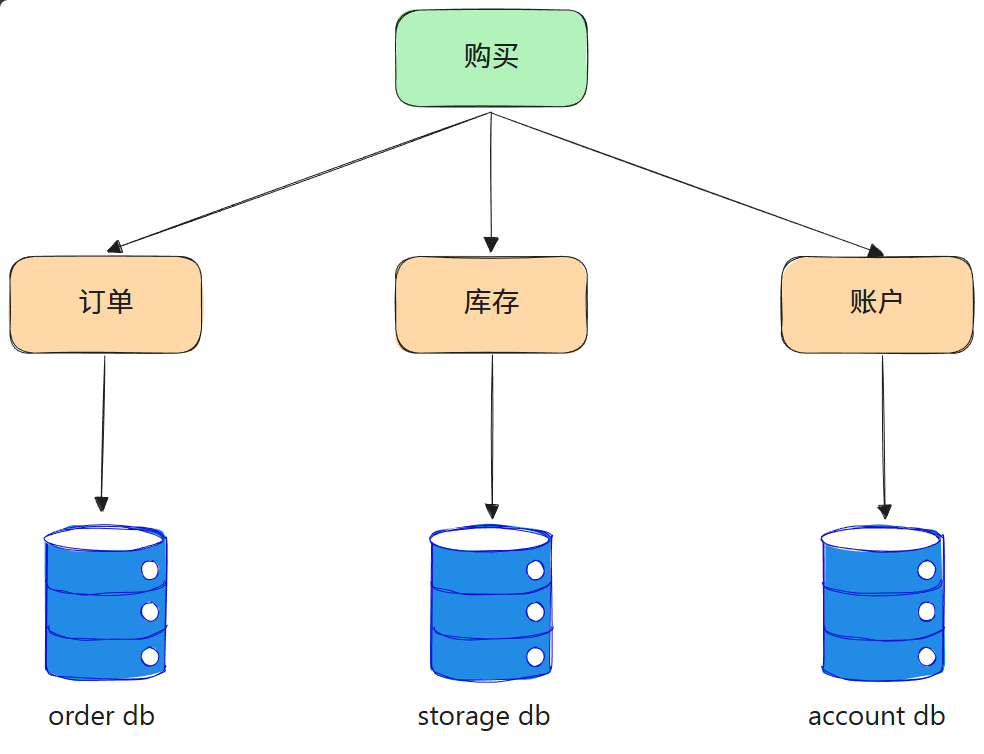
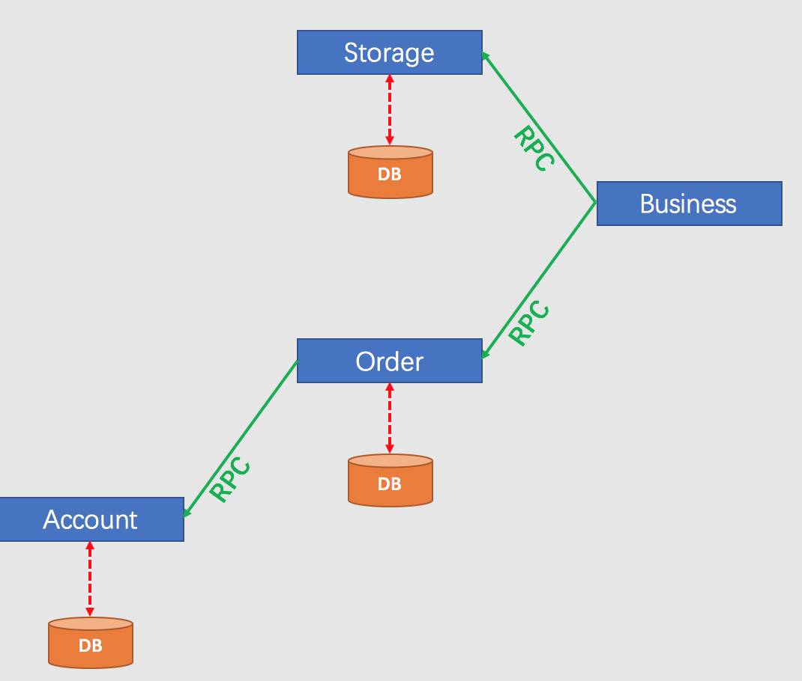
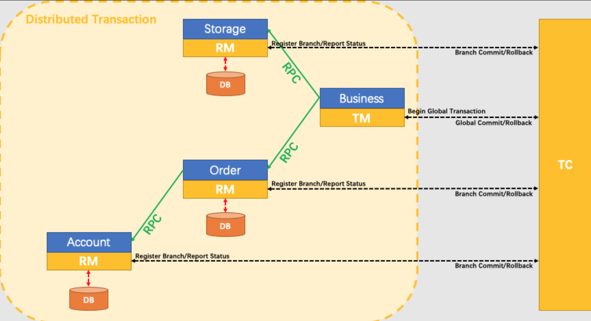
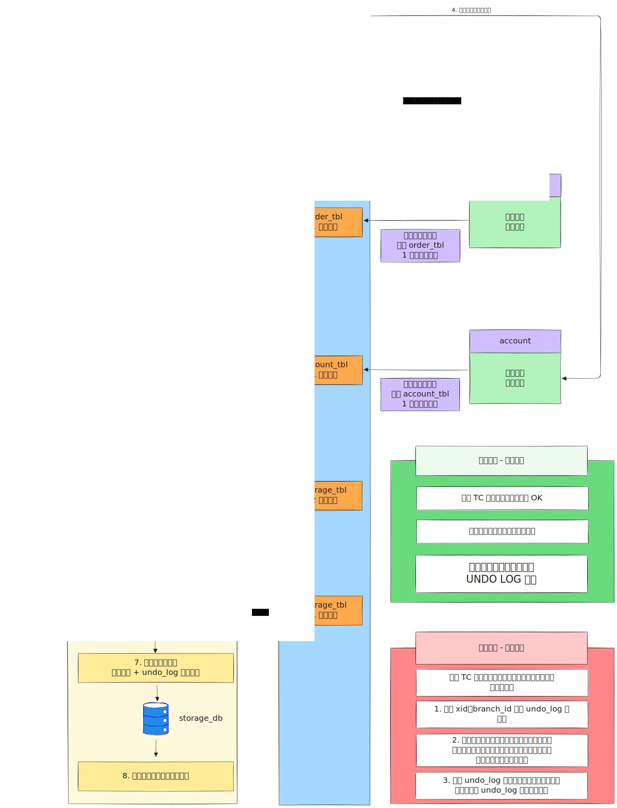

## 1.简单使用
在微服务项目中，一个操作往往会涉及多个不同的服务，每个服务又会连接不同的数据库：

<!-- 这是一张图片，ocr 内容为： -->


此时应该如何保证多个事务的统一提交和统一回滚呢？

[Seata](https://seata.apache.org/zh-cn/) 是一款开源的分布式事务解决方案，致力于在微服务架构下提供高性能和简单易用的分布式事务服务。

现有如下交易流程：

<!-- 这是一张图片，ocr 内容为： -->


发起采购流程后，需要扣库存、生成订单、从账户中扣除指定金额，任一流程发生异常时，整个流程应当回滚。

<!-- 这是一张图片，ocr 内容为： -->


+ TC：Transaction Coordinator，即事务协调者。维护全局和分支事务的状态，驱动全局事务提交或回滚；
+ TM：Transaction Manager，即事务管理器。定义全局事务的范围，开始全局事务、提交或回滚全局事务；
+ RM：Resource Manager，即资源管理器。管理分支事务处理的资源，与 TC 交谈以注册分支事务和报告分支事务的状态，并驱动分支事务提交或回滚。

[下载](https://seata.apache.org/zh-cn/download/seata-server)并解压 Seata 后，进入 `bin` 目录，使用 `seata-server.bat` 命令启动 Seata。

下载的 Seata 版本保证与 pom 文件中引入的 `spring-cloud-alibaba-dependencies` 依赖中的 Seata 版本一致。

在需要使用分布式事务的模块中添加依赖：

```xml
<dependency>
  <groupId>com.alibaba.cloud</groupId>
  <artifactId>spring-cloud-starter-alibaba-seata</artifactId>
</dependency>
```

在需要使用 Seata 的模块的**resources**中添加 Seata 的配置文件 `file.conf` ：

```plain
service {
  #transaction service group mapping
  vgroupMapping.default_tx_group = "default"
  #only support when registry.type=file, please don't set multiple addresses
  default.grouplist = "127.0.0.1:8091"
  #degrade, current not support
  enableDegrade = false
  #disable seata
  disableGlobalTransaction = false
}
```

最后在最顶端的方法入口上使用 `@GlobalTransactional` 注解，由此开启全局事务。

<!-- 这是一张图片，ocr 内容为： -->



## 2.生产部署
**步骤 1：建库建表**

① 新建 seata 库，执行 3 张系统表

```sql
CREATE DATABASE seata DEFAULT CHARSET utf8mb4;

USE seata;

-- 全局事务表
CREATE TABLE `global_table` (
  `xid` varchar(128) NOT NULL,
  `transaction_id` bigint DEFAULT NULL,
  `status` tinyint NOT NULL,
  `application_id` varchar(32) DEFAULT NULL,
  `transaction_service_group` varchar(32) DEFAULT NULL,
  `transaction_name` varchar(128) DEFAULT NULL,
  `timeout` int DEFAULT NULL,
  `begin_time` bigint DEFAULT NULL,
  `application_data` varchar(2000) DEFAULT NULL,
  `gmt_create` datetime DEFAULT NULL,
  `gmt_modified` datetime DEFAULT NULL,
  PRIMARY KEY (`xid`),
  KEY idx_status (status),
  KEY idx_transaction_id (transaction_id)
) ENGINE=InnoDB DEFAULT CHARSET=utf8mb4;

-- 分支事务表
CREATE TABLE `branch_table` (
  `branch_id` bigint NOT NULL,
  `xid` varchar(128) NOT NULL,
  `transaction_id` bigint DEFAULT NULL,
  `resource_group_id` varchar(32) DEFAULT NULL,
  `resource_id` varchar(256) DEFAULT NULL,
  `branch_type` varchar(8) DEFAULT NULL,
  `status` tinyint DEFAULT NULL,
  `client_id` varchar(64) DEFAULT NULL,
  `application_data` varchar(2000) DEFAULT NULL,
  `gmt_create` datetime DEFAULT NULL,
  `gmt_modified` datetime DEFAULT NULL,
  PRIMARY KEY (`branch_id`),
  KEY idx_xid (xid)
) ENGINE=InnoDB DEFAULT CHARSET=utf8mb4;

-- 全局锁表
CREATE TABLE `lock_table` (
  `row_key` varchar(128) NOT NULL,
  `xid` varchar(128) DEFAULT NULL,
  `transaction_id` bigint DEFAULT NULL,
  `branch_id` bigint DEFAULT NULL,
  `resource_id` varchar(256) DEFAULT NULL,
  `table_name` varchar(32) DEFAULT NULL,
  `pk` varchar(36) DEFAULT NULL,
  `gmt_create` datetime DEFAULT NULL,
  `gmt_modified` datetime DEFAULT NULL,
  PRIMARY KEY (`row_key`),
  KEY idx_branch_id (branch_id)
) ENGINE=InnoDB DEFAULT CHARSET=utf8mb4;
```

**② 每个业务库都必须建 undo_log（订单库、库存库、账户库…）**

```plsql
CREATE TABLE `undo_log` (
  `id` bigint NOT NULL AUTO_INCREMENT,
  `branch_id` bigint NOT NULL,
  `xid` varchar(100) NOT NULL,
  `context` varchar(128) NOT NULL,
  `rollback_info` longblob NOT NULL,
  `log_status` int NOT NULL,
  `log_created` datetime NOT NULL,
  `log_modified` datetime NOT NULL,
  `ext` varchar(100) DEFAULT NULL,
  PRIMARY KEY (`id`),
  UNIQUE KEY ux_undo_log (xid,branch_id)
) ENGINE=InnoDB DEFAULT CHARSET=utf8mb4;
```

---

**步骤 2：部署 Seata Server**

修改 application.yml

```yaml
server:
  port: 8091

spring:
  application:
    name: seata-server

seata:
  # 配置中心
  config:
    type: nacos
    nacos:
      server-addr: 127.0.0.1:8848
      namespace:
      group: SEATA_GROUP

  # 注册中心
  registry:
    type: nacos
    nacos:
      server-addr: 127.0.0.1:8848
      application: seata-server
      group: SEATA_GROUP

  # 存储模式（企业必须 DB）
  store:
    mode: db
    db:
      datasource: druid
      db-type: mysql
      driver-class-name: com.mysql.cj.jdbc.Driver
      url: jdbc:mysql://localhost:3306/seata?useUnicode=true&rewriteBatchedStatements=true
      user: root
      password: xxx
      global-table: global_table
      branch-table: branch_table
      lock-table: lock_table
```

**启动 Seata Server**


```bash
seata-server.bat
# 或 Linux
sh seata-server.sh
```

**步骤 3：微服务接入**

① 依赖（所有参与分布式事务的服务都加）

```xml
<dependency>
  <groupId>com.alibaba.cloud</groupId>
  <artifactId>spring-cloud-starter-alibaba-seata</artifactId>
</dependency>
```

② application.yml 配置（企业标准写法）

```yaml
seata:
  enabled: true
  # 事务组（企业一般按项目命名）
  tx-service-group: my_project_tx_group
  # 自动代理数据源（AT模式必须）
  enable-auto-data-source-proxy: true
  data-source-proxy-mode: AT

  # 注册中心
  registry:
    type: nacos
    nacos:
      server-addr: 127.0.0.1:8848
      group: SEATA_GROUP

  # 事务组映射
  service:
    vgroup-mapping:
      my_project_tx_group: default
```

---

**步骤 4：代码使用**

事务发起方（TM）：只在入口加 @GlobalTransactional

```java
@Service
public class OrderServiceImpl {

    @Autowired
    private StockClient stockClient;

    @Autowired
    private AccountClient accountClient;

    // 全局分布式事务
    @GlobalTransactional(rollbackFor = Exception.class)
    public void createOrder(Order order) {
        // 1. 本地创建订单
        orderMapper.insert(order);

        // 2. 远程扣库存
        stockClient.deductStock(order.getGoodsId(), order.getNum());

        // 3. 远程扣余额
        accountClient.deductBalance(order.getUserId(), order.getAmount());

        // 任意抛异常 → 全部回滚
    }
}
```

其他服务（RM）：正常写 @Transactional 即可

不需要任何 Seata 注解。
