## 工作原理
随着微服务的流行，服务和服务之间的稳定性变得越来越重要。Spring Cloud Alibaba Sentinel 以流量为切入点，从流量控制、流量路由、熔断降级、系统自适应过载保护、热点流量防护等多个维度保护服务的稳定性。

<!-- 这是一张图片，ocr 内容为： -->
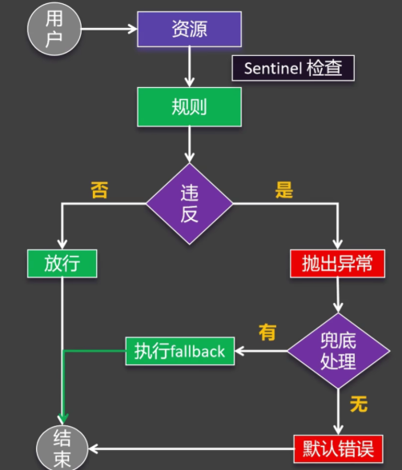

定义资源：

+ 流量控制（FlowRule）
+ 熔断降级（DegradeRule）
+ 系统保护（SystemRule）
+ 来源访问控制（AuthorityRule）
+ 热点参数（ParamFlowRule）

## 项目整合
> 启动 Dashboard
>
>

前往 Sentinel GitHub Realease 页下载 Sentinel Dashboard，这里选择 1.8.8 版本，因此下载 `sentinel-dashboard-1.8.8.jar`。

在 `sentinel-dashboard-1.8.8.jar` 所在的目录运行以下命令，启动 Dashboard：

java -jar sentinel-dashboard-1.8.8.jar

启动完成后，浏览器访问 `http://localhost:8080/`，默认用户与密码均为 `sentinel`。

> 服务整合 Sentinel
>
>

引入依赖：

```xml
<dependency>
  <groupId>com.alibaba.cloud</groupId>
  <artifactId>spring-cloud-starter-alibaba-sentinel</artifactId>
</dependency>
```

配置文件中添加：

```yaml
spring:
  application:
    name: service-product
  cloud:
    sentinel:
      transport:
        # 控制台地址
        dashboard: localhost:8080
      # 立即加载服务  
      eager: true
```

配置完成后启动对应服务，再前往 Sentinel Dashboard 查看，能够看到对应服务信息。

可以在一个方法上使用 `@SentinelResource` 注解，将其标记为一个「资源」，当方法被调用时，能够在 Dashboard 的「簇点链路」上找到对应的资源，之后在界面上完成对资源的流控、熔断、热点、授权等操作。

<font style="color:rgb(77, 77, 77);">簇点链路中的链路来自于几种资源：</font>

1. <font style="color:rgb(51, 51, 51);">主流框架自动适配（例如：web请求）</font>
2. <font style="color:rgb(51, 51, 51);">声明式 Sphu API(不常用)</font>
3. <font style="color:rgb(51, 51, 51);">声明式：@SentinelResource</font>

## 异常处理
<!-- 这是一张图片，ocr 内容为： -->
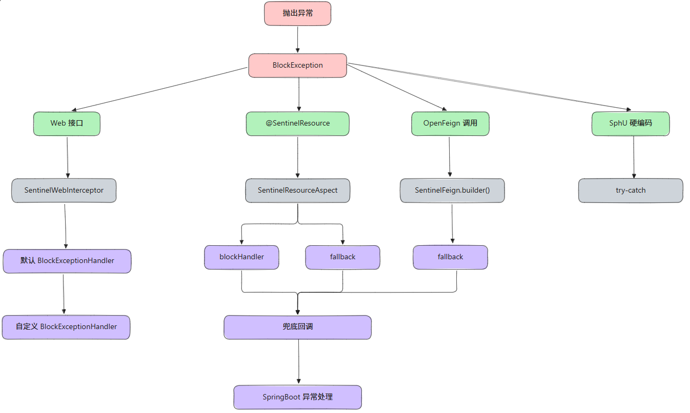


---

> **Web 接口资源**
>

当 Web 接口作为资源被流控时，默认情况下会在页面显示：

```plain
Blocked by Sentinel (flow limiting)
```

如果需要自定义异常处理，可以实现 `BlockExceptionHandler` 接口，并将实现类交给 Spring 管理：

```java
@Component
public class MyBlockExceptionHandler implements BlockExceptionHandler {

    private final ObjectMapper objectMapper;

    public MyBlockExceptionHandler(ObjectMapper objectMapper) {
        this.objectMapper = objectMapper;
    }

    @Override
    public void handle(HttpServletRequest request,
                       HttpServletResponse response,
                       String resourceName,
                       BlockException e) throws Exception {
        response.setContentType("application/json;charset=utf-8");
        PrintWriter writer = response.getWriter();

        R error = R.error(500, resourceName + " 被 Sentinel 限制了, 原因: " + e.getClass());

        String json = objectMapper.writeValueAsString(error);
        writer.write(json);

        writer.flush();
        writer.close();
    }
}
```

以 `/create` 接口为例，当其被流控时，页面显示：

```plain
{
    "code": 500,
    "message": "/create 被 Sentinel 限制了, 原因: class com.alibaba.csp.sentinel.slots.block.flow.FlowException",
    "data": null
}
```


---

> `**@SentinelResource**`**资源**
>

当 `@SentinelResource` 注解标记的资源被流控时，默认返回 500 错误页。

如果需要自定义异常处理，一般可以增加 `@SentinelResource` 注解的以下任意配置：

+ `blockHandler`
+ `fallback`
+ `defaultFallback`

以 `blockHandler` 为例：

```java
@SentinelResource(value = "createOrder", blockHandler = "createOrderFallback")
public Order createOrder(Long productId, Long userId) {
    // --snip--
}
```

在当前类中创建名称为 `<font style="color:#601BDE;">blockHandler</font>`<font style="color:#601BDE;"> </font>值的方法，并且返回值类型、参数信息与 `@SentinelResource` 标记的方法一致（可以额外增加一个 `<font style="color:#74B602;">BlockException</font>`<font style="color:#74B602;"> </font>类型的参数）：

```java
/**
 * 指定兜底回调
 */
public Order createOrderFallback(Long productId, Long userId, BlockException e) {
    Order order = new Order();
    order.setId(0L);
    order.setTotalAmount(new BigDecimal("0"));
    order.setUserId(userId);
    order.setNickname("未知用户");
    order.setAddress("异常信息: " + e.getClass());
    return order;
}
```

当资源被流控时，执行 `blockHandler` 指定的方法：

```json
{
    "id": 0,
    "totalAmount": 0,
    "userId": 666,
    "nickname": "未知用户",
    "address": "异常信息: class com.alibaba.csp.sentinel.slots.block.flow.FlowException",
    "productList": null
}
```


---

> **Feign 接口**
>

当 Feign 接口作为资源并被流控时，如果调用的 Feign 接口指定了 `fallback`，那么就会使用 Feign 接口的 `fallback` 进行异常处理，否则由 SpringBoot 进行全局异常处理。

## 流控规则
流控，即流量控制（FlowRule），用于限制多余请求，从而保护系统资源不被耗尽。

<!-- 这是一张图片，ocr 内容为： -->
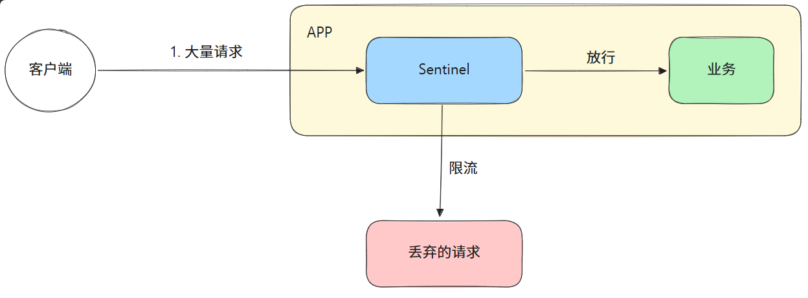

> 阈值类型
>

<!-- 这是一张图片，ocr 内容为： -->


Sentinel 的流控阈值规则有两种：

1. QPS：Queries Per Second，用于限制资源每秒的请求次数，防止突发流量，应用于高频短时接口（如 API 网关）。当每秒的请求数超过设定的阈值时，就会触发流控。比如上图设置的 QPS = 5，就表示每秒最多允许 5 个请求。
2. 并发线程数：用于限制同时处理该资源的线程数（即并发数），保护系统资源（线程池），应用于耗时操作（如数据库查询）。当处理该资源的线程数超过阈值时，就会触发流控。比如设置并发线程数为 5，表示最多允许 5 个线程同时处理该资源。

当勾选「是否集群」时，有两种集群阈值模式可供选择：

1. 单机均摊：将设置的「均摊阈值」均摊到每个节点。以上图为例，假设集群有 3 个节点，那么每个节点的阈值都是 5；
2. 总体阈值：整个集群共享设置的「均摊阈值」。假设集群有 3 个节点，这 3 个节点的的总阈值只有 5，比如按 `2-2-1` 的形式将阈值均摊到每个节点。

> 流控模式
>

<!-- 这是一张图片，ocr 内容为： -->
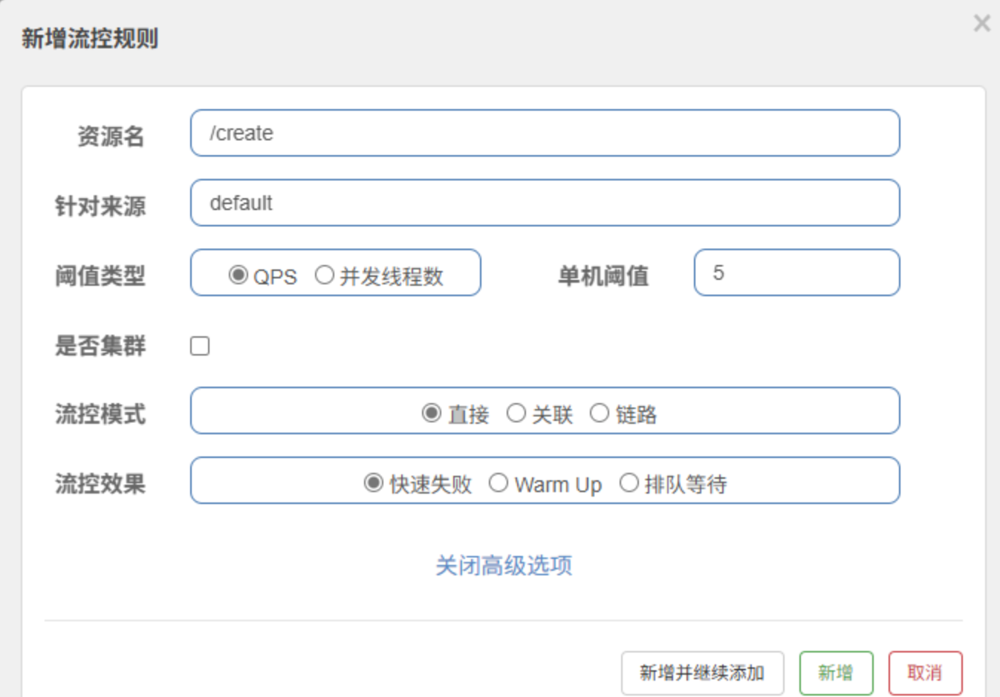

配置流控规则时，可以点击下方的「高级选项」，在这里可以配置「流控模式」，共有三种可选项：

1. 直接：默认选项。
2. 关联：关联资源超阈值时，限流当前资源。
3. 链路：仅对于某一路径下的资源访问生效。使用时需要在配置文件中设置 `spring.cloud.sentinel.web-context-unify=false`。

调用关系包括调用方、被调用方；一个方法又可能会调用其他方法，形成一个调用链路的层次关系；有了调用链路的统计信息，可以衍生出多种流量控制手段。

<!-- 这是一张图片，ocr 内容为： -->
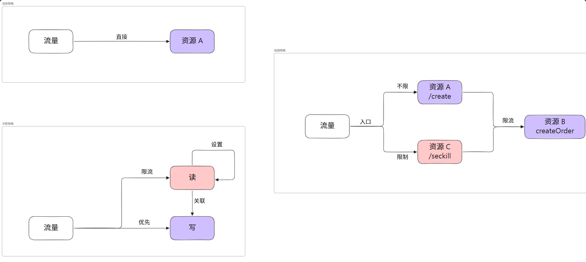


| 维度 | 直接 | 关联 | 链路 |
| --- | --- | --- | --- |
| 作用对象 | 当前资源本身 | 关联的其他资源 | 特定调用链路的入口 |
| 触发逻辑 | 当前资源超阈值 | 关联资源超阈值时，限流当前资源 | 从指定入口发起的请求超阈值 |
| 核心目的 | 保护当前资源 | 保护关联资源或间接限流 | 按入口细分流量控制 |
| 典型场景 | 独立接口的直接限流 | 资源依赖（如读操作限流写操作） | 区分不同调用来源 |
| 配置依赖 | 无需额外配置 | 需指定关联资源 | 需指定资源访问入口 |


> 流控效果
>

打开流控规则中的高级配置后，还可以配置「流控效果」，同样有三种选项：

1. 快速失败：默认选项。注意，只有该选项支持「流控模式」（直接、关联、链路）的设置。
2. Warm Up：初始阈值较低（默认是设定阈值的 13），随后在预热时间内逐步提升至设定阈值。例如设定阈值为 3 QPS、预热时间 3 秒，初始阈值为 1 QPS，3 秒内逐步升至 3。
3. 排队等待：基于漏桶算法，请求进入队列后按固定间隔时间匀速处理。若请求的预期等待时间超过设定的超时时间，则拒绝请求。

<!-- 这是一张图片，ocr 内容为： -->
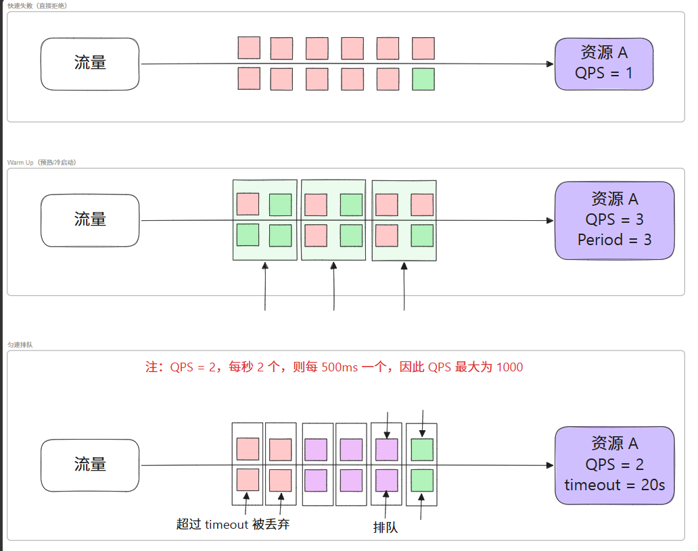

  

 

| 效果 | 核心机制 | 使用场景 | 阈值动态变化 | 流量特征 |
| --- | --- | --- | --- | --- |
| 快速失败 | 直接拒绝超出阈值的请求 | 明确系统处理能力并快速保护 | 固定阈值 | 突发流量 |
| Warm Up | 阈值逐步提升 | 冷启动或流量突增的平滑过渡 | 动态提升 | 逐步增长的流量 |
| 排队等待 | 匀速处理请求 | 服务处理均匀，避免突发压力 | 固定阈值 | 均匀的流量 |


## 熔断规则
熔断规则，即 DegradeRule。

使用熔断规则可以配置熔断降级，用于：

+ 切断不稳定调用
+ 快速返回不积压
+ 避免雪崩效应

最佳实践： 熔断降级作为保护自身的手段，通常在客户端（调用端）进行配置。

熔断降级里的核心组件是「断路器」，其工作原理如下：

<!-- 这是一张图片，ocr 内容为： -->
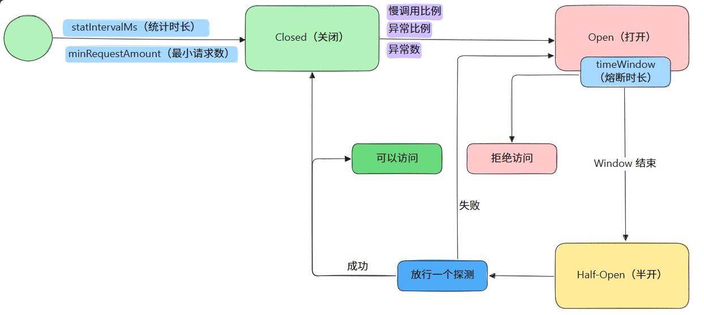

**Sentinel 提供了三种熔断策略：**

1. 慢调用比例
2. 异常比例
3. 异常数


---

> 慢调用比例
>

<!-- 这是一张图片，ocr 内容为： -->
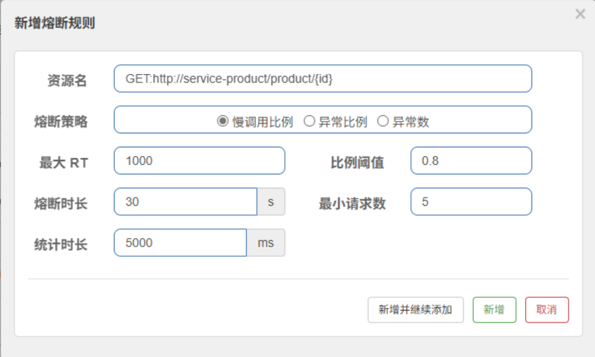

在 5000ms 内，有 80%（0.8 的比例阈值）的请求的最大响应时间超过 1000ms，则进行 30s 的熔断。

如果 5000ms 内，请求数不超过 5，就算达到熔断规则，也不进行熔断。


---

> 异常比例
>

在远程调用的目标接口里添加 `int i = 1 / 0;` 模拟远程调用异常。

此时尚未配置任何熔断规则，然后远程调用存在异常的接口，此时会触发使用 OpenFeign 配置的兜底回调。

换句话说，没有配置任何熔断规则可以触发兜底回调，而配置熔断规则也是为了触发兜底回调，那岂不是配不配置熔断规则都可以？

<!-- 这是一张图片，ocr 内容为： -->
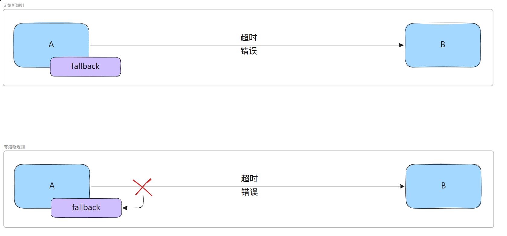

当 A 服务向 B 服务发送请求时，远程调用的 B 服务接口中存在异常，此时触发兜底回调。

在这个过程，由 A 服务发送的请求依旧会打到 B 服务上。

而配置熔断规则后，A 服务发送的请求快速失败，立即出发兜底回调，不会再把请求打到 B 服务上。

<!-- 这是一张图片，ocr 内容为： -->
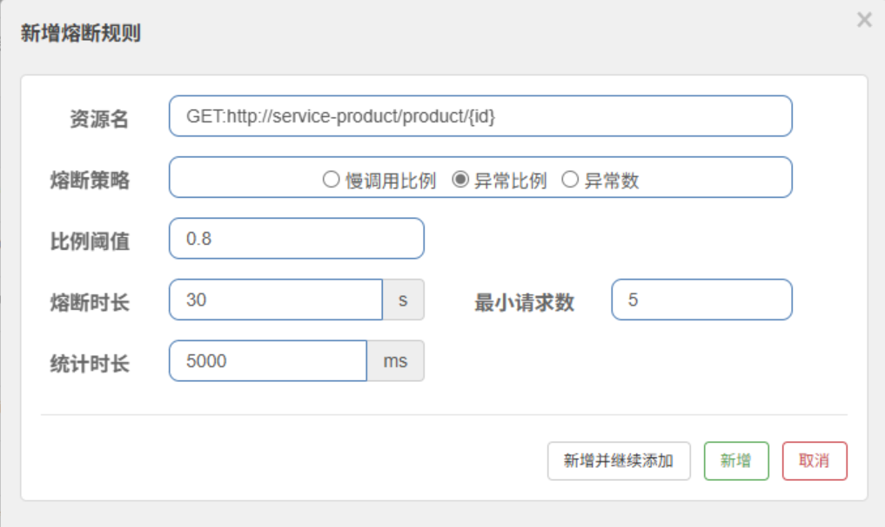

在 5000ms 内，有 80%（0.8 的比例阈值）的请求产生了异常，则进行 30s 的熔断。


---

> 异常数
>

<!-- 这是一张图片，ocr 内容为： -->
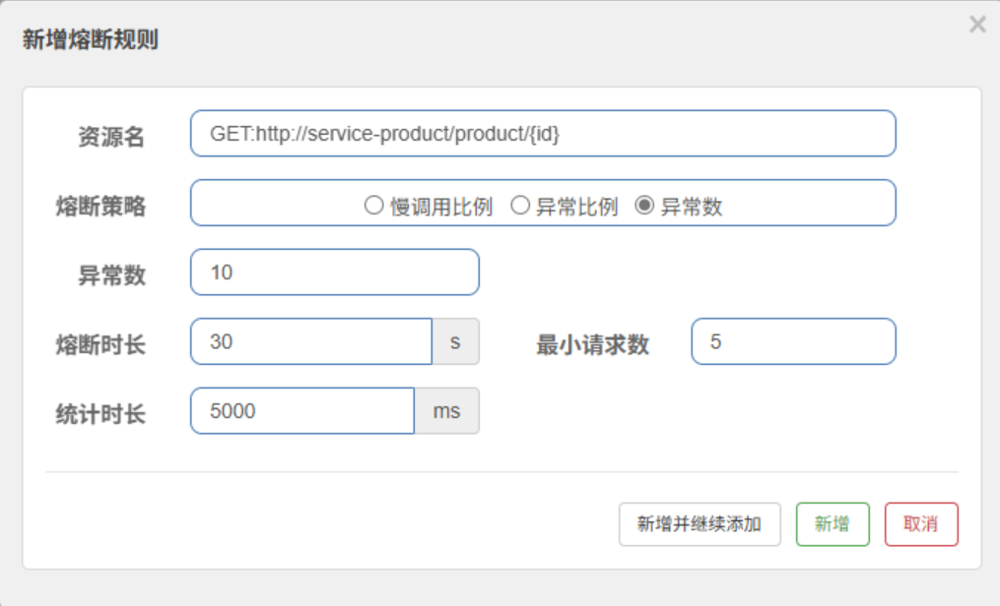

「异常数」的熔断策略与「异常比例」很类似，只不过「异常数」是直接统计异常个数，就算统计时长内产生了一百万个请求，但只要有 10 个请求出现了异常，也会触发熔断。


## 热点规则
所谓热点，即经常访问的数据。很多时候希望统计某个热点数据中访问频次最高的 Top K 数据，并对其访问进行限制。比如：

+ 商品 ID 为参数，统计一段时间内最常购买的商品 ID 并进行限制
+ 用户 ID 为参数，针对一段时间内频繁访问的用户 ID 进行限制

热点参数限流会统计传入参数中的热点参数，并根据配置的限流阈值与模式，对包含热点参数的资源调用进行限流。

热点参数限流可以看做是一种特殊的流量控制，仅对包含热点参数的资源调用生效。

<!-- 这是一张图片，ocr 内容为： -->
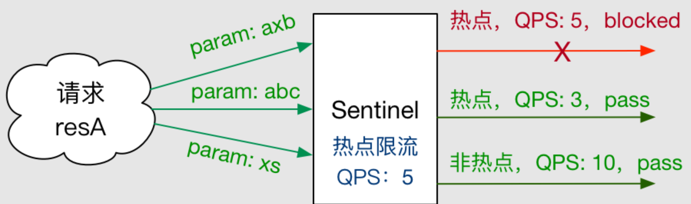

Sentinel 利用 LRU 策略统计最近最常访问的热点参数，结合令牌桶算法来进行参数级别的流控。

实际需求：

---

现有如下需求：

+ 每个用户秒杀 QPS 不得超过 1（秒杀下单时，userId 级别）
+ 6 号用户是 vvip，不限制 QPS（例外情况）
+ 666 号商品是下架商品，不允许访问

在 Sentinel GitHub Wiki 中指出：

+ 目前 Sentinel 自带的 adapter 仅 Dubbo 方法埋点带了热点参数，其它适配模块（如 Web）默认不支持热点规则，可通过自定义埋点方式指定新的资源名并传入希望的参数。注意自定义埋点的资源名不要和适配模块生成的资源名重复，否则会导致重复统计。

```java
@GetMapping("/seckill")
@SentinelResource(value = "seckill-order", fallback = "seckillFallback")
public Order seckill(@RequestParam(value = "userId", required = false) Long userId,
                     @RequestParam(value = "productId", defaultValue = "1000") Long productId) {
    Order order = orderService.createOrder(productId, userId);
    order.setId(Long.MAX_VALUE);
    return order;
}

public Order seckillFallback(Long userId,
                             Long productId,
                             // 使用 fallback，而不是 blockHandler
                             // 最后一个参数类型是 Throwable，而不是 BlockException
                             Throwable throwable) {
    System.out.println("seckillFallback...");
    Order order = new Order();
    order.setId(productId);
    order.setUserId(userId);
    order.setAddress("异常信息: " + throwable.getClass());
    return order;
}
```

对 `seckill-order` 资源进行如下热点规则配置：

<!-- 这是一张图片，ocr 内容为： -->
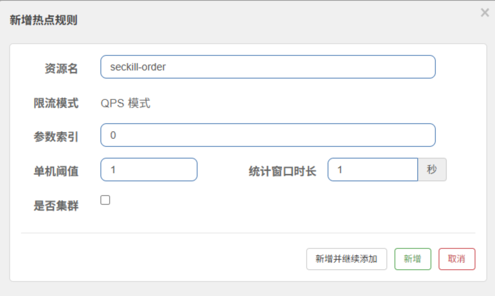

这表示：访问 `seckill-order` 资源时，第一个参数（参数索引 0）在 1 秒的统计窗口时长下，其阈值为 1，也就是 QPS = 1。

需要注意：携带此参数，则参与流控；不携带不流控。

```java
@GetMapping("/seckill")
@SentinelResource(value = "seckill-order", fallback = "seckillFallback")
public Order seckill(@RequestParam(value = "userId", defaultValue = "888") Long userId,
                     @RequestParam(value = "productId", defaultValue = "1000") Long productId) {
    // --snip--
}
```

上述代码中，`userId` 的默认值为 `888`，也就是以 `http://localhost:8000/seckill?productId=777` 的形式进行访问时，`userId` 的值为 `888`，此时依旧传入了 `userId`，依旧触发流控。

```java
@GetMapping("/seckill")
@SentinelResource(value = "seckill-order", fallback = "seckillFallback")
public Order seckill(@RequestParam(value = "userId", required = false) Long userId,
                     @RequestParam(value = "productId", defaultValue = "1000") Long productId) {
    // --snip--
}
```

上述代码中，`userId` 可以不传，当以 `http://localhost:8000/seckill?productId=777` 的形式进行访问时，`userId` 为 `null`，没有传入 `userId`，不会触发流控。

经过上述配置，已经完成「每个用户秒杀 QPS 不得超过 1」的需求，但「6 号用户」是个例外：

<!-- 这是一张图片，ocr 内容为： -->
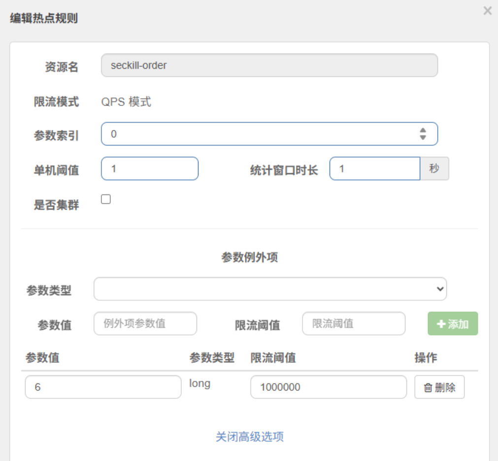

访问 `seckill-order` 资源时，第一个参数（参数索引 0）的类型是 `long`，当其值为 `6` 时，限流阈值为 `1000000`，变相不限制「6 号用户」的 QPS。

现在还有最后一个需求「666 号商品是下架商品，不允许访问」，这其实相当于：对 666 号商品进行流控（限流阈值为 0，不允许访问），对其他商品不进行流控（或阈值非常大）。

新增热点规则：

<!-- 这是一张图片，ocr 内容为： -->
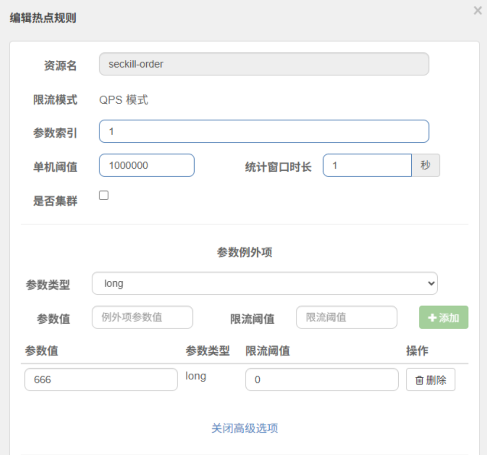

访问 `seckill-order` 资源时，第二个参数（参数索引 1）在 1 秒的统计窗口时长下，其阈值为 1000000，这是一个无法达到的值，相当于不进行限流。但有一个例外：当其值为 666 时，限流阈值为 0，也就是不允许访问。

