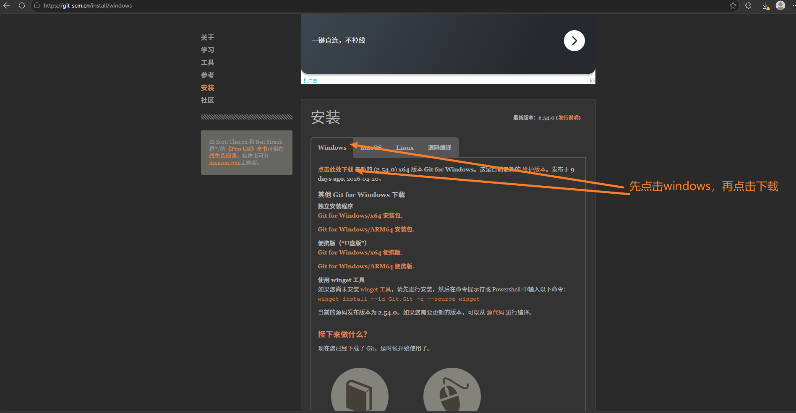

## 1.1 `Node.js`环境下载与配置

### 1.1.1 下载

[官网下载`Node.js`](https://nodejs.org/zh-cn/download)

选择Windows x64，安装目录一定选择一个D盘方便找到的目录，新建一个NodeJS文件夹，安装时就选择这个目录！！！

### 1.1.2 环境变量配置

需配置「系统变量」和「用户变量」，路径通过 `NODE_HOME` 统一管理：

- 系统变量
  - 新建`NODE_HOME`
    - `NODE_HOME` 值为 `nodejs`的安装根目录
    - 作用：统一指向 Node 安装路径，后续 Path 可通过变量引用，修改路径时只需改这里
  - 编辑`path`
    - 添加`%NODE_HOME%`
      - 作用：系统识别Node 核心命令目录
    - 添加`%NODE_HOME%\node_global`
      - 作用：识别全局包命令目录
    - 添加`%NODE_HOME%\node_cache`
      - 作用：识别缓存目录
- 用户变量
  - 编辑 `Path`
    -   修改默认 `npm` 路径，改为你的node_global的绝对路径(该路径在下面有配置说明)
        - 作用：覆盖用户级的全局包路径，与系统变量保持一致，避免冲突


### 1.1.3`npm` 手动配置

通过命令行将 `npm` 的全局包和缓存目录与之前新建的文件夹绑定（关键，否则环境变量配置无效）：

**管理员运行**`cmd`

```bash
# 设置全局包目录（与 node_global 对应）
C:\Windows\System32>npm config set prefix "D:\DevelopmentEnvironment\NodeJS\node_global"
# 设置缓存目录（与 node_cache 对应）
C:\Windows\System32>npm config set cache "D:\DevelopmentEnvironment\NodeJS\node_cache"

#查看配置是否生效
C:\Windows\System32>npm config get cache
D:\DevelopmentEnvironment\NodeJS\node_cache  #输出你之前配置的路径
C:\Windows\System32>npm config get prefix
D:\DevelopmentEnvironment\NodeJS\node_global #输出你之前配置的路径
```


### 1.1.4 更换 `npm` 镜像（国内加速）

默认 `npm` 源为国外服务器，下载慢：

```bash
# 更换为淘宝新镜像
npm config set registry https://registry.npmmirror.com
# 验证镜像是否生效
npm config get registry
```


### 1.1.5 验证配置是否成功

```bash
node -v  # 显示 Node 版本（如 v24.12.0）
npm -v   # 显示 npm 版本（如 11.6.2）
npm root -g  # 验证全局包路径是否为 node_global（如 D:\DevelopmentEnvironment\NodeJS\node_global\node_modules）
```

### 1.1.6 配置文件夹权限

- 走到这一步，在`vue`项目中执行`npm`命令大概率会报错 ，比如 `npm i`
- 这是因为执行操作后，会在`node_cache`目录下会创建缓存文件，而你并没有为windows登录用户分配文件夹权限。
- 找到`node_cache`右键->**属性**->**安全**->**组或用户名**->**选择Users**->**编辑**->再次在**组或用户下**选择**Users**->此时下方会切换到**Users的权限**->勾选**完全控制**->应用，确定，再确定
- 为了防止出现相似的错误，把`node_global`也做相同的操作

## 1.2 下载git工具

下载网址：[Git - Windows 安装](https://git-scm.cn/install/windows)



## 1.3 注册GitHub

[GitHub地址](https://github.com/)

注册的时候，起一个好听且有意思的名字

应该只能注册英文的名字，如果也能注册中文的名字，请不要使用中文名字，因为到时候网站上线后会以github的名字作为前缀，中文的特别不美观

## 1.4 开发工具选择

- VSCode
- WebStorm

以WebStorm为例[`WebStorm`下载地址](https://www.jetbrains.com/webstorm/)