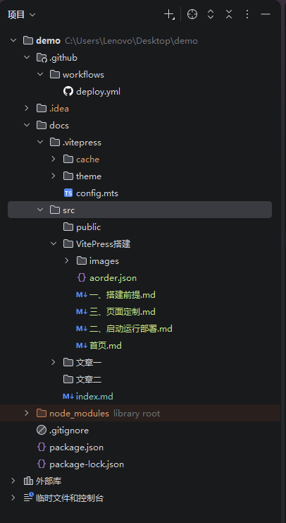
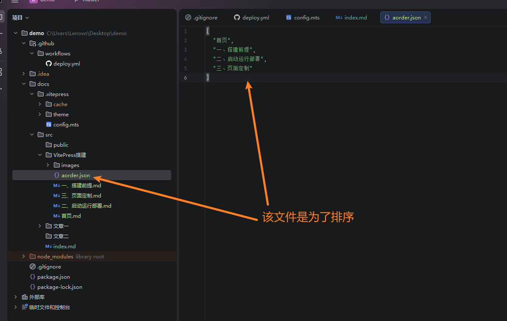
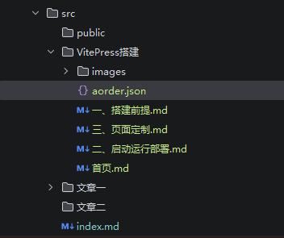
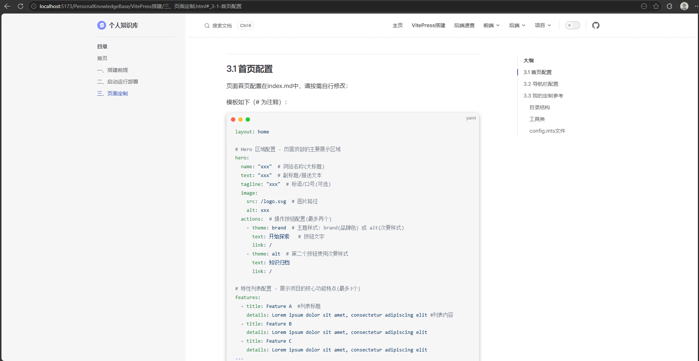

## 3.1 首页配置

页面首页配置在index.md中，请按需自行修改：

模板如下（# 为注释）：

```yaml
layout: home

# Hero 区域配置 - 页面顶部的主要展示区域
hero:
  name: "xxx"  # 网站名称(大标题)
  text: "xxx"  # 副标题/描述文本
  tagline: "xxx"  # 标语/口号(可选)
  image:
    src: /logo.svg  # 图片路径
    alt: xxx
  actions:  # 操作按钮配置(最多两个)
    - theme: brand  # 主题样式: brand(品牌色) 或 alt(次要样式)
      text: 开始探索   # 按钮文字
      link: /
    - theme: alt  # 第二个按钮使用次要样式
      text: 知识归档
      link: /

# 特性列表配置 - 展示项目的核心功能特点(最多3个)
features:
  - title: Feature A  #列表标题
    details: Lorem ipsum dolor sit amet, consectetur adipiscing elit #列表内容
  - title: Feature B
    details: Lorem ipsum dolor sit amet, consectetur adipiscing elit
  - title: Feature C
    details: Lorem ipsum dolor sit amet, consectetur adipiscing elit
---
```

## 3.2 导航栏配置

顶部导航栏和二级下拉框配置在config.mts中，请按需自行修改

```json
import { defineConfig } from 'vitepress'

// https://vitepress.dev/reference/site-config
export default defineConfig({
  // 部署基础路径，设置为 /demo/ 表示部署在 GitHub Pages 的子目录下
  base: '/demo/',
  // 网站标题
  title: "demo",
  // 网站描述，用于 SEO 和元数据
  description: "网站描述 ",
  // 主题配置
  themeConfig: {
    // https://vitepress.dev/reference/default-theme-config
    nav: [
      // 首页导航链接
      { text: 'Home', link: '/' },
      // Examples 下拉菜单
      { 
        text: 'Examples', 
        items: [
          { text: 'Markdown Examples', link: '/markdown-examples' },
          { text: 'Runtime API Examples', link: '/api-examples' }
        ]
      }
    ],

    // 侧边栏配置
    sidebar: [
      {
        text: 'Examples',
        items: [
          { text: 'Markdown Examples', link: '/markdown-examples' },
          { text: 'Runtime API Examples', link: '/api-examples' }
        ]
      }
    ],

    // 社交链接配置
    socialLinks: [
      { icon: 'github', link: 'https://github.com/vuejs/vitepress' }
    ]
  }
})

```

## 3.3 我的定制参考

如果想个性化定制自己的网站请参考：[VitePress 官网](https://vuejs.github.io/vitepress/v1/zh/)

### 目录结构





### 工具类

```json
import * as fs from 'node:fs'
import * as path from 'path'

/**
 * 根据分类目录自动生成侧边栏的 items 数组
 * 功能：扫描目录下的 md 文件 → 读取 aorder.json 排序 → 返回标准 sidebar 结构
 * @param category 分类文件夹名称（如 Spring、SpringBoot）
 */
export function getCategoryItems(category: string) {
    // 1. 拼接当前分类的完整绝对路径
    // __dirname = 当前 config.mts 所在目录
    // ../src/${category} = 指向 src/分类名 这个文件夹
    const dir = path.resolve(__dirname, `../../src/${category}`)

    // 2. 读取目录下所有文件，只保留 .md 文件，并去掉文件后缀名
    // 最终得到：['Spring', 'api-examples中文', 'markdown-examples']
    const files = fs.readdirSync(dir)
        .filter(f => f.endsWith('.md'))       // 只筛选 .md 结尾的文件
        .map(f => f.replace('.md', ''))       // 去掉 .md 后缀，只保留文件名

    // 3. 读取当前分类下的 order.json 排序配置
    let order: string[] = []
    try {
        // 读取 order.json 文件内容
        const orderFileContent = fs.readFileSync(path.join(dir, 'aorder.json'), 'utf8')
        // 把 JSON 字符串转成数组
        order = JSON.parse(orderFileContent)
    } catch (e) {
        // 如果没有 order.json 或读取失败，就用空数组，不报错
    }

    // 4. 第一步排序：严格按照 order.json 里的顺序，只保留真实存在的文件
    const sorted = order.filter(name => files.includes(name))

    // 5. 找出没有在 order.json 里的文件，追加到列表末尾
    const unordered = files.filter(name => !order.includes(name))

    // 6. 合并最终的文件名顺序：排序好的 + 未排序的
    const finalNames = [...sorted, ...unordered]

    // 7. 转换成 VitePress sidebar 需要的格式：{ text: 显示名称, link: 链接 }
    return finalNames.map(name => ({
        text: name,                // 侧边栏显示的文字
        link: `/${category}/${name}`  // 页面跳转链接
    }))
}

```

### config.mts文件

```json
import {defineConfig} from 'vitepress'
import {getCategoryItems} from "./utils/SidebarUtils";

export default defineConfig({

    // 部署
    base: '/github的仓库地址（请自行修改）/',
    // 源码目录改为src，为了让目录结构更加清晰
    srcDir: './src',
    // 语言
    lang: 'zh-CN',
    //网站标题
    title: "个人知识库",
    //网站描述
    description: "一个使用VitePress搭建的个人知识库",
    // 头部logo 图片保存在src/public目录下
    head: [
        ['link',{ rel: 'icon', href: '/logo.svg'}],
    ],

    themeConfig: {
        logo: '/logo.svg',
        // 搜索功能
        search: {
            provider: 'local',
            options: {
                translations: {
                    button: {
                        buttonText: '搜索文档',
                        buttonAriaLabel: '搜索文档'
                    },
                    modal: {
                        noResultsText: '无法找到相关结果',
                        resetButtonTitle: '清除查询条件',
                        footer: {
                            selectText: '选择',
                            navigateText: '切换',
                            closeText: '关闭'
                        }
                    }
                }
            }
        },
        /**
         * ================================= 添 加 文 档 后 修 改 处 ========================
          */
        // 导航栏
        nav: [
            {text: '主页', link: '/'},
            //无下拉框配置，link配置的是默认的首页
            {
                text: '导航一',link: '/文章一/文章'//基于src的绝对路径,比如文章在src/文章一/文章.md
            },
            // 无下拉框配置
            // VitePress搭建教程导航（目录结构:/src/VitePress搭建/首页）
            {
                text: 'VitePress搭建',link: '/VitePress搭建/首页'
            },
        // sidebar: getSidebar(),
        sidebar: {
            //===========================以导航一为例================================
            //  "VitePress搭建"目录下的其他文章通过该配置导入
            '/VitePress搭建/':[
                {
                    text: '目录',
                    items: getCategoryItems('VitePress搭建')
                }
            ],
            /**
             * =============================================================================
             */

        },
        // 右侧大纲 - deep - 显示所有标题(不支持一级标题)
        outline: {
            level: "deep",
            label: '大纲'
        },
		// github跳转地址
        socialLinks: [
            {icon: 'github', link: 'https://github.com/vuejs/vitepress'}
        ]
    },
    // 忽略死链接比如localhost:8080/xxx 一定要配置！！！！！！！！！！！！
    ignoreDeadLinks: true,
    // 禁用 Markdown 属性语法 一定要配置！！！！！！！！！！！！
    markdown: {
        // 禁用 Markdown 属性语法解析（如 {.class #id}）
        attrs: {
            disable: true
        },
        // 禁用 HTML 标签渲染，纯 Markdown 更安全
        html: false,
    }

})

```

文章目录，以及运行样例




