## 2.1 安装

### 2.1.1 项目拉取

新建一个项目文件夹,地址栏输入`cmd`后点击回车,输入以下命令：

```shell
npm add -D vitepress
```

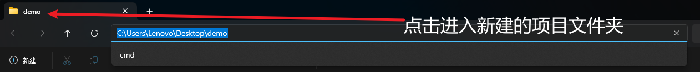


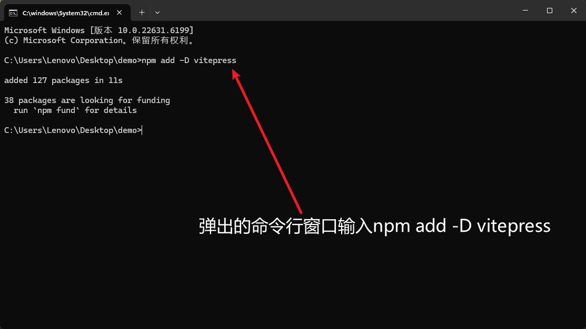

### 2.1.2安装向导

`VitePress` 附带一个命令行设置向导，可以帮助构建一个基本项目。

安装后，通过运行以下命令启动向导：

```sh
npx vitepress init
```

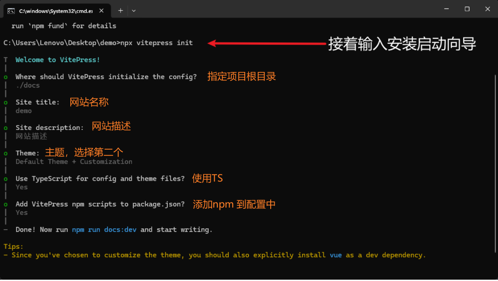


## 2.2 打开项目并运行

**打开项目（弹出提示框：选择信任项目）**


**运行项目**

打开终端输入运行命令

```sh
npm run docs:dev
```

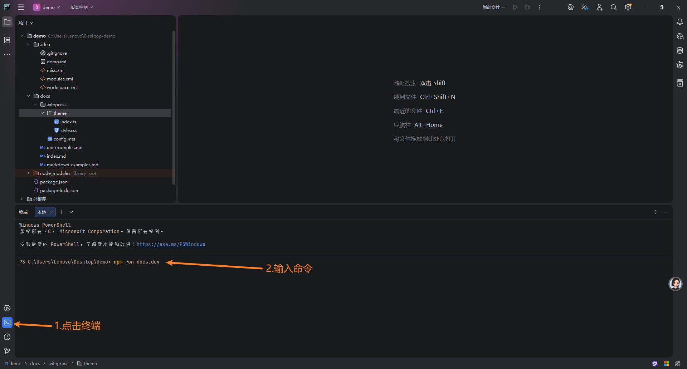

运行后点击床阔中的 http://localhost:5174/  就可以打开网站了

**关闭项目**

点击终端空白处 键盘：`Ctal+c`

## 2.3 部署

### 2.3.1 添加git管理

1. 在项目**根目录**下新建`.gitignore`文件内容如下：

```yaml
# 依赖目录
node_modules/

# 构建输出目录（VitePress 编译后的产物）
docs/.vitepress/dist/
docs/.vitepress/cache/

# 环境变量
.env
.env.local
.env.*.local

# 编辑器配置
.idea/
.vscode/
*.swp
*.swo
.DS_Store

# 日志
logs/
*.log
npm-debug.log*
yarn-debug.log*
yarn-error.log*

# 系统文件
Thumbs.db

# 文本文件
*.txt
```

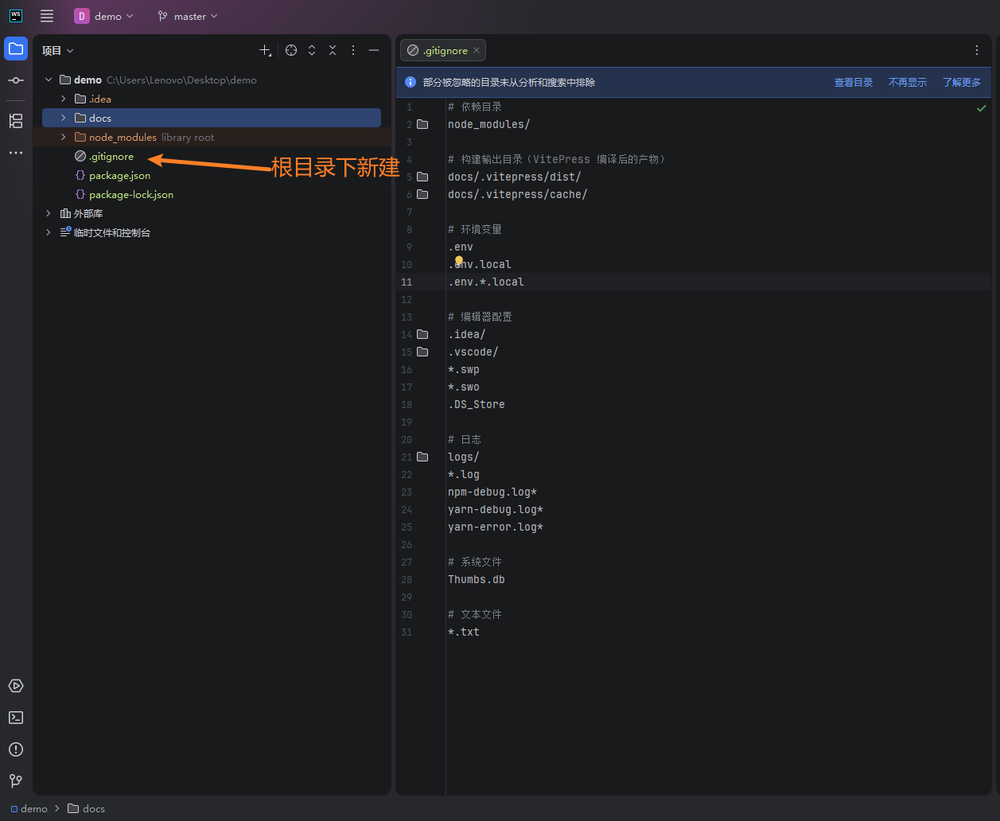

2. 初始化

```cmd
# 1. 初始化 git
git init

# 2. 添加所有文件到暂存区
git add .
```

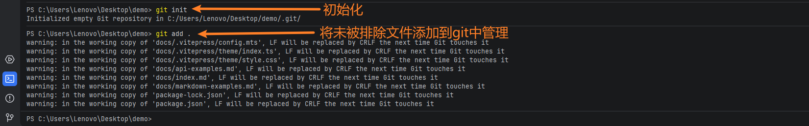

### 2.3.2 `GitHub Pages`

1. 在项目的根目录下创建文件夹 `.github/workflows` ，并在该目录中创建一个名为 `deploy.yml` 的文件，其中包含这样的内容：

   `.github/workflows/deploy.yml`

   ```yaml
   # 构建 VitePress 站点并将其部署到 GitHub Pages 的示例工作流程
   #
   name: Deploy VitePress site to Pages
   
   on:
     # 在针对 `main` 分支的推送上运行。如果你
     # 使用 `master` 分支作为默认分支，请将其更改为 `master`
     push:
       branches: [main]
   
     # 允许你从 Actions 选项卡手动运行此工作流程
     workflow_dispatch:
   
   # 设置 GITHUB_TOKEN 的权限，以允许部署到 GitHub Pages
   permissions:
     contents: read
     pages: write
     id-token: write
   
   # 只允许同时进行一次部署，跳过正在运行和最新队列之间的运行队列
   # 但是，不要取消正在进行的运行，因为我们希望允许这些生产部署完成
   concurrency:
     group: pages
     cancel-in-progress: false
   
   jobs:
     # 构建工作
     build:
       runs-on: ubuntu-latest
       steps:
         - name: Checkout
           uses: actions/checkout@v4
           with:
             fetch-depth: 0 # 如果未启用 lastUpdated，则不需要
         # - uses: pnpm/action-setup@v3 # 如果使用 pnpm，请取消此区域注释
         #   with:
         #     version: 9
         # - uses: oven-sh/setup-bun@v1 # 如果使用 Bun，请取消注释
         - name: Setup Node
           uses: actions/setup-node@v4
           with:
             node-version: 20
             cache: npm # 或 pnpm / yarn
         - name: Setup Pages
           uses: actions/configure-pages@v4
         - name: Install dependencies
           run: npm ci # 或 pnpm install / yarn install / bun install
         - name: Build with VitePress
           run: npm run docs:build # 或 pnpm docs:build / yarn docs:build / bun run docs:build
         - name: Upload artifact
           uses: actions/upload-pages-artifact@v3
           with:
             path: docs/.vitepress/dist
   
     # 部署工作
     deploy:
       environment:
         name: github-pages
         url: ${{ steps.deployment.outputs.page_url }}
       needs: build
       runs-on: ubuntu-latest
       name: Deploy
       steps:
         - name: Deploy to GitHub Pages
           id: deployment
           uses: actions/deploy-pages@v4
   ```

   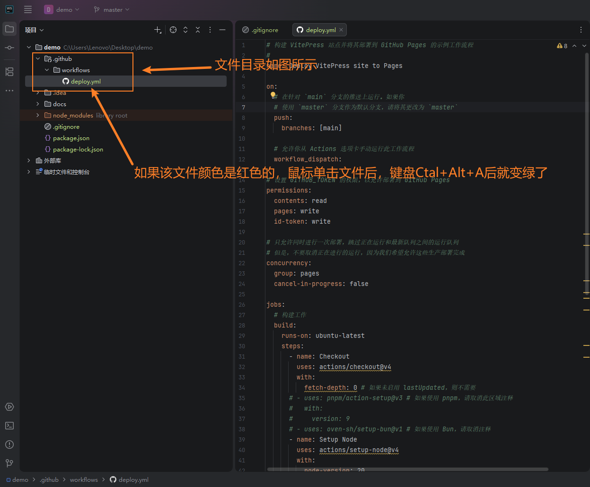

### 2.3.3 github上创建仓库

（这一步方式多样，我已我最顺手的方式为例）

如果是第一次在WebStorm中使用GitHub提交，按钮会与图片中的不一样

第一次的话，操作步骤

- 点击左上角**三个杠**（鼠标移动过去就行了）
- 选在**VCS**
- 选择GitHub
- 使用GitHub用户名和密码登录

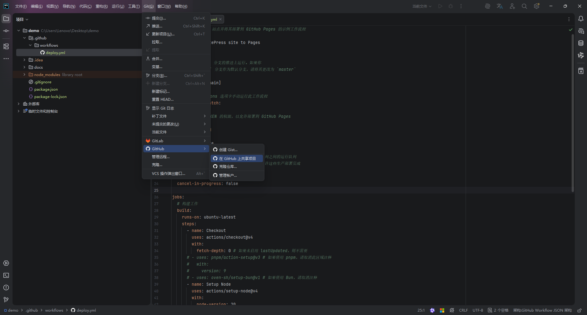

点击添加文件

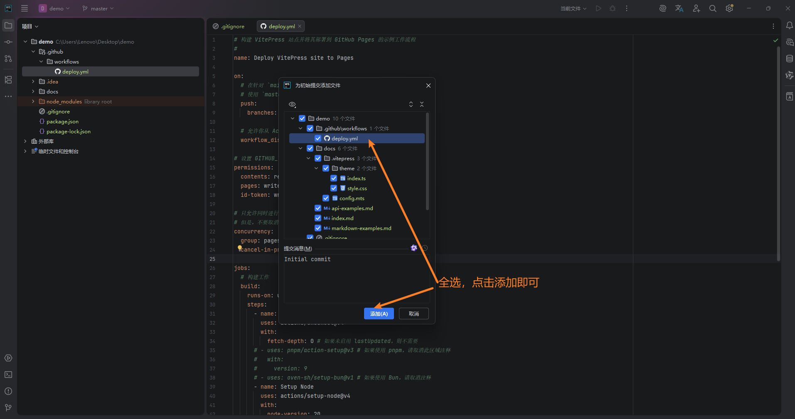

### 2.3.4 修改GitHub仓库

进入GitHub，点击项目

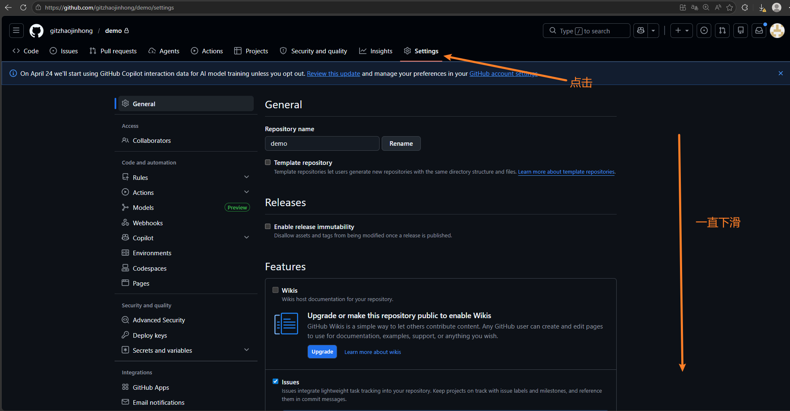

将项目设为公开，点击按钮后一路下一步，最后需要输入账户密码

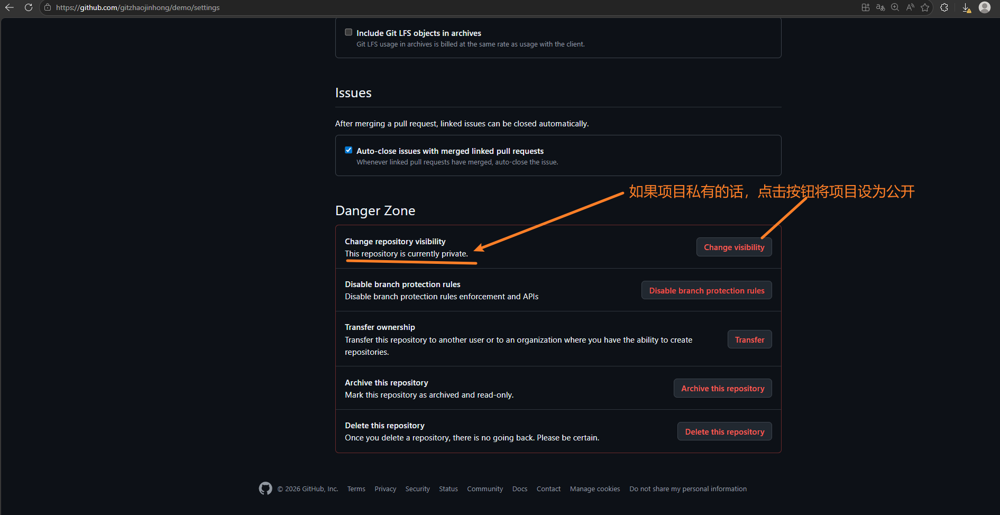

配置 GitHub Pages 源，**改为GitHub Actions**

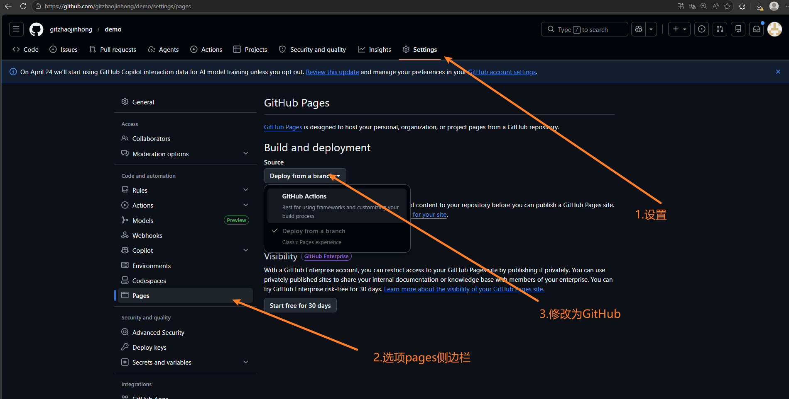

### 2.3.5 代码部署

#### 修改 VitePress 配置

打开 项目`docs/.vitepress/config.mts`，添加 `base` 配置：

如果不添加base信息，后续项目部署后访问会出现渲染异常

```
import { defineConfig } from 'vitepress'

export default defineConfig({
  // 👇 关键：这里必须是你的仓库名，前后加斜杠
  base: '/你的GitHub仓库名/', 

  title: 'demo',
  description: "网站描述 ",
  themeConfig: {
    // ... 你的其他配置
  }
})
```

#### 提交代码

**第一次提交代码到GitHub**

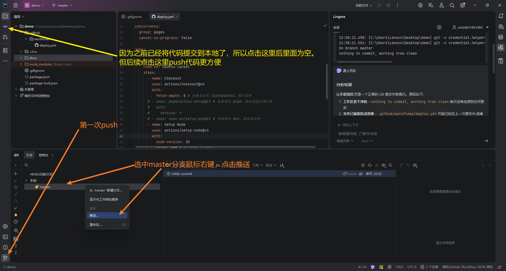

修改远程分支的名字后点击推送

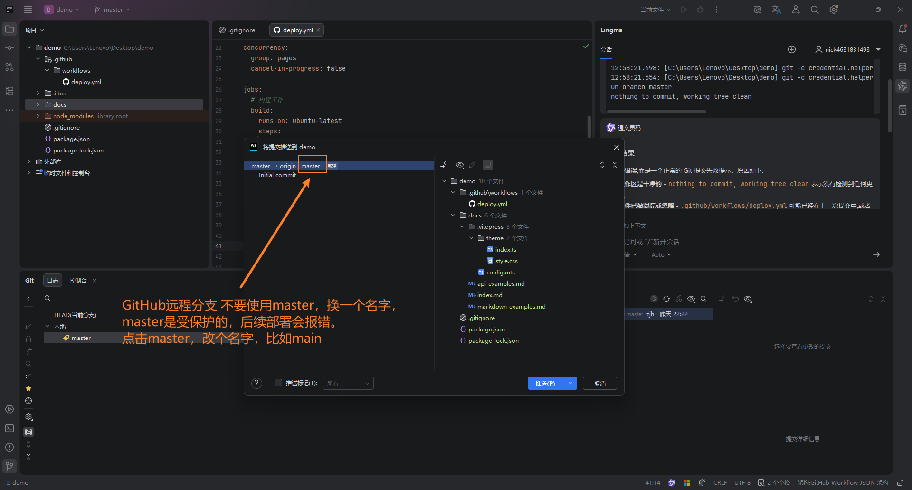

如果推送失败请参考2.4 建立ssh连接章节（这一步也是必做的，如果没有这一步经常会出现推送失败的情况）

**后续push步骤，更简便**

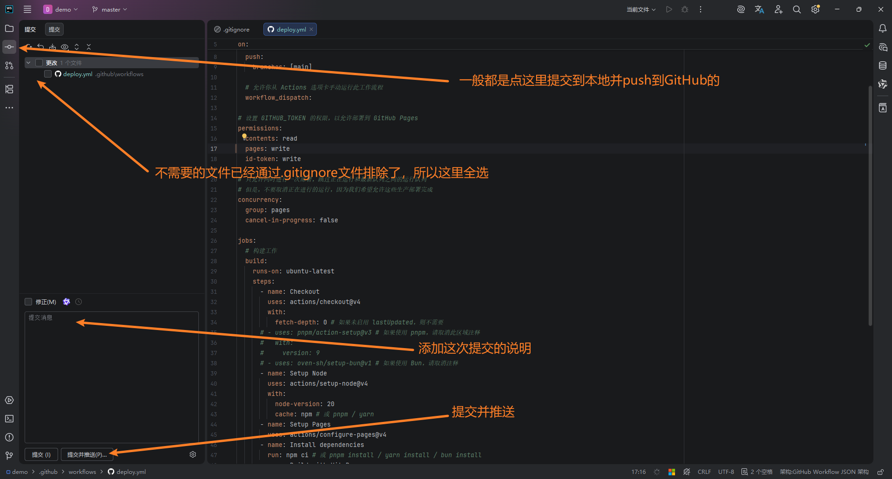

push成功后进入GitHub项目仓库，点击Actions查看部署情况

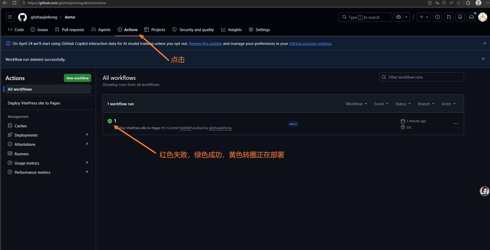

查看部署后可访问的网站地址，进入项目仓库，点击settings，选择pages即可找到

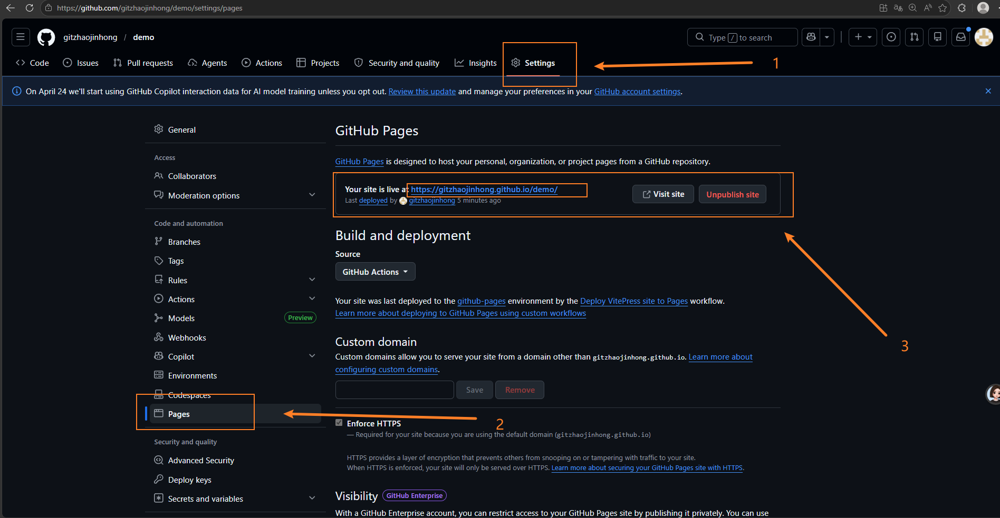

复制后贴到浏览器地址栏回车即可查看网站详情

## 2.4 Git SSH 连接配置

这一步没有截屏演示，如有疑问问豆包或网上搜一下教程

### 2.4.1 检查当前连接方式

在项目终端输入：

```bash
git remote -v
```

- 输出包含 `https://github.com/xxx/xxx.git` → HTTPS 连接，需要改为 SSH
- 输出包含 `git@github.com:xxx/xxx.git` → 已经是 SSH，无需操作

---

### 2.4.2 检查电脑是否已建立 SSH 连接

```bash
ssh -T git@github.com
```

输出示例：

```
Hi xxxxxx! You've successfully authenticated
```

出现这个提示说明本机已与 GitHub 建立 SSH 信任关系。

---

### 2.4.3 情况 A：已建立过 SSH 连接

直接修改项目的远程地址即可：

```bash
git remote set-url origin git@github.com:你的GitHub名字/项目名字.git
```

---

### 2.4.4 情况 B：未建立过 SSH 连接

**1. 生成 SSH 密钥对**

```bash
ssh-keygen -t ed25519 -C "你的GitHub邮箱或noreply邮箱"
```

一路回车，不输入任何内容。

**2. 查看并复制公钥**

```bash
cat ~/.ssh/id_ed25519.pub
```

复制输出的全部内容。

**3. 将公钥添加到 GitHub**

打开：https://github.com/settings/ssh/new

- Title：随便起个名字（如"我的电脑"）
- Key：粘贴刚才复制的公钥内容

点击 Add SSH key 完成添加。

**4. 修改项目远程地址**

```bash
git remote set-url origin git@github.com:你的GitHub名字/项目名字.git
```

**5. 执行代码push操作**