# Claude Code 安装与使用

---

## 一、安装与环境配置

### 1.1 安装 Claude Code

由于Claude Code 官方明确**拒绝向中国大陆地区提供服务**，所以如果使用官方推荐的安装方式，就**必须**使用代理！！！

7897端口 是我的电脑开启代理后所使用的端口（在自己的代理软件设置中查看），**请替换为自己代理端口**！！！

```powershell
# 给当前 PowerShell 设置代理（立刻生效）
$env:HTTP_PROXY="http://127.0.0.1:7897"
$env:HTTPS_PROXY="http://127.0.0.1:7897"

# 安装 Claude 该命令是官方推荐的第一个命令(仅推荐这一种方式)
irm https://claude.ai/install.ps1 | iex
```

安装成功后，关闭代理：

```powershell
Remove-Item env:HTTP_PROXY
Remove-Item env:HTTPS_PROXY
```

### 1.2 配置环境变量

可以先进行**1.3验证**安装，如果验证成功则说明环境变量已经在安装过程中配置好了

点 **高级** → **环境变量**，在上方「系统变量」找到 **Path** → 编辑 → **新建**，粘贴：

(该环境变量配的是ClaudeCode的安装目录，该目录下有一个claude.exe)，安装方式不同，环境变量的配置略有差异

```
C:\Users\你的电脑用户名\.local\bin
```

### 1.3 验证安装

关闭当前 PowerShell，重新打开一个新窗口，输入：

```powershell
claude
```

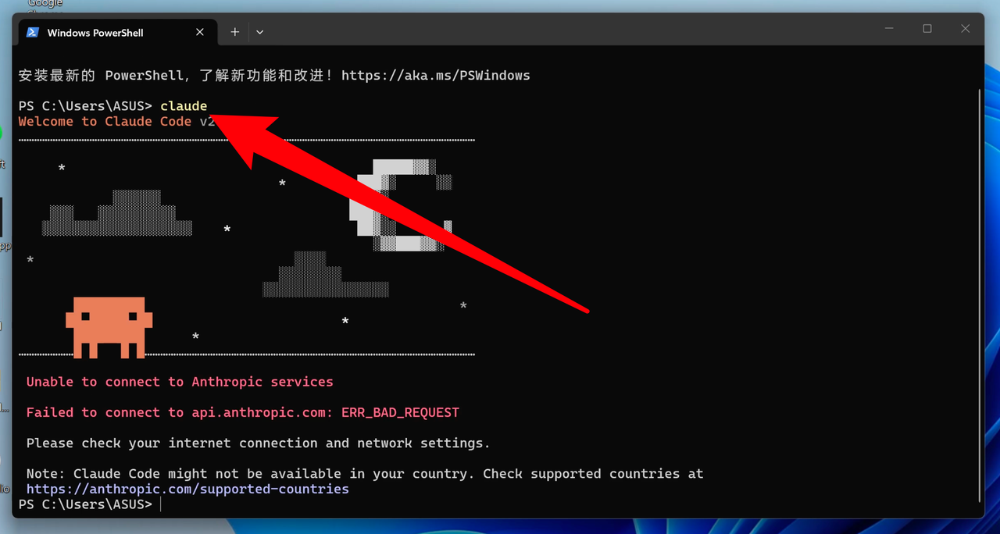


如果看到 Claude Code 的界面，即使出现"当前国家或地区不被支持"的报错，也说明安装成功，只是还未完成后续配置。

---

## 二、配置国产模型并绕过地区报错

### 2.1 打开配置文件

```powershell
cd ~
notepad.exe .\.claude.json
```

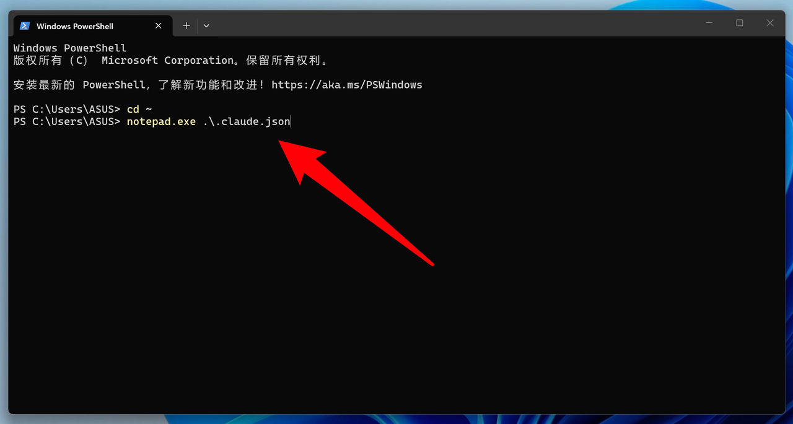

这会打开 Claude Code 的配置文件：

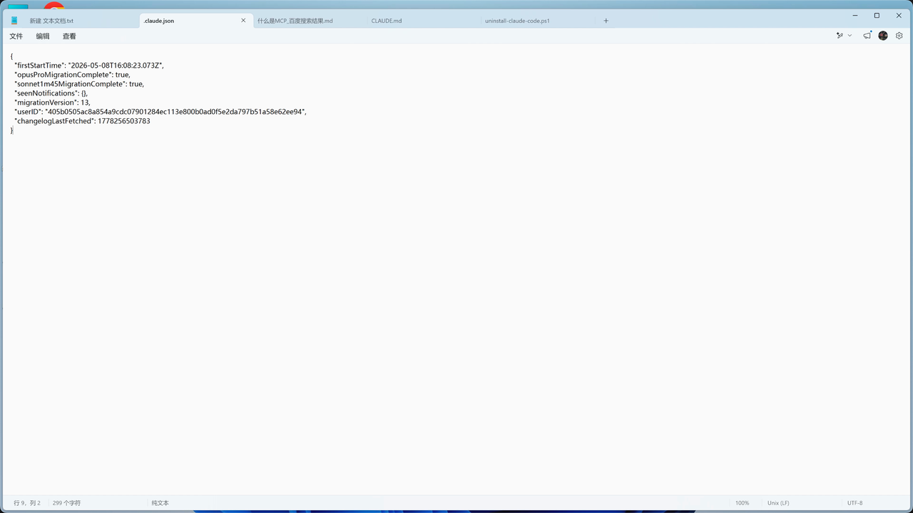

### 2.2 绕过地区检测

在配置文件中，添加一行 `"hasCompletedOnboarding": true,`（注意别漏了逗号），然后保存并关闭。

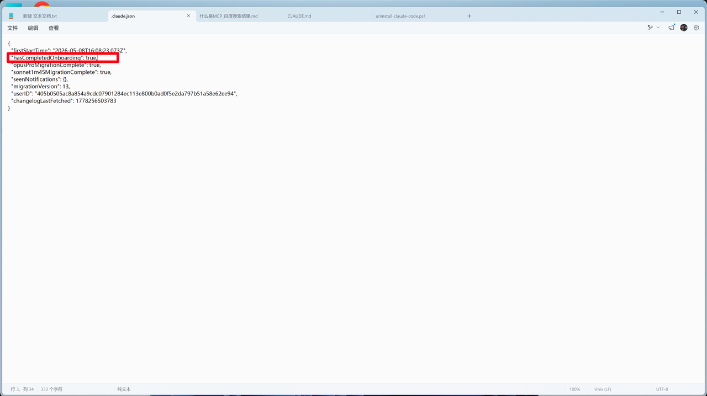

**强烈建议：直接复制粘贴，不要手打。** 手动输入容易混进中文逗号、中文引号，导致配置报错。

保存后，再次运行：

```powershell
claude
```

Claude Code 会问你是否信任当前目录，直接按 `Enter` 即可。

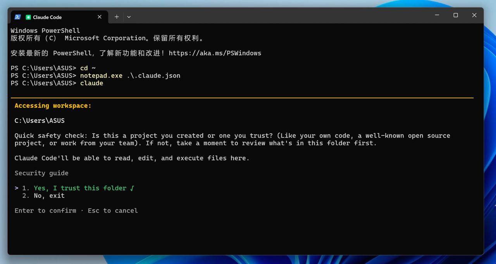

如果不再出现地区报错，说明绕过成功：

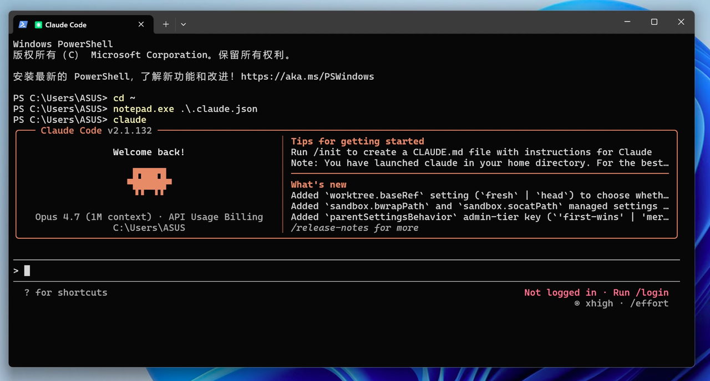

退出 Claude Code：按两次 `Ctrl + C`。

### 2.3 指定模型与 API 接入

再次打开配置文件：

```powershell
cd ~
notepad.exe .\.claude.json
```

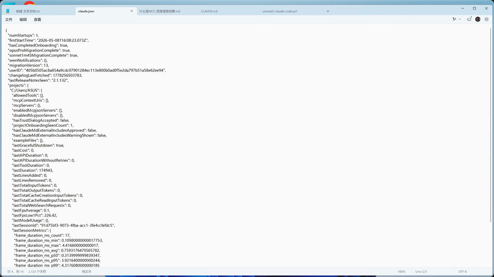

文件里已经自动多出一些配置项，不用管。继续加入模型和 API 配置：

Kimi配置参考：

```json
"env": {
    "ANTHROPIC_BASE_URL": "https://api.moonshot.cn/anthropic",
    "ANTHROPIC_AUTH_TOKEN": "你的开放平台Key",
    "ANTHROPIC_MODEL": "kimi-k2.6"
},
```

DeepSeek配置参考：

```json
"env": {
    "ANTHROPIC_BASE_URL": "https://api.deepseek.com/anthropic",
    "ANTHROPIC_AUTH_TOKEN": "你的开放平台Key",
    "ANTHROPIC_MODEL": "deepseek-v4-pro"
},
```

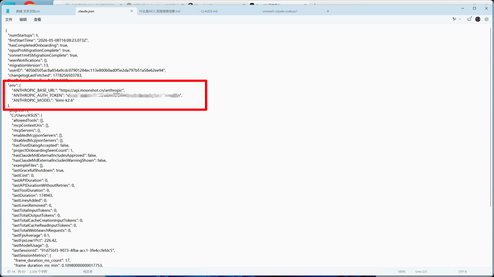

### 2.4 获取 API Key

Kimi 开放平台：[Kimi API 开放平台](https://platform.moonshot.cn/console/api-keys)

DeepSeek开放平台：[DeepSeek 开放平台](https://platform.deepseek.com/usage)

1. 登录开放平台
2. 打开 API Key 管理页面
3. 创建一个新的 API Key
4. 复制，粘贴到前面的配置文件处
5. 账户一定要有钱

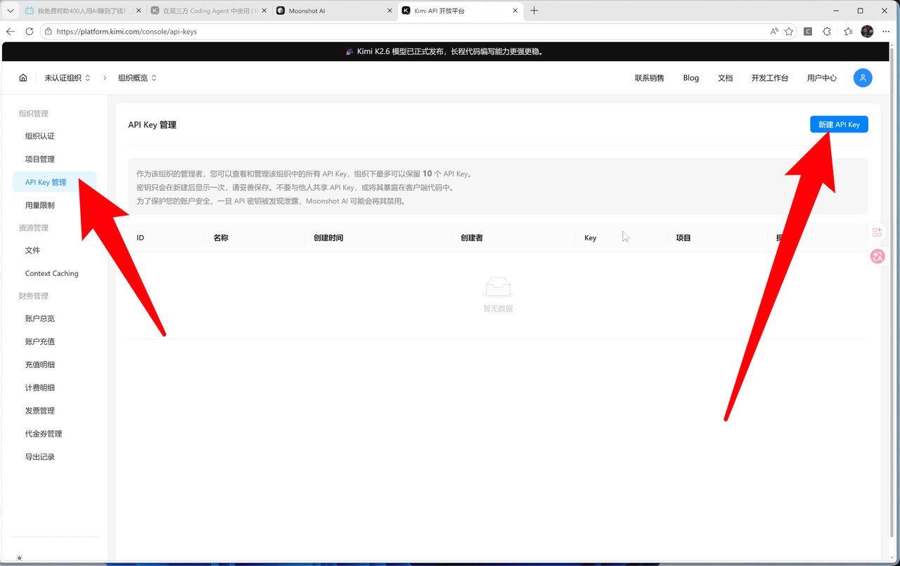

### 2.5 启动并验证

保存配置文件后，运行：

```powershell
claude
```

输入 `你好` 测试，如果能正常回复且显示为你设置的国产模型，说明接入成功。

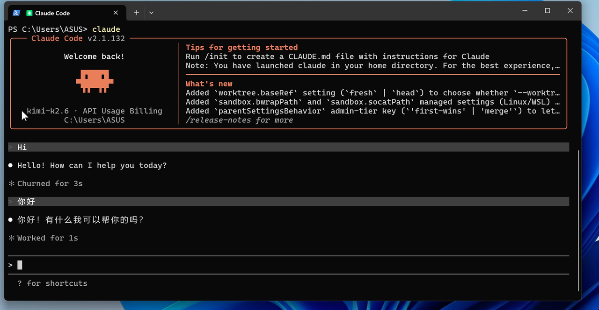

---

## 三、理解 Claude Code 的工作方式

### 3.1 工作目录

Claude Code 不是纯聊天工具，它会直接读写你当前目录下的文件。你在哪个文件夹里运行 `claude`，哪个文件夹就是它的工作目录。

```powershell
cd 你的项目目录
claude
```

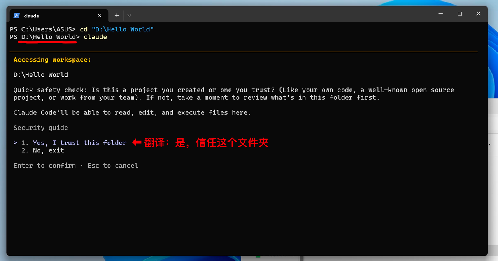

### 3.2 为什么比普通聊天慢

一次任务背后，Claude Code 会反复调用几十次甚至上百次模型：调用模型 → 读取文件 → 调用模型 → 执行命令 → 检查结果 → 重试……这也正是 Agent 类产品比普通对话更强但更慢的原因。

---

## 四、权限模式、上下文和记忆管理

### 4.1 权限模式

默认情况下，Claude Code 执行很多动作都需要你批准（运行命令、安装工具、修改文件、调用外部能力）。所有支持的权限模式：

| 模式 | 作用 | 如何开启 |
| --- | --- | --- |
| default | 默认模式；只读操作直接执行，其他询问 | 直接启动即为此模式；或 `claude --permission-mode default` |
| acceptEdits | 自动接受文件编辑和常见文件系统命令 | 会话中按 `Shift+Tab` 切换；或 `claude --permission-mode acceptEdits` |
| plan | 只分析、读文件、写计划，不改代码 | 会话中按 `Shift+Tab` 切换；或 `claude --permission-mode plan`；也可在单条消息前用 `/plan` |
| auto | 自动执行大多数操作，带后台安全检查 | `claude --permission-mode auto` |
| dontAsk | 不弹确认框；只有预先批准的工具才能用 | `claude --permission-mode dontAsk` |
| bypassPermissions | 跳过几乎所有权限检查，最激进 | `claude --permission-mode bypassPermissions` 或 `claude --dangerously-skip-permissions` |

> 如果使用最新模型，且清楚自己在做什么，没有使用不明来源的 skills 或 mcp，可以逐渐放宽权限。

### 4.2 查看上下文占用

Claude Code 会把对话、MCP 信息、Skills 信息、文件内容、工具调用结果等装进上下文。上下文太长后模型会变笨（"上下文腐烂"）。

输入 `/context` 查看：

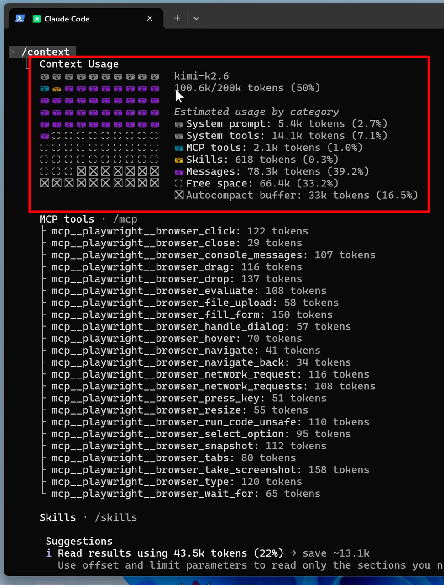

### 4.3 压缩上下文

完成阶段性任务后，前面的内容"还有一点价值但不需要保留全部细节"时，建议手动执行 `/compact`：

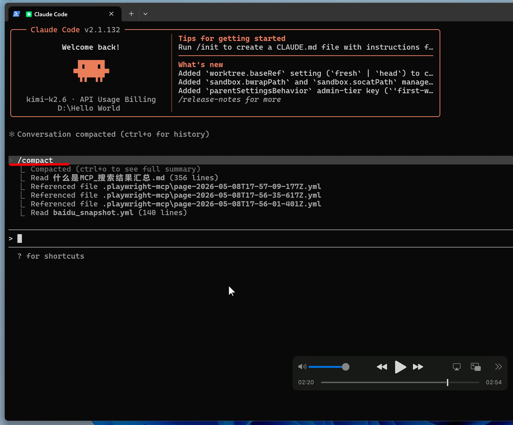

它会对前面的上下文做压缩总结，释放大量空间。比等系统自动 compact 更可控。

### 4.4 清空上下文

如果前面的上下文已经完全没用了，输入 `/clear`：

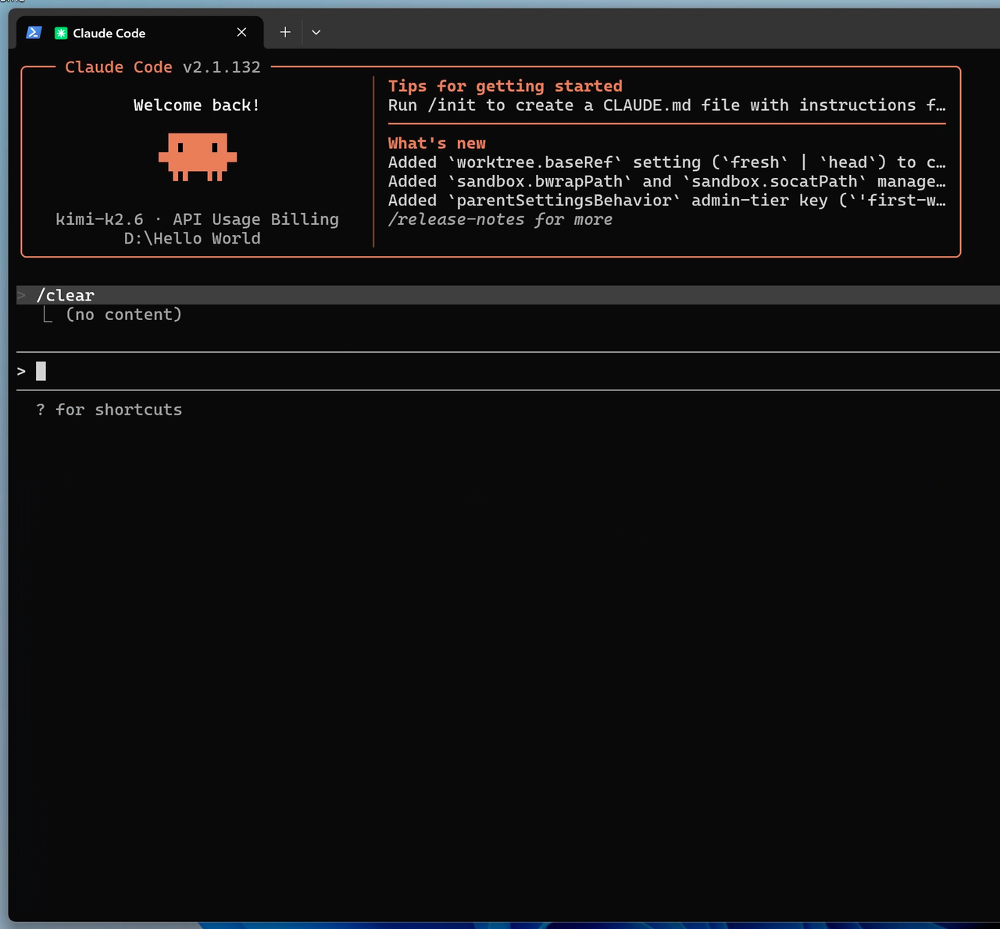

**记住一个原则：上下文是临时记忆，文件才是长期记忆。** 真正重要的信息应该让 Claude Code 写进文件。


---

## 附录：常用命令速查

| 命令 | 作用 |
| --- | --- |
| `claude` | 启动 Claude Code |
| `/context` | 查看上下文占用 |
| `/compact` | 压缩上下文 |
| `/clear` | 清空上下文 |
| `/resume` | 恢复历史会话 |
| `/mcp` | 查看 MCP 列表 |
| `/skills` | 查看 Skills 列表 |
| `Ctrl + C`（两次） | 退出 Claude Code |
| `Shift + Tab` | 切换权限模式 |
