# Claude Code 安装与使用

---

## 一、安装与环境配置

### 1.1 安装 Claude Code

由于Claude Code 官方明确**拒绝向中国大陆地区提供服务**，所以如果使用官方推荐的安装方式，就**必须**使用代理！！！

7897端口 是我的电脑开启代理后所使用的端口，**请替换为自己代理端口**！！！

```powershell
# 给当前 PowerShell 设置代理（立刻生效）
$env:HTTP_PROXY="http://127.0.0.1:7897"
$env:HTTPS_PROXY="http://127.0.0.1:7897"

# 安装 Claude 该命令是官方推荐的第一个命令(仅推荐这一种方式)
irm https://claude.ai/install.ps1 | iex
```

安装成功后，关闭代理：

```powershell
Remove-Item env:HTTP_PROXY
Remove-Item env:HTTPS_PROXY
```

### 1.2 配置环境变量

可以先进行**1.3验证**安装，如果验证成功则说明环境变量已经在安装过程中配置好了

点 **高级** → **环境变量**，在上方「用户变量」找到 **Path** → 编辑 → **新建**，粘贴：

(该环境变量配的是ClaudeCode的安装目录，该目录下有一个claude.exe)安装方式不同环境变量的配置略有差异

```
C:\Users\你的电脑用户名\.local\bin
```

### 1.3 验证安装

关闭当前 PowerShell，重新打开一个新窗口，输入：

```powershell
claude
```


如果看到 Claude Code 的界面，即使出现"当前国家或地区不被支持"的报错，也说明安装成功，只是还未完成后续配置。

---

## 二、配置国产模型并绕过地区报错

### 2.1 打开配置文件

```powershell
cd ~
notepad.exe .\.claude.json
```


这会打开 Claude Code 的配置文件：


### 2.2 绕过地区检测

在配置文件中，添加一行 `"hasCompletedOnboarding": true,`（注意别漏了逗号），然后保存并关闭。


**强烈建议：直接复制粘贴，不要手打。** 手动输入容易混进中文逗号、中文引号，导致配置报错。

保存后，再次运行：

```powershell
claude
```

Claude Code 会问你是否信任当前目录，直接按 `Enter` 即可。


如果不再出现地区报错，说明绕过成功：


退出 Claude Code：按两次 `Ctrl + C`。

### 2.3 指定模型与 API 接入

再次打开配置文件：

```powershell
cd ~
notepad.exe .\.claude.json
```


文件里已经自动多出一些配置项，不用管。继续加入模型和 API 配置（以 Kimi K2.6 为例）：

建议切换为次旗舰模型，这玩意使用起来太贵了，比如将kimi-2.6改为kimi-2.5

```json
"env": {
    "ANTHROPIC_BASE_URL": "https://api.moonshot.cn/anthropic",
    "ANTHROPIC_AUTH_TOKEN": "你的开放平台Key",
    "ANTHROPIC_MODEL": "kimi-k2.6"
},
```


### 2.4 获取 API Key

打开 Kimi 开放平台：https://platform.kimi.com/console/account

1. 登录开放平台
2. 打开 API Key 管理页面
3. 创建一个新的 API Key
4. 复制，粘贴到前面的配置文件处


### 2.5 启动并验证

保存配置文件后，运行：

```powershell
claude
```

输入 `你好` 测试，如果能正常回复且显示为你设置的国产模型，说明接入成功。


---

## 三、理解 Claude Code 的工作方式

### 3.1 工作目录

Claude Code 不是纯聊天工具，它会直接读写你当前目录下的文件。你在哪个文件夹里运行 `claude`，哪个文件夹就是它的工作目录。

```powershell
cd 你的项目目录
claude
```


### 3.2 为什么比普通聊天慢

一次任务背后，Claude Code 会反复调用几十次甚至上百次模型：调用模型 → 读取文件 → 调用模型 → 执行命令 → 检查结果 → 重试……这也正是 Agent 类产品比普通对话更强但更慢的原因。

---

## 四、安装 Playwright MCP（控制浏览器）

搜索 MCP 可以找到很多免费市场，例如：https://mcpmarket.com/

### 4.1 安装 Playwright MCP

```powershell
#1. 用户范围（全局生效，推荐）
claude mcp add --scope user playwright -- npx @playwright/mcp@latest

#2. 项目范围（仅当前项目生效）
claude mcp add --scope local playwright -- npx @playwright/mcp@latest

```

图片中的命令只是示例，并不是官方推荐的格式，官方推荐的格式参考上方命令

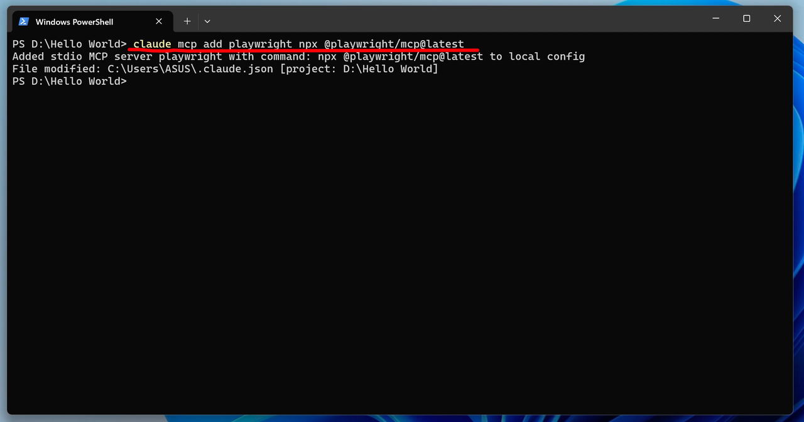

安装完成后，重新启动 Claude Code。

### 4.2 验证与排错

进入 Claude Code 后，输入 `/mcp`：

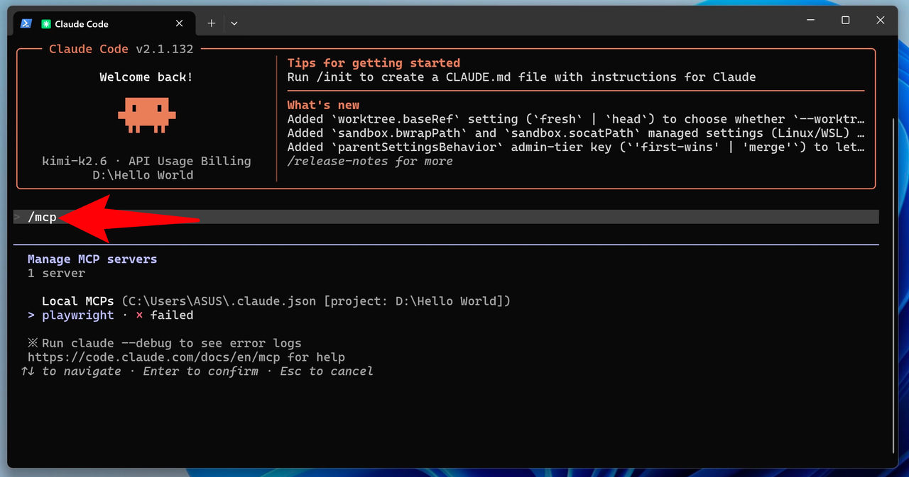

如果能看到 `playwright`，说明安装成功。如果有 "failed"，不用自己排查，直接让 Claude Code 解决：

```
请帮我修复 Playwright MCP 的安装问题，直到它能正常使用。解决不了可以上网搜一搜
```

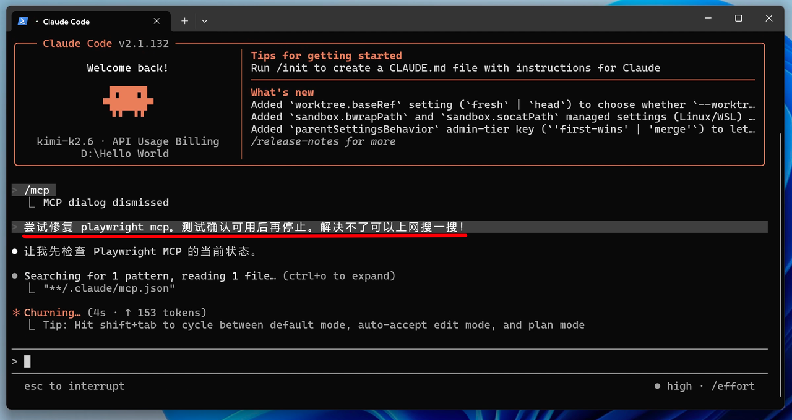

### 4.3 理解界面信息

排错和执行任务时，不同颜色代表不同含义：

- 你的输入：给 Claude Code 的任务
- 白点内容：模型对你说的话
- 灰色内容：模型读取了文件
- 绿色内容：工具调用成功
- 红色内容：工具调用报错
- 底部橙色状态：Claude Code 正在工作（耗时、token 使用等）

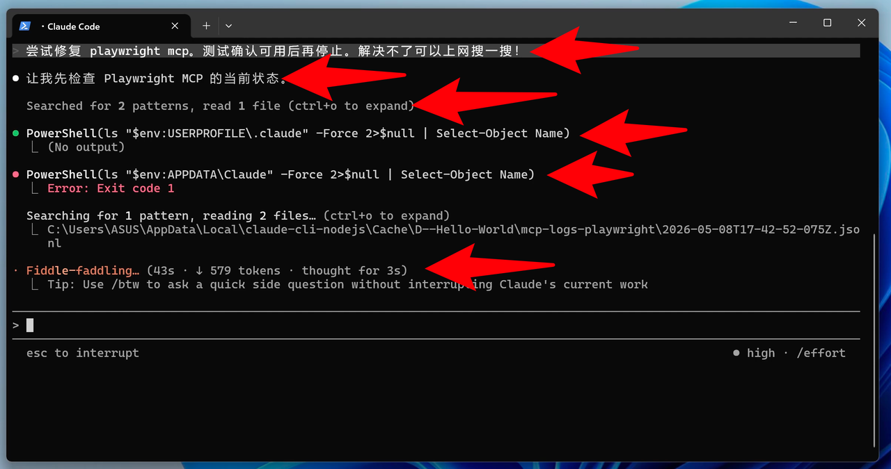

**它不是卡住了，而是在工作。**

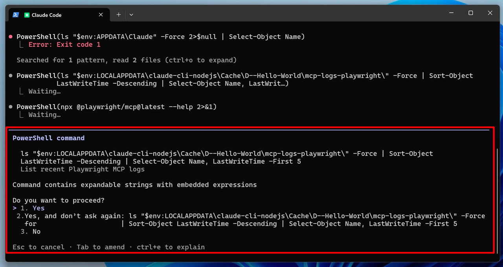

橙色提示表示它在询问你是否允许执行某个命令。

### 4.4 恢复历史对话

Claude Code 修复完 MCP 后会提示重启：

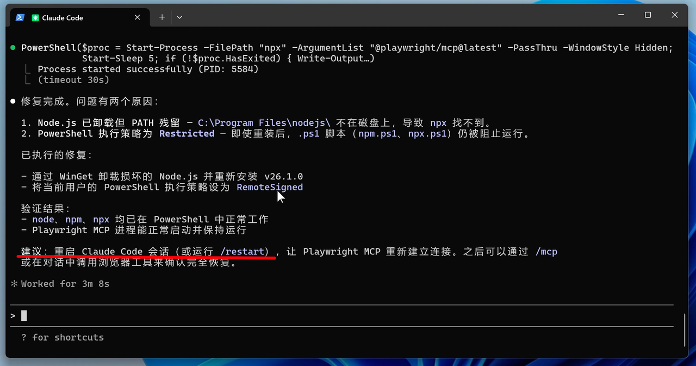

重启后如果聊天记录不见了，输入：

```
/resume
```

用方向键选择之前的会话，Enter 确认即可回到原来的上下文。

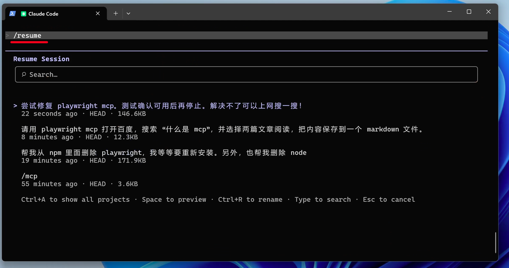

### 4.5 控制浏览器执行任务

测试一个完整任务：

```
请打开浏览器，到百度搜索"什么是 MCP"，选择两篇优质内容阅读，并整理成一个 markdown 文件保存在当前目录。
```

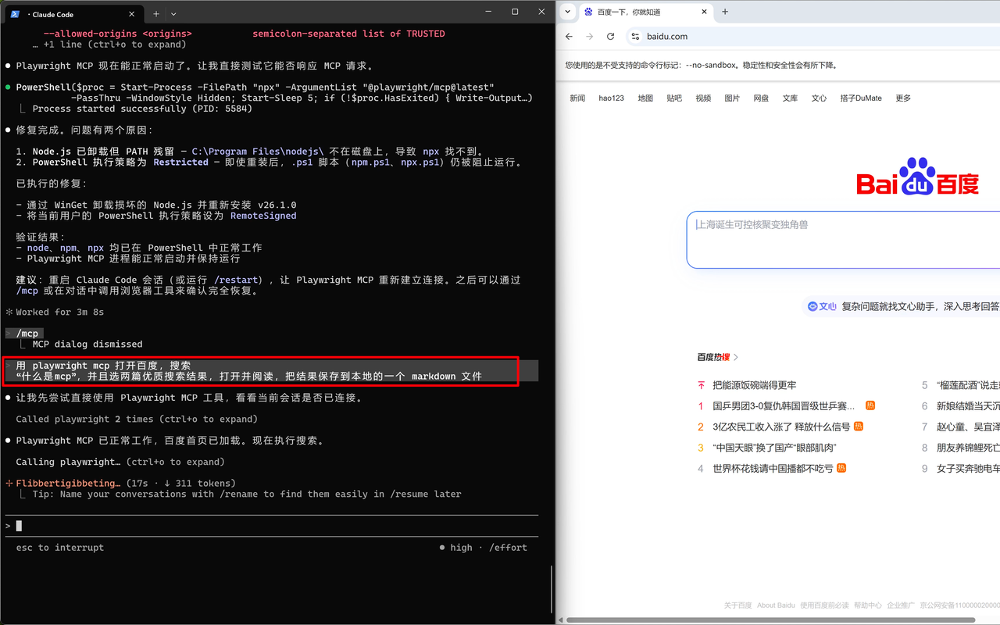

如果一切正常，它会：打开浏览器 → 搜索关键词 → 浏览网页 → 提取信息 → 生成 Markdown 文件。

过程中会弹出几十次权限审批，先手动每次同意，后续会解决。

---

## 五、权限模式、上下文和记忆管理

### 5.1 权限模式

默认情况下，Claude Code 执行很多动作都需要你批准（运行命令、安装工具、修改文件、调用外部能力）。所有支持的权限模式：

| 模式 | 作用 | 如何开启 |
| --- | --- | --- |
| default | 默认模式；只读操作直接执行，其他询问 | 直接启动即为此模式；或 `claude --permission-mode default` |
| acceptEdits | 自动接受文件编辑和常见文件系统命令 | 会话中按 `Shift+Tab` 切换；或 `claude --permission-mode acceptEdits` |
| plan | 只分析、读文件、写计划，不改代码 | 会话中按 `Shift+Tab` 切换；或 `claude --permission-mode plan`；也可在单条消息前用 `/plan` |
| auto | 自动执行大多数操作，带后台安全检查 | `claude --permission-mode auto` |
| dontAsk | 不弹确认框；只有预先批准的工具才能用 | `claude --permission-mode dontAsk` |
| bypassPermissions | 跳过几乎所有权限检查，最激进 | `claude --permission-mode bypassPermissions` 或 `claude --dangerously-skip-permissions` |

> 如果使用最新模型，且清楚自己在做什么，没有使用不明来源的 skills 或 mcp，可以逐渐放宽权限。

### 5.2 查看上下文占用

Claude Code 会把对话、MCP 信息、Skills 信息、文件内容、工具调用结果等装进上下文。上下文太长后模型会变笨（"上下文腐烂"）。

输入 `/context` 查看：


### 5.3 压缩上下文

完成阶段性任务后，前面的内容"还有一点价值但不需要保留全部细节"时，建议手动执行 `/compact`：


它会对前面的上下文做压缩总结，释放大量空间。比等系统自动 compact 更可控。

### 5.4 清空上下文

如果前面的上下文已经完全没用了，输入 `/clear`：


**记住一个原则：上下文是临时记忆，文件才是长期记忆。** 真正重要的信息应该让 Claude Code 写进文件。

---

## 六、安装 Skills（以 HyperFrames 为例）

### 6.1 理解 Skills

- MCP 更像是"连接工具"
- Skills 更像是"现成的能力包"

一个 Skill 不仅帮你接外部工具，还会顺带提供一整套适合该任务的提示词、流程和约束。

### 6.2 安装 HyperFrames Skill

安装命令：

```
npx skills add /-com/hyperframes
```

这次不自己运行命令，直接让 Claude Code 帮你安装即可。

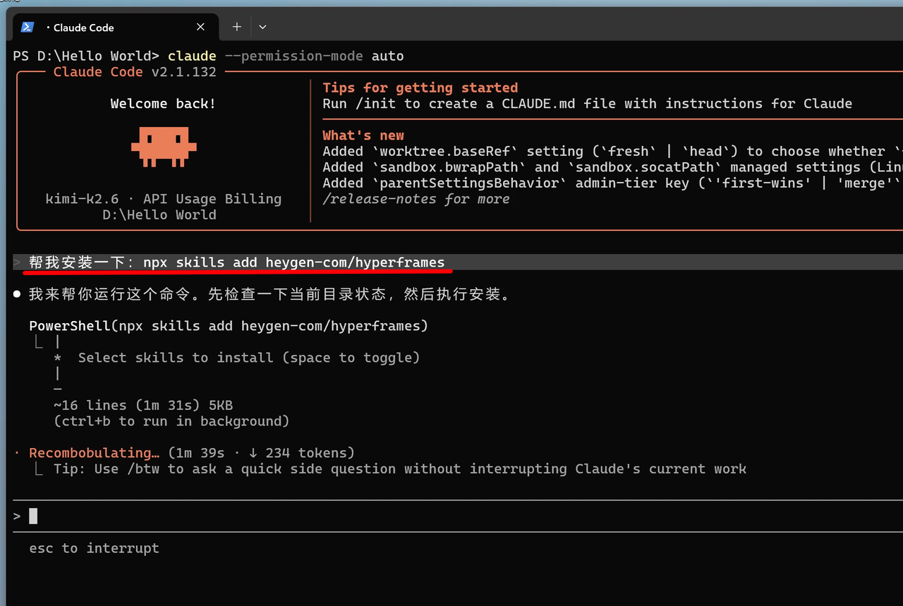

### 6.3 确认安装成功

安装完成后，重启 Claude Code，输入 `/skills`：

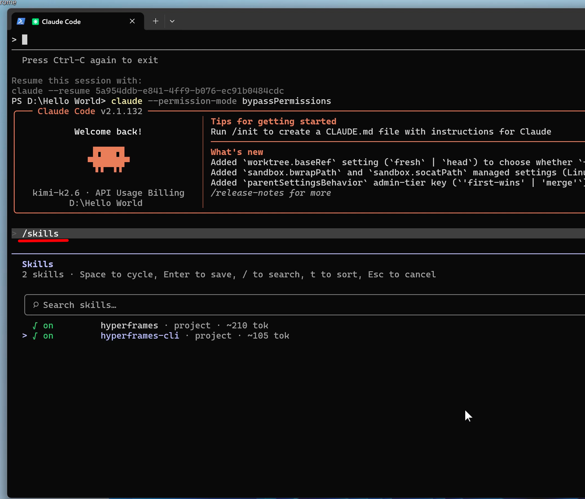

如果列表里有 `hyperframes`，说明安装成功。

### 6.4 使用 Skill 制作视频

在 Claude Code 中，通过 `@` 选择当前工作目录下的文件：

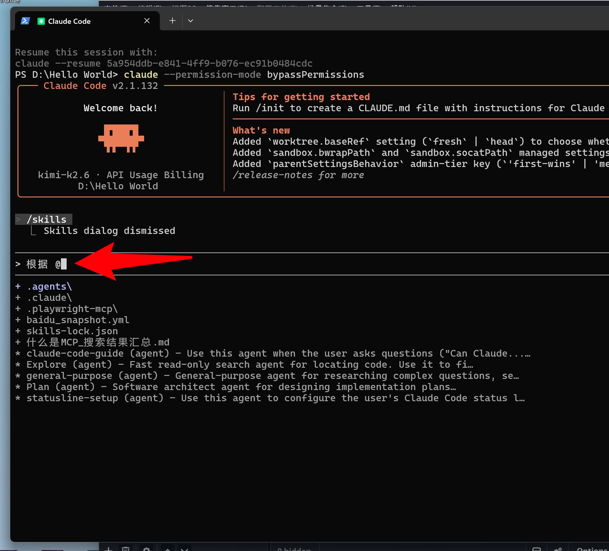

1. 输入 `@`
2. 选择前面生成的"什么是 MCP"的 Markdown 文件
3. 给一个任务，例如：

```
请基于这个 markdown 内容，制作一个适合短视频传播的科普视频，要求节奏清晰、动画直观、适合新手理解。
```

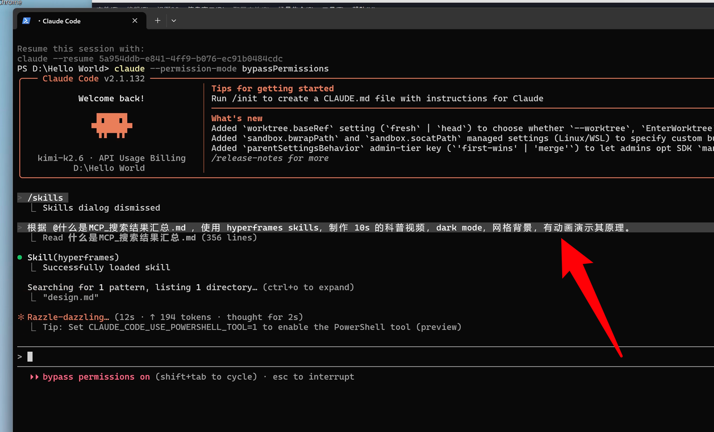

还可以继续补充风格、时长、字幕、配音、画面参考截图等要求。

### 6.5 迭代优化

第一次生成的不一定完美，像带实习生一样继续提要求：

- 画面不够震撼，请增加动态转场
- 解释太抽象，请把"有 MCP / 没 MCP"的对比再直观一点
- 字太多，请精简每页文案
- 配色太平，请做得更有科技感

一般 2 到 4 轮迭代后，效果会明显提升。

---

## 附录：常用命令速查

| 命令 | 作用 |
| --- | --- |
| `claude` | 启动 Claude Code |
| `/context` | 查看上下文占用 |
| `/compact` | 压缩上下文 |
| `/clear` | 清空上下文 |
| `/resume` | 恢复历史会话 |
| `/mcp` | 查看 MCP 列表 |
| `/skills` | 查看 Skills 列表 |
| `Ctrl + C`（两次） | 退出 Claude Code |
| `Shift + Tab` | 切换权限模式 |
