# Codex 安装与使用

---

Codex 开发组现阶段优先推进 Mac 端版本迭代，若在其他网络平台发现部分新功能上线 Mac、而自己的Windows 端暂未适配，属于正常版本差异。得益于 Mac 成熟规范的 CLI 生态，多数 AI 工具厂商均优先落地 Mac 版本开发。

## 一、安装与环境配置

### 1.1 `Codex`的两种形态

- 桌面端：`Codex Desktop`（图形界面）
- CLI：`codex` 命令行工具（用于配置、热切换）

这两种形态**正规登录**都需要`ChatGPT`账号，但由于`OpenAI`公司的产品不对中国提供服务，中国用户即使能注册`ChatGPT`账号，但在登录`Codex`的时候也需要验证手机号，中国的手机号是不满足要求的。所以要想使用Codex，需要借用cc switch切换为国内的`api`。

所以Codex安装成功后登录不上也不用着急，参考：`CC Switch接入国产API KEY`章节

### 1.2 安装 `Codex CLI`

#### 1.2.1 安装前提

`CLI方式`的安装依赖于`npm`命令，所以电脑上要有`NodeJS`环境，参考：[NodeJS环境安装](./NodeJS环境安装.md)
。

#### 1.2.2 安装命令

```cmd
npm install -g @openai/codex
```

装好后在终端输入 `codex` 就能进入对话界面，首次使用同样需要登录 OpenAI 账号。没有账号的话，就要用 CC Switch 来切换模型。

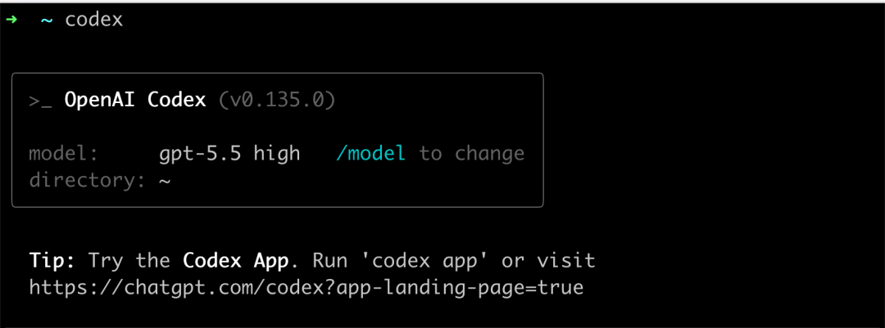

#### 1.2.3 CLI界面切换审批模式

```cmd
# 指定审批模式启动
codex --approval-mode ask        # 默认只读模式
codex --approval-mode auto-edit  # 自动编辑模式（缩写 -a auto-edit）
codex --approval-mode full-auto  # 完全自动模式

# 在交互界面中切换
/approvals  # 输入此命令切换审批模式
```


### 1.2 安装 `Codex Desktop`

#### 1.2.1 安装方式

- 关闭“魔法”，在国内若开启“魔法”，默认不能使用微软商店

- Codex官网：[Codex | OpenAI 打造的 AI 编码助手 | OpenAI](https://openai.com/zh-Hans-CN/codex/)点击"下载Windows版"自动跳转到微软商店下载
- 直接点击微软商店，搜索Codex进行下载

#### 1.2.2 创建桌面快捷方式

- 按下键盘上的 Win + R 键，打开“运行”对话框。

- 输入命令 shell:AppsFolder 并按回车，这会打开一个包含你电脑上所有应用的文件夹窗口。
- 在列表中找到 Codex 应用，鼠标右键点击它，选择“创建快捷方式”。
- 系统会弹出一个提示框，告诉你“无法在此位置创建快捷方式，是否将其放在桌面上？”，直接点击“是”即可。

## 二、`CC Switch`接入国产`API KEY`

### 2.1 安装`CC Switch`

CC Switch官网：[CC Switch 官方网站 - AI 编程工具统一管理平台](https://www.ccswitch.io/zh/)

CC Switch开源下载地址：[Releases · farion1231/cc-switch](https://github.com/farion1231/cc-switch/releases)

进入CC Switch开源下载地址，往下翻，找到Assets，下载Windows版本，点击`CC-Switch-v3.16.1-Windows.msi`  进行下载。

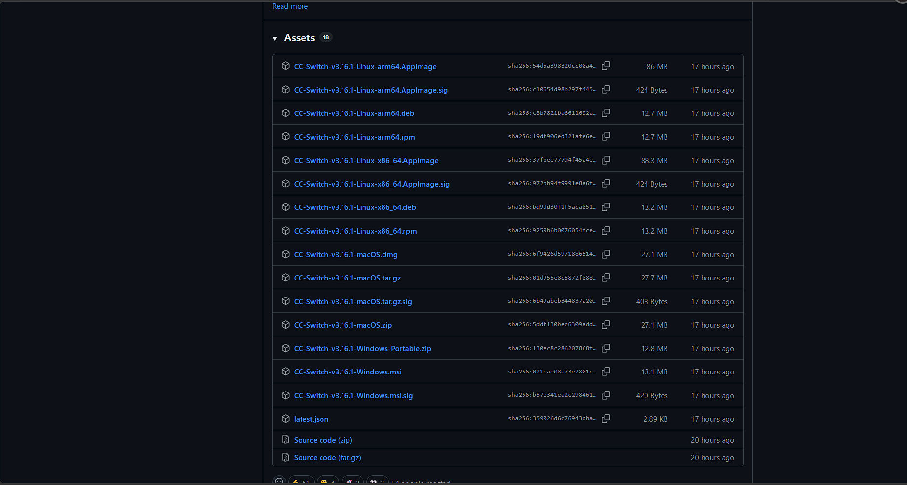

### 2.2 用 CC Switch 配置

打开 CC Switch，在顶部应用栏切换到 **Codex**，点击「添加供应商」：

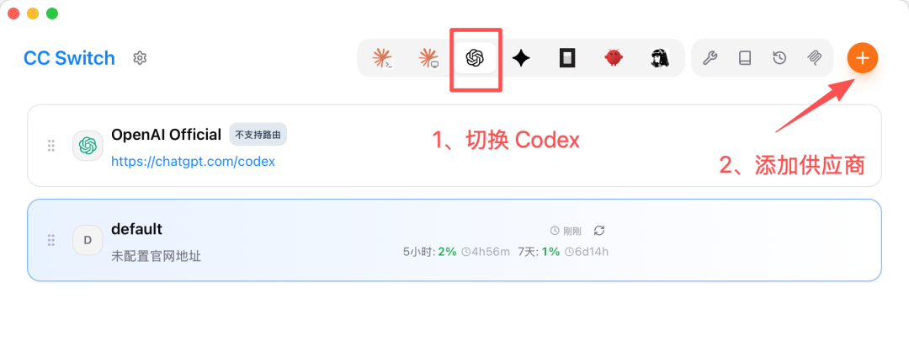

在预设里搜索并选择 **DeepSeek**:

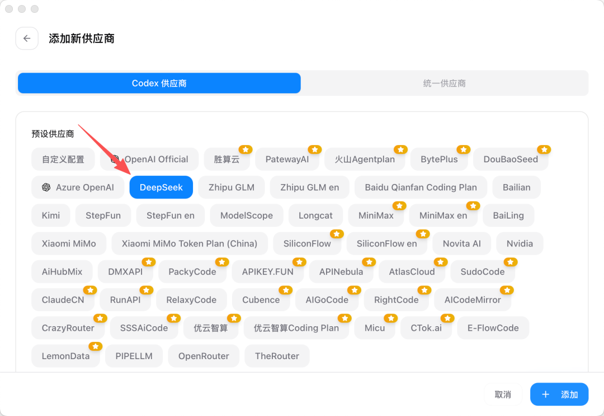

填入你的 DeepSeek API Key，其余字段保持默认：


模型这些 CC Switch 都已经预设好了，其他字段不用动。

要特别注意的是，这一步的关键是得 **开启「本地路由映射」**，然后点右下角的「添加」按钮保存就好。


回到主页后，选择启用 DeepSeek：

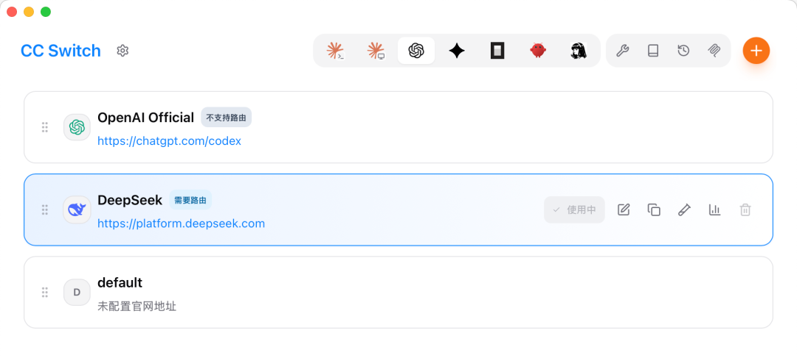

但是到目前为止，我们还不能在 Codex 中正常使用 DeepSeek，对话会直接报前面说的 404 错误：

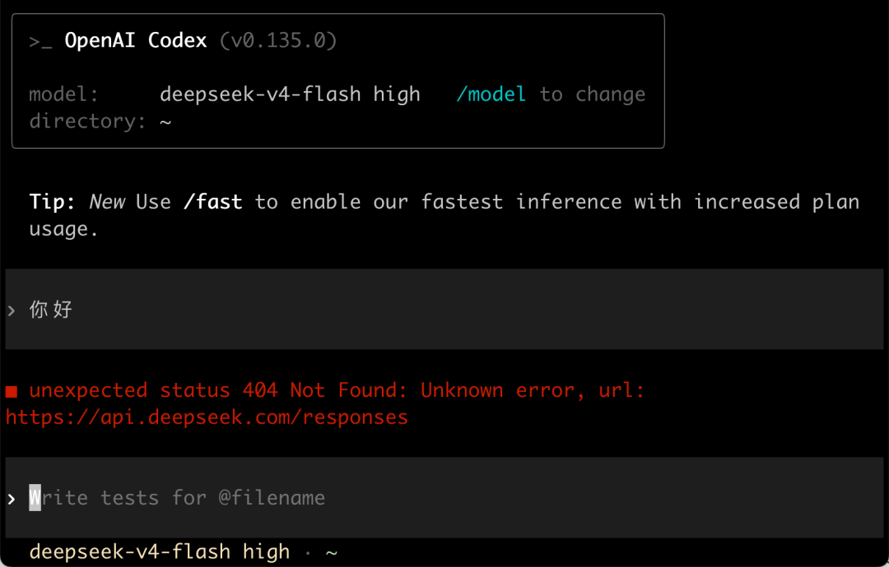

**开启本地路由**

切换到 DeepSeek 后，系统会提示你开启路由。点击左上角的「设置」按钮进入设置页面：


找到路由设置菜单，把本地路由的「路由总开关」打开，然后选择启用 Codex 路由：


这一步就是让 CC Switch 的本地代理正式接管 Codex 的请求，前面说的协议转换全靠它。

大功告成！

重新打开 Codex CLI，就能看到已经切换为 DeepSeek 模型了。同样让它自报家门，能正常对话就说明切换成功了：


会发现，AI 还说自己是基于 GPT-5 的 Codex。这是因为 Codex 会给模型注入一套自己的系统提示词，让它默认以为自己是官方模型，但实际干活的底层已经换成 DeepSeek 了。

再来试试 Codex 桌面 APP。因为它和命令行版共用 `~/.codex` 这套配置，CC Switch 切换之后直接打开就能用，同样问它是什么模型，底层跑的也是 DeepSeek：


如果想改回来，反向操作即可，把路由关掉、再启用默认配置就行：


最后：如果配置过后仍不能使用codex，请更新CC Switch到最新版本。


## 三、codex宠物商店

稍微有点小用处：点击宠物可以直接打开Codex Desktop，以及能随时查看聊天状态。

Codex Desktop->打开设置->外观-> 宠物

社区宠物商店：[Petdex: 适用于 Codex 的动画伙伴](https://petdex.crafter.run/zh)

我的宠物伙伴如下，在社区宠物商店直接搜索：Hoops

## 四、功能介绍

### 4.1 对话模式选择


- 请求批准（默认权限）：AI 可以读取和编辑工作区的文件，需要额外权限时会问你
- 替我审查（自动审查）：AI 自动帮你审查操作
- 完全访问：AI 想干啥干啥，不会弹确认框


- 计划模式 ：AI 不会直接开始写代码，而是先帮你规划方案、问你细节，确认没问题了再动手。
- 追求目标 ：强制 AI 严格贴合你的提示词关键词，大幅减少自由发挥，极致还原画面需求，锁死创作风格、元素、画质标准。

### 4.2 快捷指令

**$ — 技能（Skills）**

$ 前缀用来引用已安装的**技能（skills）**。

[Codex官方技能仓库](https://github.com/openai/skills)

Codex内置技能：

- **Image Gen**：用于为网站等场景生成或编辑图片，是视觉内容创作的工具型技能。
- **OpenAI Docs**：提供 OpenAI 文档、Codex 相关内容的参考查询，方便开发者查阅官方资料。
- **Plugin Creator**：快速搭建插件框架并生成 marketplace 条目，用于插件开发与发布流程。
- **Skill Creator**：用于创建或更新自定义技能，是扩展 Codex 能力的核心工具。
- **Skill Installer**：从 `openai/skills` 等仓库安装精选技能，实现技能的快速部署与复用。

------

- **Browser**：让 Codex 打开并控制浏览器，实现网页浏览、交互等自动化操作。

- **Chrome: Control Chrome**：专门控制用户的 Chrome 浏览器，可执行页面操作、数据获取等精细化任务。
- **Documents**：创建和编辑 Word、Google Docs 等文档，支持文档内容的生成与修改。
- **PDF Skill**：创建、编辑和审阅 PDF 文件，覆盖 PDF 全流程处理需求。
- **Playwright Scraper**：基于 Playwright 进行动态网页内容抓取，适用于复杂网页数据采集。
- **Spreadsheets**：创建和编辑电子表格（如 Excel、Google Sheets），支持数据录入与分析。
- **Calendar Automation**：实现 Google Calendar 和 Outlook 的自动化操作，如日程创建、提醒设置等。
- **Computer Use: Computer Use**：让 Codex 控制 Windows 应用程序，实现桌面端软件的自动化操作。
- **Hatch Pet**：创建风格灵活的 Codex 虚拟宠物，偏向娱乐与个性化交互。
- **Playwright CLI Skill**：通过终端命令自动化真实浏览器，适合开发与测试场景。
- **Presentations**：制作精美的 PowerPoint 或 Google Slides 演示文稿，支持演示内容生成。

------

**@ — 插件（Plugins）**

@ 前缀用来引用**插件（plugins）**。插件是技能的更大容器，功能更加强大。

Codex内置插件：

- Computer Use

  让 Codex 直接控制 Windows 应用程序，实现桌面端软件的自动化操作，比如打开软件、执行菜单命令、处理窗口交互等，是打通 AI 与本地系统的核心能力。

- Chrome

  让 Codex 接管 Chrome 浏览器，可执行打开网页、点击按钮、填写表单、抓取页面内容等操作，实现浏览器级别的自动化。
  使用该插件需要安装Chrome插件，但这个插件已经被Chrome插件商店下架了，可以访问这个链接[插件](https://www.crx4chrome.com/crx-downloader/hehggadaopoacecdllhhajmbjkdcmajg )

  点击下载Crx文件，然后打开Chrome浏览器，点击到插件扩展页面，打开开发者模式，将该Crx文件拖进去。

- Spreadsheets

  用于创建和编辑电子表格文件（如 Excel、Google Sheets），支持数据录入、公式计算、格式调整等，是处理表格数据的效率工具。

- Presentations

  用于创建和编辑演示文稿（如 PowerPoint、Google Slides），可生成幻灯片内容、排版布局、设计动画，辅助完成演示材料制作。

------

- Documents

​	用于创建和编辑文档类文件（如 Word、Google Docs），支持内容撰写、格式排版、批注修改等，覆盖日常办公文档的全流程处理。

------

- LaTeX

​	借助 Tectonic 或 TeX Live 编译 LaTeX 文档，适合学术论文、技术报告、数学公式排版等专业场景，是科研与技术写作的高效工具。

------

**/ — 命令（Slash Commands）**

/ 前缀用来在 Codex 对话输入栏中输入**命令**。例如：

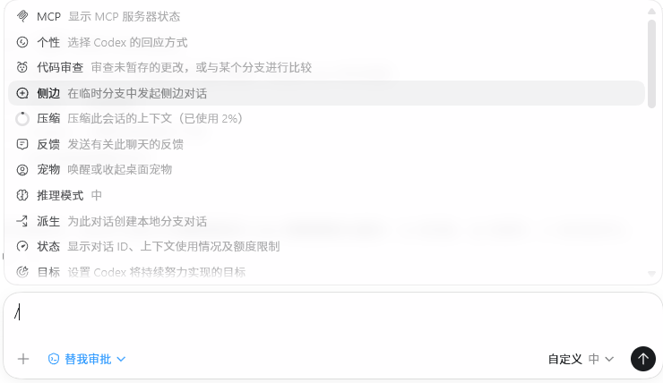

### 4.3 MCP连接外部服务

进入设置 → MCP 服务器，可以在这里添加和管理 MCP 服务。

点击「添加服务器」后，你需要手动填写服务器的配置参数才能完成添加，对新手不太友好！

这里使用docker desktop容器化部署`MCP`，如何安装docker desktop，请参考 ：[DockerDesktop环境安装](./DockerDesktop环境安装.md)

确保docker desktop已经登录，且设置中Enable Docker MCP Toolkit功能开启

**以Context7 MCP 为例**:

------

**介绍：**

一句话概括：**给 AI 装上 “实时文档浏览器”**，让它在写代码时能直接查询最新版 API，避免给出过时或错误的方案。

**核心能力**

1. 实时文档同步
   - 自动监听主流框架 / 库（如 React、Vue、Next.js、TypeScript 等）的官方文档更新。
   - 建立版本映射系统，确保 AI 调用的是当前最新稳定版文档。
2. 精准文档检索
   - 提供标准化工具接口，让 AI 能直接解析文档结构、定位函数 / 类的定义。
   - 支持按库名、版本号、API 名称精确检索，避免泛泛而谈。
3. 代码示例注入
   - 附带可运行的代码片段，AI 可以直接参考、修改并生成符合最新规范的代码。
   - 自动适配不同框架版本，给出对应版本的正确写法。

**使用docker desktop部署Context7 MCP**

- 点击**Create a profile**

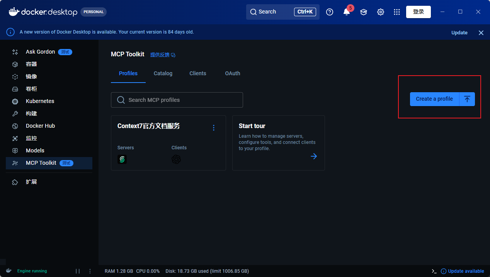

- 填写**名字**
- 搜索并添加**CONTEXT7**
- 搜索并添加**Codex**

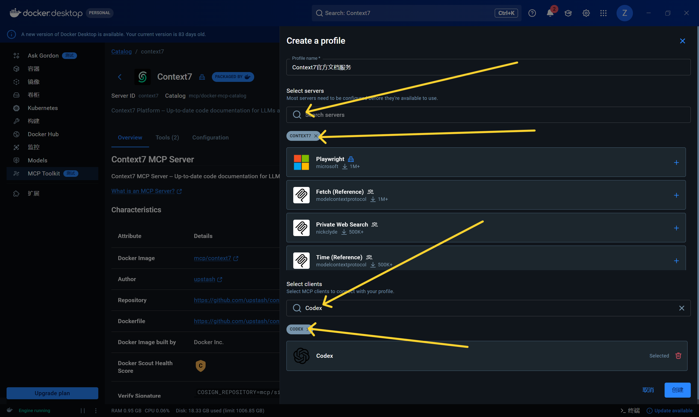

- 最终显示这个界面，证明MCP服务已经准备就绪了。


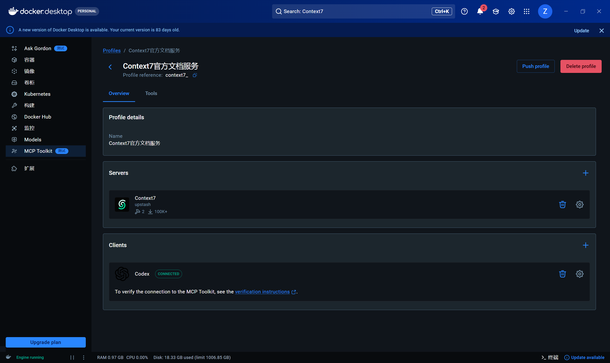

- 重启codex(确保任务栏托盘中已经关闭)，就会发现MCP服务器里面多了一个名为`MCP_DOCKER`的MCP

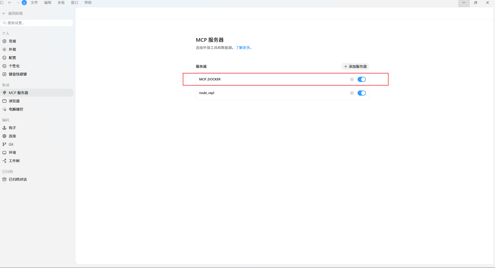

**关于如何调用MCP服务器**

- 到目前位置，**没有**像 $skill、@plugin 那样的符号语法专门用来指定 MCP。
- Codex 会把已激活的 MCP 的工具注册到我的可用工具列表里，你和codex的对话中描述需求后，会自动匹配对应命名空间下的工具来调用。
- 也可以通过对话的形式说明要调用某个MCP服务完成任务。

### 4.4 自定义全局指令

- 在设置 → 个性化里，可以修改 Codex 的个性和自定义指令。
- 你写在这里的内容，所有项目的所有对话都会自动带上。适合记录一些通用偏好，比如「回复用中文」之类的。
- 保存之后，它会被写入全局的 `~/.codex/AGENTS.md` 文件，这个文件就是 Codex 每次启动时都会读取的「行为准则」，所有项目通用。

### 4.5 项目级 AGENTS.md

AGENTS.md 是写给 Codex 的项目说明书，放在项目根目录，每次启动时自动加载，整个会话期间持续生效。

**为什么需要它**

Codex 默认对你的项目一无所知。它不知道你用的是 App Router 还是 Pages Router，不知道数据库操作要统一走哪个文件，也不知道哪些文件是碰不得的。如果每次对话都要重新交代背景，效率会非常低，而且容易出错。AGENTS.md 让这些信息一次写入、持续生效，省去重复交代的麻烦。

**写什么内容**

一份有效的 AGENTS.md 通常包含四类信息：项目概述、技术栈、重要约定和禁止事项。

以下是一个完整的示例：

```markdown
# AGENTS.md

## 项目概述
这是一个基于 Next.js 14 + Prisma + PostgreSQL 的 SaaS 应用。
使用 App Router，不使用 Pages Router。

## 技术栈
- 前端：Next.js 14, React 18, TailwindCSS, shadcn/ui
- 后端：Next.js API Routes, Prisma ORM
- 数据库：PostgreSQL 15
- 认证：NextAuth.js

## 重要约定
- 所有数据库操作必须通过 lib/db.ts 中的 prisma 实例
- API 路由错误统一用 lib/api-error.ts 处理
- 环境变量在 .env.local 中，参考 .env.example

## 禁止事项
- 不要修改 prisma/schema.prisma，除非我明确要求
- 不要删除任何现有测试
- 生产环境的 .env 文件不要碰
```

> 「禁止事项」这一内容尤其重要。Codex 在执行任务时会主动推断哪些文件需要修改，没有明确边界的情况下，它可能动到你不希望它碰的地方。把红线写清楚，比出问题后再补救要省事得多。

**配置的层级结构**

AGENTS.md 支持三层嵌套，优先级从低到高排列。

越靠近当前目录的文件优先级越高。同一目录下，AGENTS.override.md 存在时，同级的 AGENTS.md 会被跳过。

| 层级   | 路径                                      | 作用范围       | 优先级 |
| :----- | :---------------------------------------- | :------------- | :----- |
| 全局层 | ~/.codex/AGENTS.md                        | 跨项目通用约定 | 低     |
| 项目层 | repo/AGENTS.md                            | 仓库级规范     | 中     |
| 覆写层 | repo/services/payments/AGENTS.override.md | 子目录特殊规则 | 高     |

全局层适合写那些在所有项目里都成立的约定，例如：

``` markdown
# ~/.codex/AGENTS.md

## 全局约定
- 安装依赖时优先使用 pnpm
- 修改 JavaScript 文件后始终运行 npm test
- 新增生产依赖前先请求确认
```

配置完成后，可以用以下命令验证加载是否正确：

```
codex --ask-for-approval never "Summarize the current instructions."
```

### 4.6 工作树功能

**使用前提**：多智能体并行隔离依靠 git worktree 创建独立工作副本，拆分文件修改空间，是批量重构、多任务文件分区的底层依赖。所以必须**手动安装Git环境**，参考：[Git环境安装](./Git环境安装.md)。

通过`/命令`调用

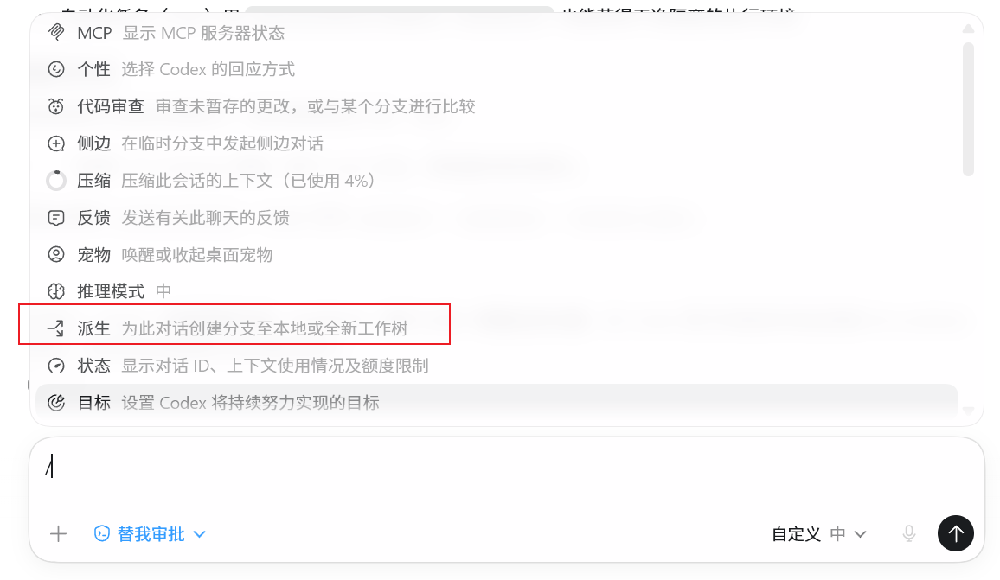

对话时通过`/命令`选择派生，这样 AI 会在一个隔离的分支中工作，不影响你当前的代码。很适合同时让多个 Agent 在同一个项目上并行干活，减少冲突。

### 4.7 其他功能

Codex Desktop是目前为止功能最全，界面最人性化，功能分布最合理的Ai工具，很多功能都是傻瓜式操作，使用过程中多尝试之前没用过的功能，很容易学会。

## 五、Codex速查表

### 5.1 命令速查表

#### 5.1.1 CLI 基础命令

| 命令                | 说明               |
| :------------------ | :----------------- |
| `codex`             | 启动交互式 TUI     |
| `codex "任务"`      | 启动并执行指定任务 |
| `codex exec "任务"` | 非交互模式执行任务 |
| `codex --version`   | 显示版本信息       |
| `codex --help`      | 显示帮助信息       |

#### 5.1.2 斜杠命令

| 命令               | 说明           |
| :----------------- | :------------- |
| `/model <name>`    | 切换模型       |
| `/fast`            | 切换 Fast 模式 |
| `/plan`            | 进入计划模式   |
| `/review`          | 审查代码变更   |
| `/new`             | 开始新会话     |
| `/resume`          | 恢复历史会话   |
| `/fork`            | 克隆当前会话   |
| `/compact`         | 压缩上下文     |
| `/status`          | 显示会话状态   |
| `/clear`           | 清除屏幕       |
| `/quit`            | 退出 Codex     |
| `/approval <mode>` | 切换审批模式   |

#### 5.1.3 CLI 参数

| 参数                         | 说明               |
| :--------------------------- | :----------------- |
| `-m <model>`                 | 指定模型           |
| `--sandbox <mode>`           | 设置沙箱模式       |
| `--approval-mode <mode>`     | 设置审批模式       |
| `-i <file>`                  | 附加图片           |
| `-o <file>`                  | 输出到文件（exec） |
| `--full-auto`                | 全自动执行         |
| `--ephemeral`                | 不保存会话文件     |
| `--reasoning-effort <level>` | 推理强度           |

#### 5.1.4 Shell 命令执行

| 格式           | 说明                       |
| :------------- | :------------------------- |
| `! <command>`  | 在 Codex 中执行 Shell 命令 |
| `! git status` | 查看 Git 状态              |
| `! npm test`   | 运行测试                   |

------

### 5.2 配置文件路径

#### 5.2.1 配置文件位置

| 文件     | 路径                   | 作用         |
| :------- | :--------------------- | :----------- |
| 用户配置 | `~/.codex/config.toml` | 全局默认配置 |
| 项目配置 | `.codex/config.toml`   | 项目特定配置 |
| 项目指令 | `AGENTS.md`            | 项目行为规范 |
| 日志目录 | `~/.codex/log/`        | 运行日志     |
| 会话目录 | `~/.codex/sessions/`   | 会话记录     |

#### 5.2.2 技能目录

| 位置   | 路径                 |
| :----- | :------------------- |
| 项目级 | `.agents/skills/`    |
| 用户级 | `~/.agents/skills/`  |
| 系统级 | `/etc/codex/skills/` |

------

### 5.3 快捷键

#### 5.3.1 CLI 快捷键

| 快捷键          | 功能             |
| :-------------- | :--------------- |
| `Enter`         | 发送消息         |
| `Shift+Enter`   | 换行             |
| `Ctrl+C`        | 中断操作         |
| `Ctrl+C (两次)` | 退出 Codex       |
| `Ctrl+D`        | 退出（输入空时） |
| `Ctrl+R`        | 搜索历史         |
| `Up/Down`       | 浏览历史         |
| `Tab`           | 自动补全         |
| `Esc Esc`       | 编辑上一条消息   |
| `Ctrl+O`        | 复制最后回复     |

#### 5.3.2 App 快捷键

| 快捷键             | 功能          |
| :----------------- | :------------ |
| `Cmd/Ctrl+N`       | 新建会话      |
| `Cmd/Ctrl+Shift+N` | 新建窗口      |
| `Cmd/Ctrl+W`       | 关闭窗口/标签 |
| `Cmd/Ctrl+[`       | 上一个标签    |
| `Cmd/Ctrl+]`       | 下一个标签    |

------
