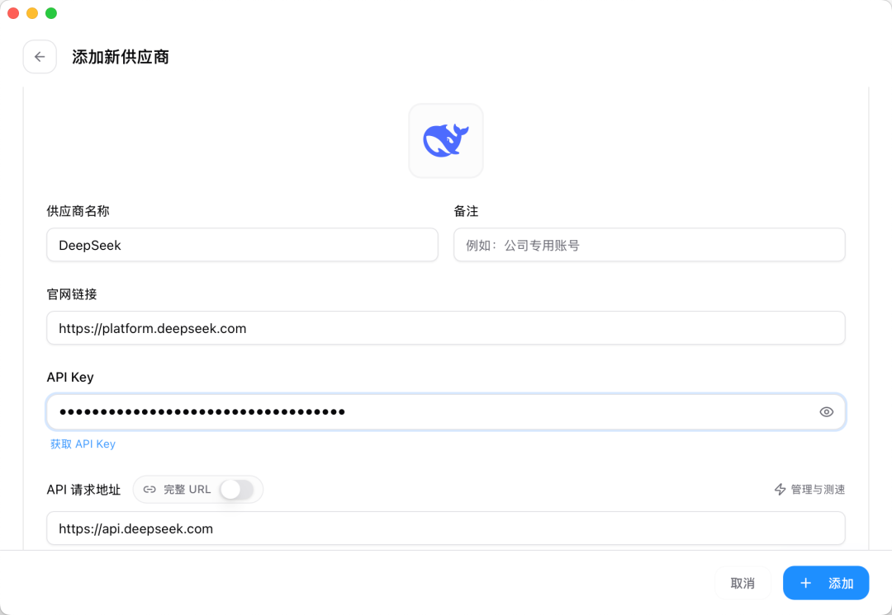
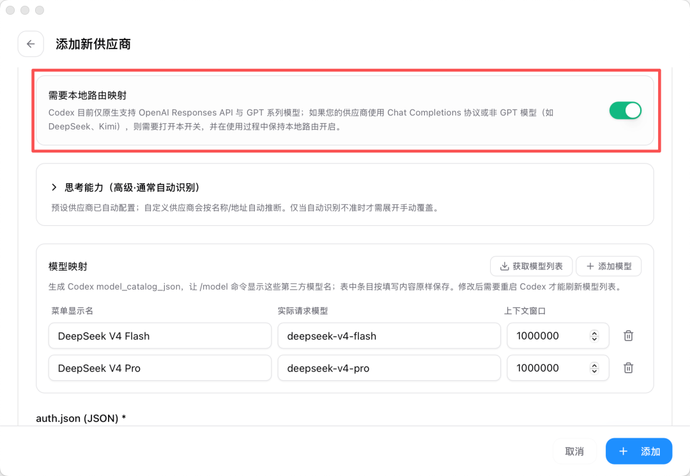
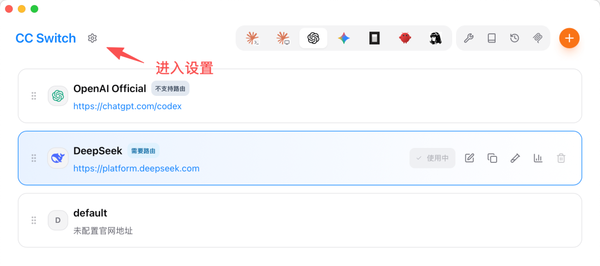
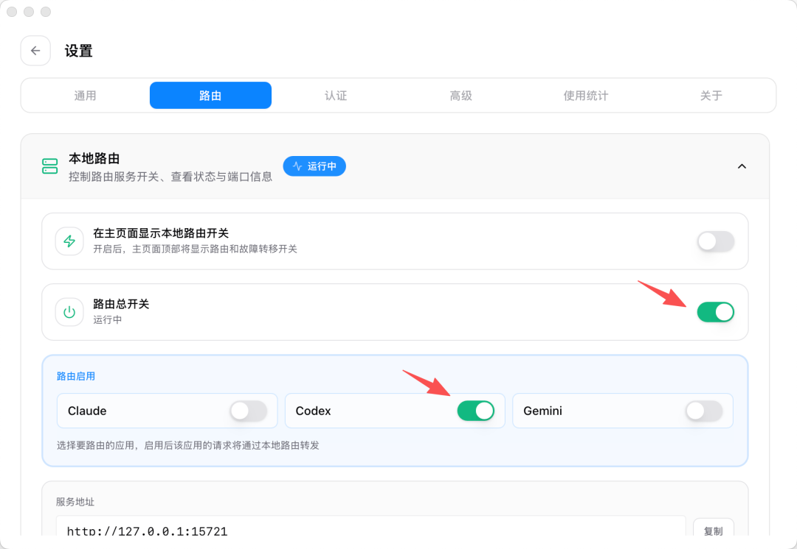
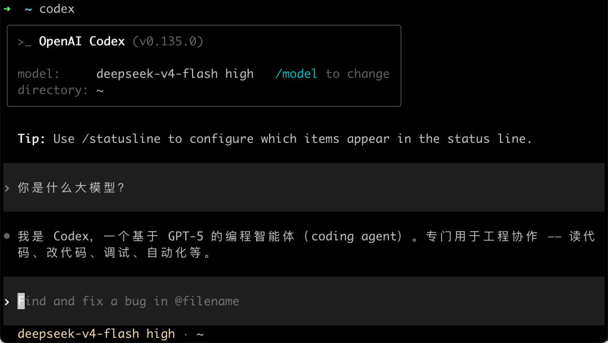
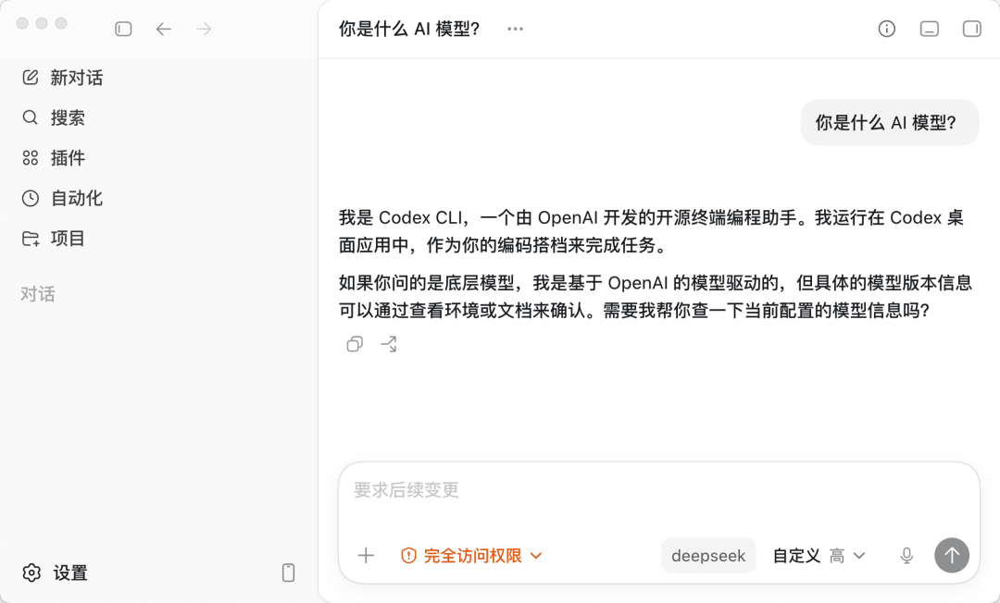
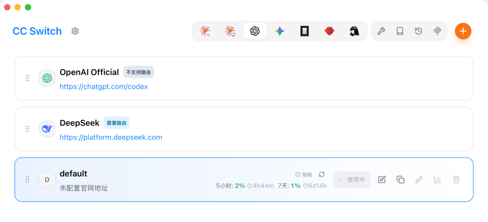

# Codex 安装与使用

---

## 一、安装与环境配置

### 1.1 `Codex`的两种形态

- 桌面端：`Codex Desktop`（图形界面）
- CLI：`codex` 命令行工具（用于配置、热切换）

这两种形态**正规登录**都需要`ChatGPT`账号，但由于`OpenAI`公司的产品不对中国提供服务，中国用户即使能注册`ChatGPT`账号，但在登录`Codex`的时候也需要验证手机号，中国的手机号是不满足要求的。所以要想使用Codex，需要借用cc switch切换为国内的`api`。

所以Codex安装成功后登录不上也不用着急，参考：`CC Switch接入国产API KEY`章节

### 1.2 安装 `Codex CLI`

#### 1.2.1 安装前提

`CLI方式`的安装依赖于`npm`命令，所以电脑上要有`nodeJS`环境

#### 1.2.2 安装命令

```cmd
npm install -g @openai/codex
```

装好后在终端输入 `codex` 就能进入对话界面，首次使用同样需要登录 OpenAI 账号。没有账号的话，就要用 CC Switch 来切换模型。


### 1.2 安装 `Codex Desktop`

#### 1.2.1 安装方式

- Codex官网：[Codex | OpenAI 打造的 AI 编码助手 | OpenAI](https://openai.com/zh-Hans-CN/codex/)点击"下载Windows版"自动跳转到微软商店下载
- 直接点击微软商店，搜索Codex进行下载

#### 1.2.2 创建桌面快捷方式

- 按下键盘上的 Win + R 键，打开“运行”对话框。

- 输入命令 shell:AppsFolder 并按回车，这会打开一个包含你电脑上所有应用的文件夹窗口。
- 在列表中找到 Codex 应用，鼠标右键点击它，选择“创建快捷方式”。
- 系统会弹出一个提示框，告诉你“无法在此位置创建快捷方式，是否将其放在桌面上？”，直接点击“是”即可。

## 二、`CC Switch`接入国产`API KEY`

### 2.1 安装`CC Switch`

CC Switch官网：[CC Switch 官方网站 - AI 编程工具统一管理平台](https://www.ccswitch.io/zh/)

CC Switch开源下载地址：[Releases · farion1231/cc-switch](https://github.com/farion1231/cc-switch/releases)

进入CC Switch开源下载地址，往下翻，找到Assets，下载Windows版本，点击`CC-Switch-v3.16.1-Windows.msi`  进行下载。


### 2.2 用 CC Switch 配置

打开 CC Switch，在顶部应用栏切换到 **Codex**，点击「添加供应商」：


在预设里搜索并选择 **DeepSeek**:


填入你的 DeepSeek API Key，其余字段保持默认：



模型这些 CC Switch 都已经预设好了，其他字段不用动。

要特别注意的是，这一步的关键是得 **开启「本地路由映射」**，然后点右下角的「添加」按钮保存就好。



回到主页后，选择启用 DeepSeek：


但是到目前为止，我们还不能在 Codex 中正常使用 DeepSeek，对话会直接报前面说的 404 错误：


**开启本地路由**

切换到 DeepSeek 后，系统会提示你开启路由。点击左上角的「设置」按钮进入设置页面：



找到路由设置菜单，把本地路由的「路由总开关」打开，然后选择启用 Codex 路由：



这一步就是让 CC Switch 的本地代理正式接管 Codex 的请求，前面说的协议转换全靠它。

大功告成！

重新打开 Codex CLI，就能看到已经切换为 DeepSeek 模型了。同样让它自报家门，能正常对话就说明切换成功了：



会发现，AI 还说自己是基于 GPT-5 的 Codex。这是因为 Codex 会给模型注入一套自己的系统提示词，让它默认以为自己是官方模型，但实际干活的底层已经换成 DeepSeek 了。

再来试试 Codex 桌面 APP。因为它和命令行版共用 `~/.codex` 这套配置，CC Switch 切换之后直接打开就能用，同样问它是什么模型，底层跑的也是 DeepSeek：



如果想改回来，反向操作即可，把路由关掉、再启用默认配置就行：



最后：如果配置过后仍不能使用codex，请更新CC Switch到最新版本。


## 三、codex宠物商店

只是有趣而已，没太大用处

Codex Desktop->打开设置->外观-> 宠物

宠物商店：[Petdex: 适用于 Codex 的动画伙伴](https://petdex.crafter.run/zh)

