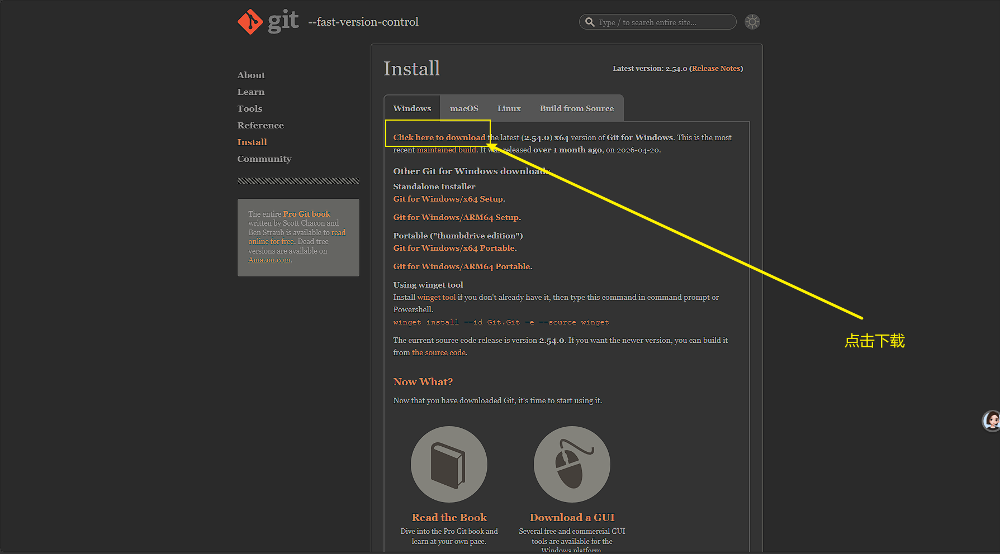

# Git环境安装

## 一、下载

官网下载：[Git - Install for Windows](https://git-scm.com/install/windows)

## 二、安装

参考：

- [Git安装及配置教程-CSDN博客](https://blog.csdn.net/Little_Carter/article/details/157698407)
- [详解 Git 安装过程的每一个步骤-CSDN博客](https://blog.csdn.net/mukes/article/details/115693833)

安装很简单，指定安装目录，调整环境变量，其他的可以参考上面跳转的文档适当修改。