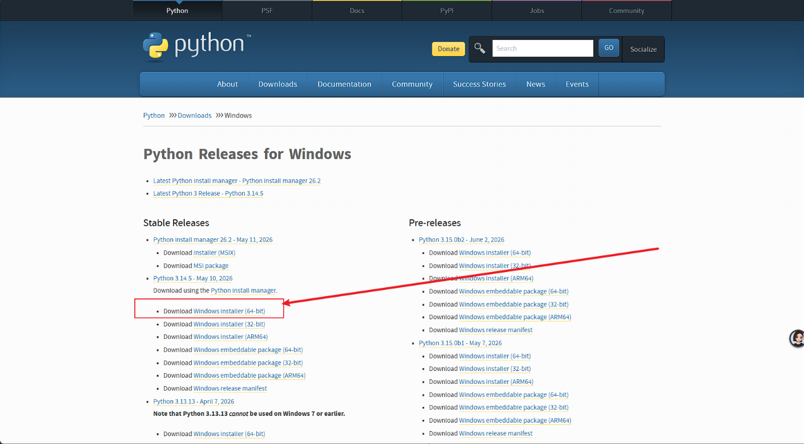

# Python环境安装

## 一、说明

Python环境是使用Ai工具必须要装的，Ai的大部分操作都是依赖于编写python脚本实现的。

## 二、下载

官网下载：[Python Releases for Windows | Python.org](https://www.python.org/downloads/windows/)

选择稳定版本

## 三、 安装

参考：[Python安装-CSDN博客](https://blog.csdn.net/qq_24923619/article/details/160594145)

选择自定义安装，勾选添加环境变量，自定义安装目录，可参考上面跳转的文档修改。