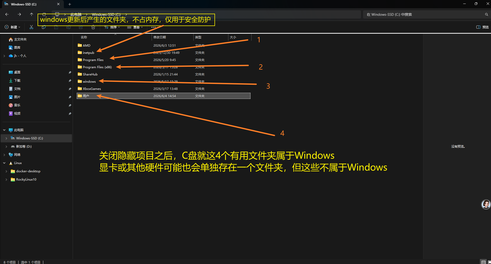
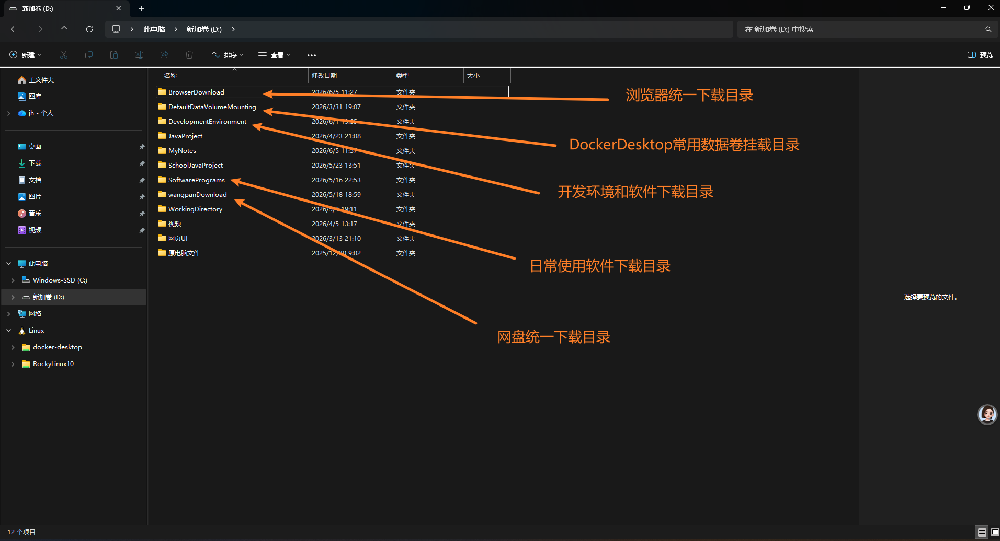

# 首页

## 一、管理好自己电脑文件夹

要尽量了解电脑上每一个文件夹的作用，并管理好自己的文件夹。

以我的电脑为例

**C盘：**

**D盘：**

**管理文件**

- 当下载一个软件或安装一个环境的时候，要先在目标目录下新建一个与待安装软件或目录名称一样的新文件夹，安装的时候指定这个文件夹。
- 如果指定安装目录的时候只指定目标目录的根目录，有的软件会在目标目录下新建一个文件夹存放相关文件，但有的软件会直接安装在根目录，这样的话就不方便管理目录

**以微信安装为例：**

- 目标安装目录："D:\SoftwarePrograms"
- 创建文件夹："D:\SoftwarePrograms\WeiXin"
- 安装微信时选择新创建的文件夹作为安装目录
- 安装后发现微信安装过程中还会创建一个weixin文件夹："D:\SoftwarePrograms\WeiXin\weixin"
- 虽然目录层级会变深，但统一这样安装会很省事，适合所有情况
- 我们还可以在"D:\SoftwarePrograms\WeiXin"中创建一个"documents"目录与“weixin”平级，作为微信聊天记录的存储目录，作为软件的拓展目录。

## 二、桌面布局要清晰

**以我的桌面为例：**

## 三、系统环境变量配置要规范

大部分环境或软件在安装的过程中都会自动配置环境变量。

但仍有一些需要自己配置，配置的过程中尽量规范且易于理解，这样配置出问题排除才会方便。

这个配多了，自然就会属性相应流程。

