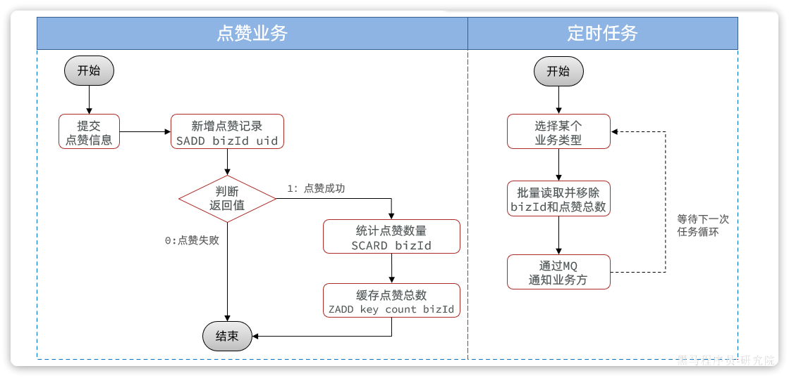

## 1.1 优化思路

点赞业务包含多次数据库读写操作（查重 → 插入/删除 → 统计总数），并且点赞操作波动较大，短时间内可能频繁触发（如反复点赞/取消），会给数据库带来极大压力。

**写多读少**的业务对于高并发写的优化方案有：

- 优化代码及 `SQL`
- 变同步写为异步写（虽然可以MQ 异步统计点赞次数写入数据库，但数据库写次数并未减少）
- **合并写请求**

**合并写请求**的前提：业务方只关心最终点赞状态，中间 N 次反复点赞/取消对业务无意义，可以安全合并。

合并写请求就是指当写数据库并发较高时，不再直接写到数据库，而是先将数据缓存到 `Redis`，然后通过定时任务定期将缓存中的数据批量同步到数据库。

## 1.2 方案设计

### 1.2.1 流程设计

优化后的整体流程如下：

- 用户点赞/取消点赞 → 直接操作 `Redis`，不写数据库
- 统计点赞总数 → 从 `Redis` 读取，并将变更记录写入待同步队列
- 定时任务每隔 20 秒扫描待同步队列 → 通过 `MQ` 批量通知业务方
- 业务方消费 `MQ` 消息 → 批量更新本地数据库点赞数

**优化前后对比：**

优化前（直写数据库）：
```
点赞请求 → 查重(DB) → 插入/删除(DB) → 统计总数(DB) → 发 MQ → 业务方更新(DB)
```

优化后（Redis 缓存 + 定时任务）：
```
点赞请求 → SADD/SREM(Redis) → SCARD 统计(Redis) → ZADD 写任务队列(Redis)
                                                          ↓（定时任务，每 20s）
                                              ZPOPMIN 取数 → 发 MQ → 业务方批量更新(DB)
```

核心收益：高频点赞操作全部命中 `Redis`，数据库写入从"每次点赞写一次"变为"每 20s 批量写一次"，压力大幅降低。



### 1.2.2 Redis Key 设计

**点赞记录 —— Set 结构**（判断用户是否点赞）

```
likes:set:biz:{bizId}   →   Set
    {
        value: userId（所有点赞过的用户 id）
    }
```

好处是以业务 id 为 key，`SCARD` 可在 O(1) 内直接读取点赞总数（Redis Set 头信息中维护元素数量），无需额外存储计数字段。

**点赞总数待同步队列 —— ZSet 结构**

```
likes:times:type:{bizType}   →   ZSet
    {
        member: bizId（发生变更的业务 id）
        score:  likedTimes（当前最新点赞总数）
    }
```

以业务类型为 key，将不同业务的点赞数变更分组存储；`member` 唯一，多次点赞自动覆盖旧的 score，避免重复处理；`ZPOPMIN（返回集合中分数最低的）` 具备原子性，定时任务读取并移除时线程安全。

### 1.2.3 定时任务方案选型

点赞行为完全随机、频率无规律，无法像播放记录那样通过"延迟检测"判断最后一次，只能依靠定时任务定期轮询。

| 方案 | 原理 | 优点 | 缺点 |
|------|------|------|------|
| SpringTask | Spring 内置 | 无第三方依赖，使用简单 | 单机，不支持分布式 |
| Quartz | 持久化调度 | 支持集群 | 配置较繁琐 |
| **XXL-JOB** | 分布式调度平台 | 可视化管理，动态配置，弹性扩缩 | 依赖第三方服务 |
| Elastic-Job | 分布式弹性任务 | 弹性扩缩容 | 依赖 ZooKeeper |

> 当前实现使用 `SpringTask`，生产环境建议迁移至 `XXL-JOB`，实现分布式调度和动态配置。

### 1.2.4 MQ 解耦通知业务方

点赞系统作为独立服务，不能直接操作业务方数据库，通过 `RabbitMQ` **TOPIC 交换机 + 不同 RoutingKey** 实现按业务类型定向通知：

```
点赞系统发送 MQ（RoutingKey = liked.times.{bizType}）
    ↓
各业务方只监听自己类型的 RoutingKey
    ↓
批量更新本地点赞数字段
```

定时任务一次处理多条数据，MQ 消息体为 `List<LikedTimesDTO>`，业务方调用 `updateBatchById` 批量更新。

## 1.3 代码实现

### 1.3.1 点赞/取消点赞

操作 `Redis` 的 Set 结构，`SADD` 返回 1 则点赞成功，`SREM` 返回 1 则取消成功；成功后统计最新点赞总数并写入 ZSet 队列。

```java
@Override
public void addLikeRecord(LikeRecordFormDTO recordDTO) {
    // 1.执行点赞或取消点赞
    boolean success = recordDTO.getLiked() ? like(recordDTO) : unlike(recordDTO);
    if (!success) return;
    // 2.统计最新点赞总数（SCARD，O(1)）
    Long likedTimes = redisTemplate.opsForSet()
            .size(LIKES_BIZ_KEY_PREFIX + recordDTO.getBizId());
    if (likedTimes == null) return;
    // 3.写入 ZSet 待同步队列（member 唯一，自动覆盖旧 score）
    redisTemplate.opsForZSet().add(
            LIKES_TIMES_KEY_PREFIX + recordDTO.getBizType(),
            recordDTO.getBizId().toString(),
            likedTimes
    );
}

private boolean like(LikeRecordFormDTO recordDTO) {
    Long userId = UserContext.getUser();
    String key = LIKES_BIZ_KEY_PREFIX + recordDTO.getBizId();
    // SADD：返回 1 说明新增成功（未重复点赞）
    Long result = redisTemplate.opsForSet().add(key, userId.toString());
    return result != null && result > 0;
}

private boolean unlike(LikeRecordFormDTO recordDTO) {
    Long userId = UserContext.getUser();
    String key = LIKES_BIZ_KEY_PREFIX + recordDTO.getBizId();
    // SREM：返回 1 说明删除成功
    Long result = redisTemplate.opsForSet().remove(key, userId.toString());
    return result != null && result > 0;
}
```

### 1.3.2 批量查询点赞状态——Pipeline

查询当前用户对多个业务的点赞状态需多次 `SISMEMBER`，使用 **Pipeline 管道**一次请求批量发送，减少网络 RTT：

```java
@Override
public Set<Long> isBizLiked(List<Long> bizIds) {
    Long userId = UserContext.getUser();
    // Pipeline 批量执行 SISMEMBER
    List<Object> objects = redisTemplate.executePipelined((RedisCallback<Object>) connection -> {
        StringRedisConnection src = (StringRedisConnection) connection;
        for (Long bizId : bizIds) {
            src.sIsMember(LIKES_BIZ_KEY_PREFIX + bizId, userId.toString());
        }
        return null;
    });
    // 过滤出结果为 true 的角标，映射回对应的 bizId
    return IntStream.range(0, objects.size())
            .filter(i -> (boolean) objects.get(i))
            .mapToObj(bizIds::get)
            .collect(Collectors.toSet());
}
```

> 注意：单次 Pipeline 不宜传输过多命令，否则会占用过多带宽导致网络阻塞。

### 1.3.3 定时任务——读取 ZSet 并发送 MQ

```java
@Scheduled(fixedDelay = 20000)
public void checkLikedTimes() {
    for (String bizType : BIZ_TYPES) {
        recordService.readLikedTimesAndSendMessage(bizType, MAX_BIZ_SIZE);
    }
}

@Override
public void readLikedTimesAndSendMessage(String bizType, int maxBizSize) {
    String key = LIKES_TIMES_KEY_PREFIX + bizType;
    // ZPOPMIN：原子性地取出并移除,最多maxBizSize条数据
    Set<ZSetOperations.TypedTuple<String>> tuples =
            redisTemplate.opsForZSet().popMin(key, maxBizSize);
    if (CollUtils.isEmpty(tuples)) return;
    // 转换为 DTO 列表
    List<LikedTimesDTO> list = new ArrayList<>(tuples.size());
    for (ZSetOperations.TypedTuple<String> tuple : tuples) {
        String bizId = tuple.getValue();
        Double likedTimes = tuple.getScore();
        if (bizId == null || likedTimes == null) continue;
        list.add(LikedTimesDTO.of(Long.valueOf(bizId), likedTimes.intValue()));
    }
    // 批量发送 MQ 通知业务方
    mqHelper.send(
            LIKE_RECORD_EXCHANGE,
            StringUtils.format(LIKED_TIMES_KEY_TEMPLATE, bizType),
            list
    );
}
```

### 1.3.4 业务方监听 MQ——批量更新点赞数

```java
@RabbitListener(bindings = @QueueBinding(
        value = @Queue(name = "qa.liked.times.queue", durable = "true"),
        exchange = @Exchange(name = LIKE_RECORD_EXCHANGE, type = ExchangeTypes.TOPIC),
        key = QA_LIKED_TIMES_KEY
))
public void listenReplyLikedTimesChange(List<LikedTimesDTO> likedTimesDTOs) {
    List<InteractionReply> list = new ArrayList<>(likedTimesDTOs.size());
    for (LikedTimesDTO dto : likedTimesDTOs) {
        InteractionReply r = new InteractionReply();
        r.setId(dto.getBizId());
        r.setLikedTimes(dto.getLikedTimes());
        list.add(r);
    }
    replyService.updateBatchById(list);
}
```

## 1.4 面试要点

**答题框架：先说设计思考，再说整体方案，最后说细节；说完 Redis 两种数据结构时停顿一下，引导面试官追问。**

---

**面试官：讲讲你们的点赞系统是如何设计的？**

首先分析了业务特点：点赞功能要被多个业务复用（问答、笔记等），所以必须具备通用性和独立性。其次，热点内容点赞并发高，必须考虑数据库压力问题。

因此，将点赞功能抽离为独立微服务，用业务类型对不同数据做隔离。在具体实现上，为降低数据库压力，用 `Redis` 保存点赞记录和点赞数，再通过定时任务定期将点赞数同步给业务方，持久化到数据库。

---

**面试官追问：Redis 里用了哪种数据结构？**

用了两种：`Set` 和 `ZSet`。

- **Set**：以业务 id 为 key，存储所有点赞用户的 id。点赞用 `SADD`，取消用 `SREM`，判断是否点赞用 `SISMEMBER`。统计点赞总数用 `SCARD`，Redis 的 Set 结构在头信息中维护元素数量，`SCARD` 时间复杂度 O(1)，性能极好。
- **ZSet**：作为"待持久化任务队列"，以业务类型为 key，业务 id 为 member，点赞总数为 score。member 唯一，多次写入会覆盖旧的 score，天然合并重复更新；`ZPOPMIN` 原子性地取出并移除数据，保证线程安全。

---

**面试官追问：为什么不用 List 或 Set 代替 ZSet 存点赞总数？**

- **List**：同一业务在定时任务间隔内多次点赞，会向 List 中写入多条重复数据，只有最后一条有效，造成冗余处理。
- **Set（只存 bizId）**：业务方收到通知后还需再查一次点赞总数，增加一次网络往返。
- **ZSet**：member 唯一自动覆盖，同时携带最新点赞总数，一次 `ZPOPMIN` 取出后直接发 MQ，无需额外查询。

> ZSet 底层是哈希 + 跳表，内存略高；但定时任务每次取出即删除，ZSet 中数据量始终维持在低水平，内存占用可接受。

---

**面试官追问：批量查询点赞状态怎么处理的？**

页面需要判断当前用户对多个业务是否点赞，`SISMEMBER` 每次只能判断一个业务，多次调用意味着多次网络往返，性能差。

解决方案是使用 `Redis Pipeline（管道）`，将多个 `SISMEMBER` 命令打包在一次请求中发送，显著减少网络 RTT，实现批量点赞状态查询。
