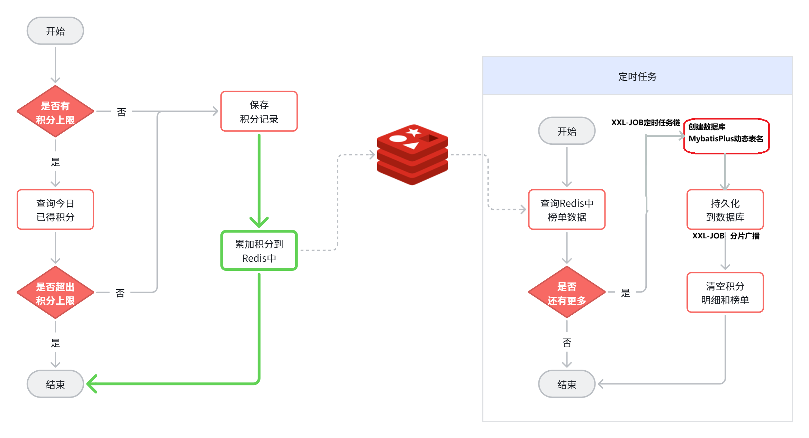

## 1.1 优化思路

积分排行榜的核心问题是**查询性能**：每个用户可能产生数十甚至上百条积分记录，当用户规模达到百万级，积分记录就是**数以亿计**。

如果每次查询排行榜都用 SQL 做分组、求和、排序：

```sql
SELECT user_id, SUM(points) FROM points_record GROUP BY user_id ORDER BY SUM(points)
```

在内存中对海量数据做这些运算，对 CPU 和内存的占用会非常恐怖，不太靠谱。

这里有两种不同的思路：

- **方案一：基于 MySQL 的离线排序**。将数据库数据查出来，在内存中自己用算法排序，然后将结果保存到数据库。缺点是实现复杂、实时性差，只能每隔几分钟计算一次。优点是不会持续占用系统资源。

- **方案二：基于 Redis 的 SortedSet**。Redis 的 SortedSet 底层采用**跳表**数据结构，排序效率极高，百万用户排序轻松搞定。每当用户积分变更，实时累加到 SortedSet 的 score，排名也会实时更新。实现简单、高效、实时性好。缺点是需要持续占用 Redis 内存。

当系统用户量达到**数千万甚至数亿**时，可以采用**分治**思路：将用户按积分范围划分为多个桶（如 0~100、101~200……），每个桶对应一个 SortedSet key，分散数据规模。计算排名时只需查当前桶，再累加分值比他高的所有桶的用户总数即可。

综上，**推荐基于 Redis 的 SortedSet 实现排行榜**。

## 1.2 方案设计

### 1.2.1 整体流程

排行榜分为两类：

- **实时榜单**（当前赛季）：存储在 Redis，积分变更时实时更新
- **历史榜单**（历史赛季）：持久化到 MySQL，按赛季水平分表存储

整体流程如下：

```
用户产生积分行为
    ↓
累加积分到数据库积分明细表
    ↓
同步累加积分到 Redis SortedSet（实时榜单自动更新）
    ↓（月初定时任务）
① 创建上赛季历史榜单表（水平分表）
② 从 Redis 分页读取上赛季榜单，批量持久化到 MySQL
③ 清理 Redis 中的上赛季数据
```

### 1.2.2 Redis Key 设计

**实时榜单 —— SortedSet 结构**

```
boards:{yyyyMM}   →   SortedSet
    {
        member: userId（用户 id）
        score:  当月积分总和
    }
```

以赛季年月作为 key 后缀，每月自动产生新 key，历史 key 随持久化任务清理。

- **新增积分**：`ZINCRBY` 累加 score，SortedSet 自动维护排名
- **查榜单**：`ZREVRANGEWITHSCORES` 按 score 倒序分页
- **查个人排名**：`ZREVRANK` 获取名次，`ZSCORE` 获取积分

### 1.2.3 海量数据存储策略

历史榜单数据随赛季增长，若全存一张表数据量极大。常见方案对比：

| 方案 | 原理 | 优点 | 缺点 |
|------|------|------|------|
| 表分区（Partition） | 物理拆分 ibd 文件，逻辑仍为一张表 | 增删改查无需改代码 | List 分区需枚举所有值，赛季 id 无限增长，无法预枚举 |
| 水平分表 | 按赛季拆分为多张独立表 | 拆分灵活，查询时一次只查一张表 | 需要自己判断访问哪张表 |
| 垂直分表 | 按字段拆分宽表 | 减小单行体积 | 增加表关联和事务复杂度 |
| 分库+集群 | 垂直分库 + 主从复制 | 突破单机瓶颈，高可用 | 成本极高，事务/一致性复杂 |

**最终选择：按赛季水平分表**。每个赛季独立一张表，命名规则为 `points_board_{seasonId}`，表结构精简如下（去掉 rank 和 season 字段，用 id 存排名）：

```sql
CREATE TABLE IF NOT EXISTS `points_board_X`
(
    `id`      BIGINT NOT NULL AUTO_INCREMENT COMMENT '榜单id（即排名）',
    `user_id` BIGINT NOT NULL COMMENT '学生id',
    `points`  INT    NOT NULL COMMENT '积分值',
    PRIMARY KEY (`id`) USING BTREE,
    INDEX `idx_user_id` (`user_id`) USING BTREE
) COMMENT ='学霸天梯榜'
  COLLATE = 'utf8mb4_0900_ai_ci'
  ENGINE = InnoDB
  ROW_FORMAT = DYNAMIC;
```

### 1.2.4 定时任务方案——XXL-JOB

历史榜单持久化需要三个定时任务，且要**按顺序依次执行**，普通 SpringTask 无法控制任务执行顺序，也无法在多实例下防重复执行，因此采用 **XXL-JOB** 分布式任务调度框架。

| 框架 | 优点 | 缺点 |
|------|------|------|
| SpringTask | 无第三方依赖，简单 | 单机，不支持分布式调度 |
| Quartz | 支持集群 | 配置繁琐，功能有限 |
| **XXL-JOB** | 开源免费，可视化管理，支持分片广播、子任务链 | 依赖调度中心服务 |
| PowerJob | 功能最强（MapReduce 等） | 市场占比较低，稳定性待验证 |

XXL-JOB 通过**子任务功能**实现任务链：任务 A 完成后自动触发子任务 B，B 完成后触发 C，从而保证三个任务的执行顺序。

① 创建上赛季历史榜单表（水平分表）
② 从 Redis 分页读取上赛季榜单，批量持久化到 MySQL
③ 清理 Redis 中的上赛季数据

### 1.2.5 MybatisPlus 动态表名

持久化写入时，目标表名随赛季变化，MyBatisPlus 默认从 `@TableName` 注解读取表名，需借助**动态表名插件（DynamicTableNameInnerInterceptor）**实现运行时替换。

由于计算表名和执行插件在同一线程内，使用 **ThreadLocal** 传递表名：

```
定时任务计算表名 → 存入 ThreadLocal
    ↓
MyBatisPlus 执行 SQL
    ↓
动态表名插件从 ThreadLocal 读取表名 → 替换 SQL 中的 points_board → points_board_{seasonId}
    ↓
任务结束，remove ThreadLocal
```

## 1.3 代码实现

### 1.3.1 新增积分同步到 Redis

```java
@Override
public void addPointsRecord(Long userId, int points, PointsRecordType type) {
    LocalDateTime now = LocalDateTime.now();
    int maxPoints = type.getMaxPoints();
    int realPoints = points;
    if (maxPoints > 0) {
        LocalDateTime begin = DateUtils.getDayStartTime(now);
        LocalDateTime end = DateUtils.getDayEndTime(now);
        // 查询今日已得积分，判断是否超上限
        int currentPoints = queryUserPointsByTypeAndDate(userId, type, begin, end);
        if (currentPoints >= maxPoints) return;
        if (currentPoints + points > maxPoints) {
            realPoints = maxPoints - currentPoints;
        }
    }
    // 保存积分明细到数据库
    PointsRecord p = new PointsRecord();
    p.setPoints(realPoints);
    p.setUserId(userId);
    p.setType(type);
    save(p);
    // 同步积分到 Redis SortedSet（ZINCRBY 累加 score，排名实时更新）
    String key = RedisConstants.POINTS_BOARD_KEY_PREFIX
            + now.format(DateUtils.POINTS_BOARD_SUFFIX_FORMATTER);
    redisTemplate.opsForZSet().incrementScore(key, userId.toString(), realPoints);
}
```

### 1.3.2 查询实时榜单（Redis）

```java
public List<PointsBoard> queryCurrentBoardList(String key, Integer pageNo, Integer pageSize) {
    // 1.计算分页偏移
    int from = (pageNo - 1) * pageSize;
    // 2.ZREVRANGEWITHSCORES 倒序分页查询
    Set<ZSetOperations.TypedTuple<String>> tuples = redisTemplate.opsForZSet()
            .reverseRangeWithScores(key, from, from + pageSize - 1);
    if (CollUtils.isEmpty(tuples)) return CollUtils.emptyList();
    // 3.封装结果，排名从 from+1 开始连续递增
    int rank = from + 1;
    List<PointsBoard> list = new ArrayList<>(tuples.size());
    for (ZSetOperations.TypedTuple<String> tuple : tuples) {
        String userId = tuple.getValue();
        Double points = tuple.getScore();
        if (userId == null || points == null) continue;
        PointsBoard board = new PointsBoard();
        board.setUserId(Long.valueOf(userId));
        board.setPoints(points.intValue());
        board.setRank(rank++);
        list.add(board);
    }
    return list;
}
```

### 1.3.3 查询个人当前排名和积分

```java
private PointsBoard queryMyCurrentBoard(String key) {
    BoundZSetOperations<String, String> ops = redisTemplate.boundZSetOps(key);
    String userId = UserContext.getUser().toString();
    // ZSCORE 查积分，ZREVRANK 查排名（排名从 0 开始，+1 转为自然排名）
    Double points = ops.score(userId);
    Long rank = ops.reverseRank(userId);
    PointsBoard board = new PointsBoard();
    board.setPoints(points == null ? 0 : points.intValue());
    board.setRank(rank == null ? 0 : rank.intValue() + 1);
    return board;
}
```

### 1.3.4 ThreadLocal 传递动态表名

```java
// 工具类：在同一线程内传递动态表名
public class TableInfoContext {
    private static final ThreadLocal<String> TL = new ThreadLocal<>();

    public static void setInfo(String info) { TL.set(info); }
    public static String getInfo() { return TL.get(); }
    public static void remove() { TL.remove(); }
}

// MybatisPlus 动态表名插件配置
@Configuration
public class MybatisConfiguration {
    @Bean
    public DynamicTableNameInnerInterceptor dynamicTableNameInnerInterceptor() {
        Map<String, TableNameHandler> map = new HashMap<>(1);
        // 当 ThreadLocal 中有值时替换 points_board，否则保持原表名
        map.put("points_board",
                (sql, tableName) -> TableInfoContext.getInfo() == null
                        ? tableName
                        : TableInfoContext.getInfo());
        return new DynamicTableNameInnerInterceptor(map);
    }
}
```

### 1.3.5 XXL-JOB 定时任务链

**任务一：创建上赛季榜单表（月初 3 点执行）**

```java
@XxlJob("createPointsBoardTableOfLastSeason")
public void createPointsBoardTableOfLastSeason() {
    // 获取上月时间，查询对应赛季 id
    LocalDateTime time = LocalDateTime.now().minusMonths(1);
    Integer season = seasonService.querySeasonByTime(time);
    if (season == null) return;
    // 创建该赛季对应的分表
    pointsBoardService.createPointsBoardTableBySeason(season);
}
```

**任务二：持久化 Redis 榜单数据到 MySQL（分片广播）**

```java
@XxlJob("savePointsBoard2DB")
public void savePointsBoard2DB() {
    LocalDateTime time = LocalDateTime.now().minusMonths(1);
    // 1.查询赛季 id，存入 ThreadLocal 供动态表名插件使用
    Integer season = seasonService.querySeasonByTime(time);
    TableInfoContext.setInfo(POINTS_BOARD_TABLE_PREFIX + season);

    String key = RedisConstants.POINTS_BOARD_KEY_PREFIX
            + time.format(DateUtils.POINTS_BOARD_SUFFIX_FORMATTER);

    // 2.获取分片参数：每个执行器处理不同页，互不重叠
    int index = XxlJobHelper.getShardIndex(); // 分片序号（从 0 开始）
    int total = XxlJobHelper.getShardTotal(); // 分片总数
    int pageNo = index + 1; // 起始页 = 分片序号 + 1
    int pageSize = 10;

    // 3.分页读取 Redis，批量写入 MySQL
    while (true) {
        List<PointsBoard> boardList = pointsBoardService.queryCurrentBoardList(key, pageNo, pageSize);
        if (CollUtils.isEmpty(boardList)) break;
        // 将排名写入 id 字段（分表设计：id 即排名）po实体类中的主键必须：@TableId(value = "id", type = IdType.INPUT)
        boardList.forEach(b -> {
            b.setId(b.getRank().longValue());
            b.setRank(null);
        });
        pointsBoardService.saveBatch(boardList);
        pageNo += total; // 跳过其他分片已处理的页
    }
    TableInfoContext.remove();
}
```

> **分片原理**：3 个执行器时，执行器 1 处理第 1、4、7… 页，执行器 2 处理第 2、5、8… 页，执行器 3 处理第 3、6、9… 页，每份数据只被处理一次。

**任务三：清理 Redis 历史榜单**

```java
@XxlJob("clearPointsBoardFromRedis")
public void clearPointsBoardFromRedis() {
    LocalDateTime time = LocalDateTime.now().minusMonths(1);
    String key = RedisConstants.POINTS_BOARD_KEY_PREFIX
            + time.format(DateUtils.POINTS_BOARD_SUFFIX_FORMATTER);
    // UNLINK 异步删除，不阻塞主线程
    redisTemplate.unlink(key);
}
```

> **任务链配置**：在 XXL-JOB 控制台将任务二设为任务一的子任务，任务三设为任务二的子任务，只需给任务一配置触发器，三个任务即可按顺序依次执行。

## 1.4 面试要点

---

**面试官：你在项目中负责积分排行榜功能，说说你们排行榜是怎么设计实现的？**

答：我们的排行榜分为两部分：当前赛季榜单和历史榜单。

产品设计是每个月为一个赛季，月初清零积分，让学员持续有学习动力，所以有了赛季概念，两类榜单的实现思路也不同。

**当前赛季榜单**用 Redis 的 SortedSet 实现，member 是用户 id，score 是当月积分总和。每次用户产生积分行为时，用 `ZINCRBY` 累加 score，SortedSet 会自动维护实时排名。非常简单高效。

**历史榜单**持久化到数据库。为了应对数据量增长问题，采用按赛季水平分表的策略，每个赛季独立一张表。这样做有几个好处：拆分方式自然，无需额外处理；查询时按赛季只查一张表，没有跨表问题。所以直接在业务层用 MyBatisPlus 的动态表名插件实现即可，无需引入分库分表中间件。

每月初通过定时任务完成三件事：创建上赛季分表 → 读取 Redis 持久化到 MySQL → 清理 Redis 历史数据。三个任务通过 XXL-JOB 的子任务功能串联，保证按顺序执行。

*（停顿，等待面试官追问）*

---

**面试官追问：Redis 的 SortedSet 用户量非常多怎么办？**

答：Redis 的 SortedSet 底层是跳表，性能非常好，百万级用户完全没问题。

当用户量达到数千万乃至数亿时，可以采用**分治**思路，将用户按积分范围划分为多个桶，每个桶对应一个 SortedSet key，这样单个 key 的数据量大幅减少。

计算排名时，先找到该用户积分所在的桶，再累加所有分值比该桶高的桶的用户总数，就是最终排名。依然简单高效。

---

**面试官追问：你们用的定时任务框架是哪个？数百万数据怎么分片的？多个任务怎么保证顺序执行？**

答：用的是 **XXL-JOB**。

XXL-JOB 自带分片广播机制，每个执行器都能通过 API 拿到自己的分片序号和总分片数。我们在持久化任务中用分页查询来处理数据：

- 起始页 = 分片序号 + 1（序号从 0 开始）
- 页跨度 = 总分片数

以 3 个执行器为例：执行器 1 处理第 1、4、7、10… 页，执行器 2 处理第 2、5、8、11… 页，执行器 3 处理第 3、6、9、12… 页。每份数据只被一个执行器处理，互不重叠，没有重复也没有遗漏。

任务顺序通过 XXL-JOB 的**子任务**功能保证：将持久化任务设为建表任务的子任务，清理任务设为持久化任务的子任务。只需触发建表任务，三个任务就会依次执行。

这样设计的好处是任务解耦——某个任务失败时可以单独重试，不用从头重跑整个流程。
