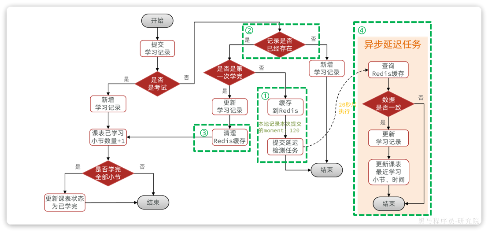

## 1.1 优化思路

播放进度统计包含大量的数据库读、写操作。不过保存播放记录还是以写数据库为主。因此优化的方向还是以高并发写优化为主。

**写多读少**的业务对于高并发写的优化方案有：

- 优化代码及`SQL`
- 变同步写为异步写
- 合并写请求

**合并写请求**播放进度数据是可以合并的（覆盖之前旧数据）

合并写请求方案其实是参考高并发读的优化思路：当读数据库并发较高时，我们可以把数据缓存到`Redis`，这样就无需访问数据库，大大减少数据库压力，减少响应时间。

合并写请求就是指当写数据库并发较高时，不再直接写到数据库。而是先将数据缓存到`Redis`，然后定期将缓存中的数据批量写入数据库。

## 1.2 方案设计

### 1.2.1 流程设计

每当前端提交播放记录时，可以设置一个延迟任务并保存这次提交的进度。等待20秒后（因为前端每15秒提交一次，20秒就是等待下一次提交），检查`Redis`中的缓存的进度与任务中的进度是否一致。

- 不一致：说明持续在提交，无需处理
- 一致：说明是最后一次提交，更新学习记录、更新课表最近学习小节和时间到数据库中



- ① 添加播放记录到`Redis`，并添加一个延迟检测任务到`DelayQueue`
- ② 查询`Redis`缓存中的指定小节的播放记录
- ③ 删除`Redis`缓存中的指定小节的播放记录
- ④ 异步执行`DelayQueue`中的延迟检测任务，检测播放进度是否变化，如果无变化则写入数据库

### 1.2.2 `Redis Key`设计

**`Redis` 用 `Hash` 结构存缓存，`key` 设计：**

```
learning:record:{lessonId}   →  Hash
    {
        field: sectionId
        value: JSON(id, moment, finished)
    }
```

好处是同一门课的所有小节共享一个 key，过期时间统一管理，1 分钟没活动自动清掉。

### 1.2.3 延迟任务方案

延迟任务的实现方案有很多，常见的有四类：

|          | `DelayQueue`                          | `Redisson`                                     | `MQ`                                     | 时间轮                   |
| :------- | :------------------------------------ | :--------------------------------------------- | :--------------------------------------- | :----------------------- |
| **原理** | `JDK`自带延迟队列，基于阻塞队列实现。 | 基于`Redis`数据结构模拟`JDK`的`DelayQueue`实现 | 利用`MQ`的特性。例如`RabbitMQ`的死信队列 | 时间轮算法               |
| **优点** | 不依赖第三方服务                      | 分布式系统下可用不占用`JVM`内存                | 分布式系统下可以不占用`JVM`内存          | 不依赖第三方服务性能优异 |
| **缺点** | 占用`JVM`内存只能单机使用             | 依赖第三方服务                                 | 依赖第三方服务                           | 只能单机使用             |

以上四种方案都可以解决问题，不过本例中使用`DelayQueue`方案。因为这种方案使用成本最低，而且不依赖任何第三方服务，减少了网络交互。

但缺点也很明显，就是需要占用`JVM`内存，在数据量非常大的情况下可能会有问题。但考虑到任务存储时间比较短（只有20秒），因此也可以接收。

如果数据量非常大，`DelayQueue`不能满足业务需求，大家也可以替换为其它延迟队列方式，例如`Redisson`、`MQ`等

## 1.3 代码实现

### 1.3.1 `DelayQueue`用法

**`DelayQueue`的原理**

`DelayQueue`的源码：

```Java
public class DelayQueue<E extends Delayed> extends AbstractQueue<E>
    implements BlockingQueue<E> {

    private final transient ReentrantLock lock = new ReentrantLock();
    private final PriorityQueue<E> q = new PriorityQueue<E>();
    
    // ... 略
}
```

`DelayQueue`实现了`BlockingQueue`接口，是一个阻塞队列。队列就是容器，用来存储东西的。`DelayQueue`叫做延迟队列，其中存储的就是**延迟执行的任务**。

我们可以看到`DelayQueue`的泛型定义：

```Java
DelayQueue<E extends Delayed>
```

说明存入`DelayQueue`内部的元素必须是`Delayed`类型，这其实就是一个延迟任务的规范接口：

```Java
public interface Delayed extends Comparable<Delayed> {

    /**
     * Returns the remaining delay associated with this object, in the
     * given time unit.
     *
     * @param unit the time unit
     * @return the remaining delay; zero or negative values indicate
     * that the delay has already elapsed
     */
    long getDelay(TimeUnit unit);
}
```

从源码中可以看出，Delayed类型必须具备两个方法：

- `getDelay()`：获取延迟任务的剩余延迟时间
- `compareTo(T t)`：比较两个延迟任务的延迟时间，判断执行顺序（`Comparable`接口）

将来每一次提交播放记录，就可以将播放记录保存在这样的一个`Delayed`类型的延迟任务里并设定20秒的延迟时间。然后交给`DelayQueue`队列。`DelayQueue`会调用`compareTo`方法，根据剩余延迟时间对任务排序。剩余延迟时间越短的越靠近队首，这样就会被优先执行。

**`DelayQueue`的用法**

首先定义一个`Delayed`类型的延迟任务类，要能保持任务数据。

```Java
@Data
public class DelayTask<D> implements Delayed {
    private D data; // 数据
    private long deadlineNanos; // 执行时间

    public DelayTask(D data, Duration delayTime) {
        this.data = data;
        this.deadlineNanos = System.nanoTime() + delayTime.toNanos();
    }

    // 获取剩余执行时间
    @Override
    public long getDelay(TimeUnit unit) {
        return unit.convert(Math.max(0, deadlineNanos - System.nanoTime()), TimeUnit.NANOSECONDS);
    }
	// 执行顺序比较规则
    @Override
    public int compareTo(Delayed o) {
        long l = getDelay(TimeUnit.NANOSECONDS) - o.getDelay(TimeUnit.NANOSECONDS);
        if(l > 0){
            return 1;
        }else if(l < 0){
            return -1;
        }else {
            return 0;
        }
    }
}
```

接下来就可以创建延迟任务，交给延迟队列保存：

```Java
@Slf4j
class DelayTaskTest {
    @Test
    void testDelayQueue() throws InterruptedException {
        // 1.初始化延迟队列
        DelayQueue<DelayTask<String>> queue = new DelayQueue<>();
        // 2.向队列中添加延迟执行的任务
        log.info("开始初始化延迟任务。。。。");
        queue.add(new DelayTask<>("延迟任务3", Duration.ofSeconds(3)));
        queue.add(new DelayTask<>("延迟任务1", Duration.ofSeconds(1)));
        queue.add(new DelayTask<>("延迟任务2", Duration.ofSeconds(2)));
        // 3.尝试执行任务
        while (true) {
            DelayTask<String> task = queue.take();
            log.info("开始执行延迟任务：{}", task.getData());
        }
    }
}
```

### 1.3.2 业务代码模板

**`DelayTask` 需要自己实现 `Delayed` 接口：**

```java
@Data
public class DelayTask<T> implements Delayed {
    private final T data;
    private final long expireTime; // 到期时间戳（毫秒）

    public DelayTask(T data, Duration delay) {
        this.data = data;
        this.expireTime = System.currentTimeMillis() + delay.toMillis();
    }

    @Override
    public long getDelay(TimeUnit unit) {
        return unit.convert(Math.max(0, deadlineNanos - System.nanoTime()), TimeUnit.NANOSECONDS);
    }

    @Override
    public int compareTo(Delayed o) {
        return Long.compare(this.expireTime, ((DelayTask<?>) o).expireTime);
    }
}
```

**延迟任务工具类骨架：**

```java
/**
 * 注意:
 * 1. 工具类处理业务时，要避免循环依赖，
 * service注入工具类，工具类又需要使用service的方法，可以不调用service，调用service的上一次mapper中的方法
 * 2.工具类中如果需要使用事务，最好将业务逻辑提取到service中添加事务
 */
@Slf4j
@Component
@RequiredArgsConstructor
public class XxxDelayTaskHandler {
	private final static String REDIS_KEY_TEMPLATE = "redis:key:{}";
    private final StringRedisTemplate redisTemplate;
    private final XxxMapper xxxMapper;
    private final DelayQueue<DelayTask<TaskData>> queue = new DelayQueue<>();
    // 优化死循环，控制启动和销毁，控制的变量添加volatile关键字，多线程可见
    private static volatile boolean running = true;

    // 服务启动时，异步开启消费线程，在bean初始化完成后执行
    @PostConstruct
    public void init() {
        //项目初始化执行task方法，不要在init中直接使用task方法，应该通过线程或其他方式异步方式执行，防止task方法出现异常导致spring生命周期阻塞，从而导致整个项目卡到bean初始化的位置
        CompletableFuture.runAsync(this::handleDelayTask);
    }

    // 服务关闭时，优雅停止消费，在bean销毁之前执行
    @PreDestroy
    public void destroy() {
        running = false;
    }

    // 消费循环：阻塞取任务 → 读缓存 → 比对 → 落库
    private void handleDelayTask() {
        while (running) {
            // try 捕获 InterruptedException 异常，避免线程被中断时导致程序崩溃
            try {
                DelayTask<TaskData> task = queue.take(); // 阻塞等待到期任务
                TaskData data = task.getData();

                // 1.读缓存
                XxxRecord cached = readCache(data.getKey());
                if (cached == null) continue;

                // 2.比对"版本"字段（这里是 moment，其他场景换成对应字段）
                // 不一致则说明数据还在变化
                if (!Objects.equals(data.getVersion(), cached.getVersion())) {
                    continue; // 数据还在变化，放弃
                }

                // 3.数据不变化了，可以落库了
                persistToDB(cached);

            } catch (Exception e) {
                log.error("延迟任务处理异常", e);
            }
        }
    }

    // 对外暴露：写缓存 + 投队列
    public void addTask(XxxRecord record) {
        writeCache(record);
        queue.add(new DelayTask<>(new TaskData(record), Duration.ofSeconds(20)));
    }

    // 读缓存
    public XxxRecord readCache(Long groupId, Long itemId) { ... }

    // 写缓存
    public void writeCache(XxxRecord record) { ... }

    // 清缓存（首次完成时调用）
    public void cleanCache(Long groupId, Long itemId) { ... }

    // 内部静态类：队列里存的数据
    @Data
    @NoArgsConstructor
    private static class TaskData {
        private Long groupId;
        private Long itemId;
        private Integer version; // 用于比对是否有变化
        // ...
    }
}
```

---

**业务 `Service` 里的调用逻辑：**

```java
private boolean handleProgressRecord(Long userId, RecordFormDTO dto) {
    // 1.查旧记录（先读缓存，再查库，顺便写缓存）
    XxxRecord old = queryOldRecord(dto.getGroupId(), dto.getItemId());

    if (old == null) {
        // 首次记录，直接入库
        save(buildNewRecord(userId, dto));
        return false;
    }

    // 2.判断是否首次完成
    boolean finished = !old.getFinished() && isFinished(dto);

    if (!finished) {
        // 3.未完成：走缓存+延迟队列，不直接写库
        taskHandler.addTask(buildRecord(old.getId(), dto));
        return false;
    }

    // 4.首次完成：直接写库（状态变更必须及时持久化）
    updateFinished(old.getId(), dto);
    // 清缓存（避免缓存中还是未完成的状态，避免再次走首次完成的业务代码）
    taskHandler.cleanCache(dto.getGroupId(), dto.getItemId()); 
    return true;
}
// 这里简单处理，实际情况需要使用多级缓存思路优化，避免缓存穿透、击穿、雪崩
private XxxRecord queryOldRecord(Long groupId, Long itemId) {
    // 1.查缓存
    XxxRecord record = taskHandler.readCache(groupId, itemId);
    if (record != null) return record;

    // 2.查库
    record = queryFromDB(groupId, itemId);

    // 3.写缓存（即便是 null 也可以写空值防穿透，视情况而定）
    if (record != null) taskHandler.writeCache(record);
    return record;
}
```

---

### 1.3.3 进一步优化思路

优化方案：

- 时间角度：使用多线程并行的方式处理task
- 内存角度：使用`redisson`作为替代方案

## 1.4 面试要点


---

**面试官：你在开发中参与了哪些觉得比较有挑战性的功能？**

答：我负责了学习中心里视频播放进度记录这个功能。功能本身不复杂，但产品对体验的要求比较高，主要有两点：

1. **跨设备续播**：用户换设备后，还能从上次暂停的地方继续看；
2. **时间误差 ≤ 30 秒**：用户即使突然断网，续播时间也要足够精准。

要满足这两点，播放进度就必须实时同步到服务端——前端每隔 15 秒发一次心跳请求，将当前播放进度上报。这样用户下次续播时直接读服务端数据，误差就能控制在 15 秒以内。

*（停顿，等待面试官追问）*

---

**面试官追问：前端每 15 秒上报一次，用户多的时候数据库压力怎么处理？**

答：这正是这个功能最核心的挑战。如果每次心跳都直接写数据库，在用户量大时，数据库会面临大量高频写请求。

我的处理思路是**合并写请求**：

- 用户每次上报播放进度，先写入 `Redis` 缓存（Hash 结构），不直接入库；
- 同时向 `DelayQueue` 投一个 20 秒后到期的延迟任务（比心跳间隔多 5 秒的冗余）；
- 延迟任务到期后，读取 `Redis` 中缓存的进度与任务里保存的进度做对比：
  - **不一致**：说明用户还在持续播放、仍有新数据进来，无需处理，等下一个任务到期再判断；
  - **一致**：说明是最后一次上报，此时才将数据写入数据库。

这样一来，无论用户连续看了多少次心跳，数据库只在"停止播放后约 20 秒"写一次，大幅降低了写库频率。

*（停顿，等待面试官追问）*

---

**面试官追问：Redis 里的数据结构怎么设计的？**

答：使用了 `Hash` 结构，`key` 设计为 `learning:record:{lessonId}`，`field` 是小节 id，`value` 是序列化后的播放记录（包含 id、播放进度 moment、是否完成 finished）。

```
learning:record:{lessonId}   →   Hash
    field: sectionId
    value: JSON(id, moment, finished)
```

这样设计的好处是：同一门课的所有小节共享一个 `key`，过期时间统一管理，1 分钟没有活动自动清除，避免冷数据长期占用内存。

---

**面试官追问：DelayQueue 有什么缺点？你们有考虑过其它方案吗？**

答：`DelayQueue` 最大的缺点是**数据存储在 JVM 内存中，只适合单机部署**，如果服务重启，队列里未执行的任务会丢失。常见的替代方案有：

| 方案 | 优点 | 缺点 |
|------|------|------|
| `DelayQueue` | 无第三方依赖，使用成本最低 | 占 JVM 内存，单机，重启丢任务 |
| `Redisson` | 基于 Redis，天然分布式，不占 JVM 内存 | 依赖 Redis |
| `RabbitMQ` 死信队列 | 分布式，消息持久化 | 依赖 MQ，链路略复杂 |
| 时间轮 | 性能极佳 | 单机，需自行实现 |

我们选 `DelayQueue` 的原因：任务存储时间只有 20 秒，丢失风险极低（服务重启后的那一小段时间内播放进度会多写一次库，不影响正确性）；同时不引入额外依赖，维护成本最低。如果业务规模扩大，可以无缝替换为 `Redisson` 方案。

---

**面试官追问：首次完成学习的场景怎么处理的？**

答：这里有一个特殊情况需要单独处理：如果用户是**首次看完某个小节**（`finished` 从 `false` 变为 `true`），这是一个关键状态变更，不能走延迟队列——必须**立即写库**，保证数据的及时性和准确性，不能因为"合并写"而丢失这个状态。

写库完成后，还要主动清除 `Redis` 中该小节的缓存，避免后续延迟任务读到旧数据，误判为"进度未变化"而再次触发落库逻辑。